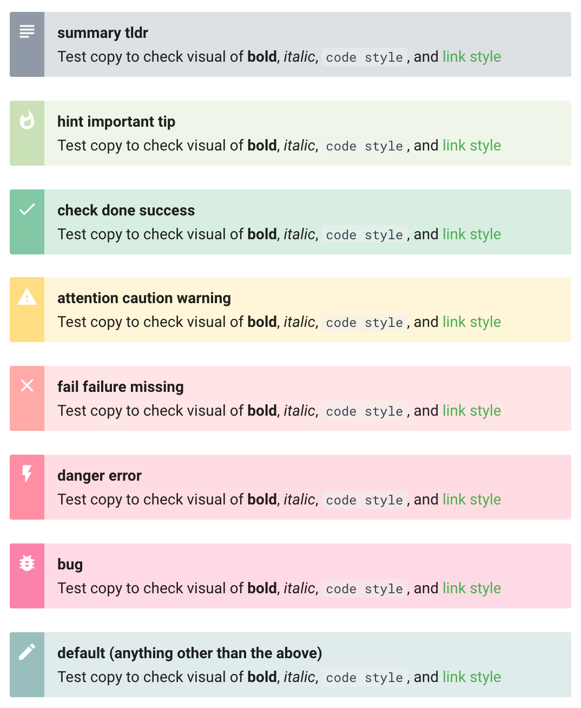
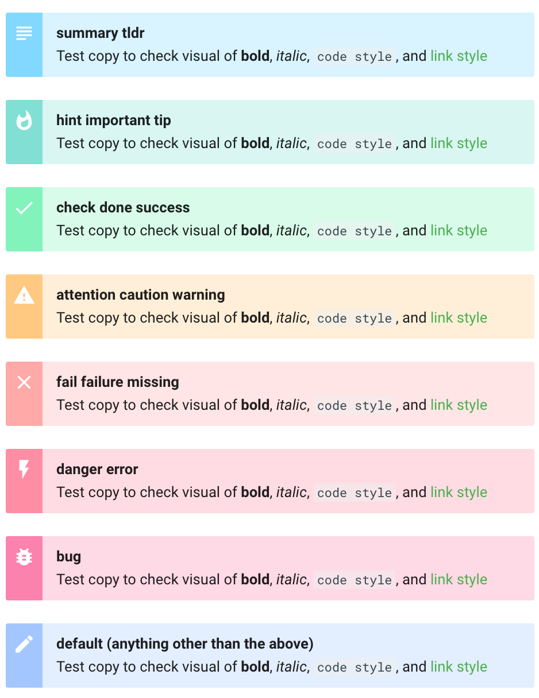

# Atomist 'end-user-documentation'

[](https://travis-ci.org/atomist/end-user-documentation)
[](https://join.atomist.com/)

This repository contains the markdown sources for the documentation
for [Atomist][atomist].  You can find the current version of the
Atomist documentation at [http://docs.atomist.com/][docs].

[atomist]: https://www.atomist.com/
[docs]: http://docs.atomist.com/

The documentation is generated from markdown using [mkdocs][].

[mkdocs]: http://www.mkdocs.org/

## Editing

Much of the documentation is hand-generated, so you can feel free to
edit.

The exception is the
auto-generated [reference documentation](docs/reference/).  The aim is
for all of the reference documentation to be auto-generated.  At
present, the [Rug][rug] and [Rug CLI][cli] reference documentation are
auto-generated during their builds.  The Rug reference docs are
automatically published to http://apidocs.atomist.com.  The Rug CLI
documentation must be copied into this repo at
`docs/reference/rug-cli/index.md`.

[rug]: https://github.com/atomist/rug
[cli]: https://github.com/atomist/rug-cli

## Content Reuse

Sometimes it's desirable to have certain content repeated in a page or duplicated
across pages. This project uses a [markdown-include][] plugin to include content
from files in the `common` directory prior to conversion to HTML. It uses the
`{!filename!}` syntax, with all filenames relative to the `common` directory.

e.g. to include the content from `common/handlers.md` into `user-guide/rug/commands.md`,
we simply add `{!handlers.md!}` to the desired location in `user-guide/rug/commands.md`.

[markdown-include]: https://github.com/cmacmackin/markdown-include

## Styles

We use the [Admonition][admonition] extension.  Here are the available
admonition styles.



Below are the default styles.



[admonition]: https://pythonhosted.org/Markdown/extensions/admonition.html

<!-- to recreate the above image
!!! tldr "summary tldr"
    Test copy to check visual of **bold**, *italic*, `code style`, and [link style][ts]

!!! important "hint important tip"
    Test copy to check visual of **bold**, *italic*, `code style`, and [link style][ts]

!!! check "check done success"
    Test copy to check visual of **bold**, *italic*, `code style`, and [link style][ts]

!!! caution "attention caution warning"
    Test copy to check visual of **bold**, *italic*, `code style`, and [link style][ts]

!!! fail "fail failure missing"
    Test copy to check visual of **bold**, *italic*, `code style`, and [link style][ts]

!!! danger "danger error"
    Test copy to check visual of **bold**, *italic*, `code style`, and [link style][ts]

!!! bug "bug"
    Test copy to check visual of **bold**, *italic*, `code style`, and [link style][ts]

!!! default "default (anything other than the above)"
    Test copy to check visual of **bold**, *italic*, `code style`, and [link style][ts]

[ts]: https://www.typescriptlang.org/
-->

## Releasing

When a push is made to this repository, the entire documentation is
built again via a [Travis][travis] job and published to
http://atomist.github.io/end-user-documentation/ .

[travis]: https://travis-ci.com/atomisthq/end-user-documentation

If the build is triggered by a tag of the form `M.N.P`, the site will
be pushed to the [Atomist GitHub Pages][pages] repository and served
by GitHub at http://atomisthq.github.io and https://docs.atomist.com .

[pages]: https://github.com/atomisthq/atomisthq.github.io

## Build and serve the documentation locally

Generally speaking, you probably do not need to do anything
with this repository aside from pushing markdown content.

However, if you want to make a change to the HTML template
or serve the doc locally before a push, you should follow the
next steps to gear up properly your environment.

First [install Python](https://github.com/Homebrew/brew/blob/master/share/doc/homebrew/Homebrew-and-Python.md)

```
$ brew install python3
```
or

```
$ sudo apt-get install python3
$ curl -O https://bootstrap.pypa.io/get-pip.py
$ sudo python3.5 get-pip.py
```

Then create a virtual environment to host the dependencies:

```
$ pip3 install virtualenv
$ mkdir ~/.venvs
$ echo "export PIP_REQUIRE_VIRTUALENV=true" >> ~/.bashrc
$ source ~/.bashrc
$ virtualenv -p `which python3` ~/.venvs/userdocs
```

Every time you want to work on this repository,
you shall activate that virtualenv in your terminal:

```
$ source ~/.venvs/userdocs/bin/activate
```

Now that the virtual environment is created, we can
install the dependencies into it:

```
$ pip install -r requirements.txt
$ ( cd rug_pygments && python setup.py install )
```

You can now serve the documentation locally by running:

```
$ mkdocs serve
```

If all goes well, you can browse the documentation at
http://127.0.0.1:8000 .

You can publish the docs manually from your local repository with the
following command:

```
$ rm docs/CNAME && mkdocs gh-deploy && git checkout docs/CNAME
```

## Conditions of use

This documentation build process is provided to the public purely for
the purpose of testing documentation changes before submitting pull
requests to the appropriate Atomist repository.

The documents produced by this build process may be published only on
http://docs.atomist.com. They may not be published in any other form
or on any other website without explicit permission.
