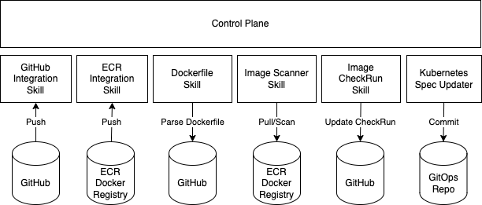

## Atomist Control Plane

The Atomist control plane permits loosely coupled skills to coordinate responses to developer change.  A skill is a user supplied function that will be invoked by the control plane in response to changes in the outside world, or updates to the state of system.  We find it useful to classify skills into two broad types.

Integration skills can register to receive webhooks, or can register schedules to poll external systems.  They can define their own schema, and write facts to the control plane.

Subscription skills tell the control plane how to watch for work that needs to be done.  They can reconcile both internal and external state changes by doing work and similar to integration skills, writing facts back to the control plane. 

A practical example of how this drives a vulnerability scanning workflow is shown below.

Higher level flows are composed from the individual skills using Atomist subscriptions.  These subscriptions are extremely powerful.  We'll describe them in detail below.  For now, it is enough to understand that subscriptions allow us to keep our functions loosely coupled, and give our operators the ability to compose consistent higher-level automation.  In the example above, the five skills had very distinct responsibilties.

* the `GitHub Integration Skill` watches for github activity (eg pushes, pull requests, issues, comments) and then records the activity.
* the `ECR Integration Skill` watches for new Image pushes, extracts metadata from the image, and records details about the image.
* the `Image Scanner Skill` watches for unscanned Images.  It records an SBOM describing the contents of each image layer.
* the `Dockerfile Skill` watches for updates to Dockerfiles.  It parses the Dockerfile and records details about the instructions, and base image usage.
* the `Image CheckRun skill` watches for image scan results that can be linked to git commits.  This keeps developers informed of the status of their change by updating a GitHub CheckRun on their commit, or pull request.
* the `Kubernetes Spoec Updater Skill` watches for scanned images that have not violated any policies.  These images are ready for deployment so the skill updates the relevant deployment specs. 

Some skills require configuration.  For example, the ECR integration skill integration requires that an operator run a Cloud Formation template, and then configure a role.  Similarly, the GitHub integration skill requires that the operator install the Atomist GitHub applicaation.  In general, every skill can register it's own parameters and the skill parameters are collected together into what we call an Atomist "workspace".  The workspace is how operators set up the Atomist control plane and skills.

Individual skills can be swapped in and out independently.  Entirely new functions can be added without needing to reconfigure any existing skills. Operators achieve uniform delivery, whether they are pulling public images, or building private images from source. 

## Composition 

The power of the control plane comes from how skills are automatically composed into higher level flows. This is done using control plane subscriptions. These allow teams to arrange their skills into higher level features like the ones listed below.

* consistent SBOM generation across all container workloads
* impact analysis for new security advisories
* software supply chain analysis

For out of the box use cases, operators do not need to create these subscriptions.  They are enabled on the control plane by configuring the Atomist workspace.  For example, SBOM generation and security analysis are out of the box flows offered to all Atomist customers.  The control plane will start scheduling skill functions as soon as the customer has authorized the integration (integrations map to the integration skills described above).  Default workspaces run skills as serverless workloads on cloud compute that is managed by Atomist.

### Subscriptions and schema

### Skills are themselves container workloads

Besides some additional skill metadata, a skill is packaged as a container image.  Besides the control plane itself, the workload can run on any container runtime cluster.  The Atomist service currently runs customer skill workloads on the GCP Cloudrun service.  This provides a turn-key experience for enabling Container security analysis on top of any exising delivery process. Teams can get started by simply authorizing one registry integration (dockerhub, gcr, gar, or ecr). 
