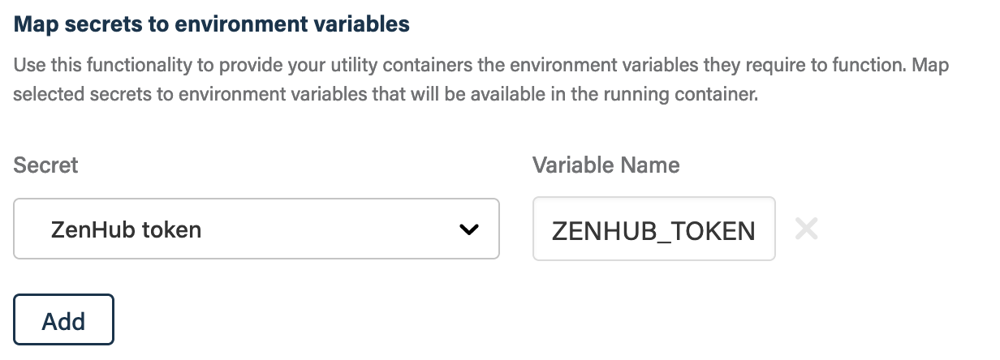

# Container Skills

Container Skills run Docker images on certain, pre-defined triggers.

This section describes the contract between a container skill and the skill
runtime. The information in this documentation provides details on what
information is available to container skills and how they can interact with the
Atomist runtime and other external systems like GitHub and Slack.

## Requirements

The container skill can use any Docker image that can be pulled from a public
Docker registry. There are no requirements for what needs to be installed in the
container.

## Triggers

The following skill triggers are available.

-   **GitHub**
    -   **branch**: a branch is created
    -   **commit check**: a GitHub commit check is created or updated
    -   **issue or pull request comment**: a comment on an issue or pull request
        is created or updated
    -   **deleted branch**: a branch is deleted
    -   **issue**: an issue is created, updated, or closed
    -   **new repository**: a new repository is created
    -   **pull request**: a pull request is created, updated, or closed
    -   **push**: new commits are pushed to a repository
    -   **release**: a GitHub release is created, updated, or deleted
    -   **pull request review**: a request to review a pull request is created
        or updated
    -   **commit status**: the status of a commit is updated
    -   **tag**: a new tag is pushed to a repository
-   **Chat**
    -   **channel linked**: a chat channel is mapped to a GitHub repository
    -   **new user**: a new chat user is created in the chat team
    -   **user joined channel**: a new user joins a chat channel

For information on the specific payloads refer to the
[Container Skills Triggers](triggers.md). The payload will be written to a file
pointed to by the value of the `ATOMIST_PAYLOAD` environment variable.

## Running commands

There are several ways to use the container run skill to execute a command. The
command run is determined by a combination of the Docker image and
[entrypoint/command](https://docs.docker.com/engine/reference/builder/#understand-how-cmd-and-entrypoint-interact "Understand how CMD and ENTRYPOINT interact")
provided in the skill configuration. The following table provides an overview of
the possible image and entrypoint configurations.

| Image           | Entrypoint and command                              | Description                                                                                                                                                  |
| --------------- | --------------------------------------------------- | ------------------------------------------------------------------------------------------------------------------------------------------------------------ |
| `alpine:3.12.0` | `/bin/sh -c 'echo $(cd /atm/home && ls -la)'`       | Runs the `alpine:3.12.0` Docker image using `/bin/sh` as the entrypoint and `-c` & `echo $(cd /atm/home && ls -la)` as command arguments                     |
| `nginx`         | _left empty_                                        | Runs the `nginx:latest` Docker image using the image provided entrypoint and command arguments                                                               |
| _left empty_    | `https://gist.github.com/.../gistfile1.txt Germany` | Downloads the referenced script and runs it in a Ubuntu-based container; additional parameters are passed to the script, `Germany` in this example           |
| _left empty_    | `example-org/deploy-script bin/deploy.sh prod`      | Clones the public `example-org/deploy-script` GitHub repository and runs the `bin/deploy.sh` script passing the `prod` argument in a Ubuntu-based container. |

## Environment Variables

The following environment variables are available inside the container:

-   `ATOMIST_WORKSPACE_ID=AZQMH6PO7` - ID of the Atomist workspace
-   `ATOMIST_CORRELATION_ID=<UUID generate for the skill invocation>` - Unique
    execution correlation id
-   `ATOMIST_PAYLOAD=/atm/payload.json` - Pointer to a file containing the
    triggering event payload
-   `ATOMIST_PUSH=/atm/output/push.json` - Pointer to a file containing push
    instructions to persist changes to cloned repos
-   `ATOMIST_STATUS=/atm/output/status.json` - Pointer to a file containing
    skill execution status
-   `ATOMIST_INPUT_DIR=/atm/input` - Directory that can contain additional input
    like provider secrets
-   `ATOMIST_OUTPUT_DIR=/atm/output` - Directory that can be used to store
    output
-   `ATOMIST_MATCHERS_DIR=/atm/output/matchers` - Directory containing problem
    matchers used to extract eg GitHub Checks
-   `ATOMIST_MESSAGES_DIR=/atm/output/messages` - Directory containing chat
    messages to send via the runtime
-   `ATOMIST_HOME=/atm/home` - Directory containing the cloned repository source
    files
-   `ATOMIST_TOPIC=<name of PubSub topic to write responses to>` - Name of
    PubSub topic to write responses to
-   `ATOMIST_STORAGE=<name of Storage bucket to write objects to>` - Name of
    Storage bucket to write objects to
-   `ATOMIST_GRAPHQL_ENDPOINT=<url for querying the GraphQL API>` - Url to the
    Atomist GraphQL endpoint

## Project

For some triggers, the skill will clone the GitHub repository and checkout the
git reference of the triggering event. The repository will be cloned into
`/atm/home`. If a SHA can be extracted from the event payload, the repository
will be cloned in a detached head state. The following triggers provided a clone
of the repository:

-   GitHub > branch
-   GitHub > commit check
-   GitHub > pull request
-   GitHub > push
-   GitHub > release
-   GitHub > commit status
-   GitHub > tag

## Skill status

The result status of a skill can be set either by the exit code of the container
or by creating a status file, with the latter taking precedence.

### Exit code

A container skill that exits its first container with a non-zero exit code will
always show as a failed skill execution unless the status
[is overwritten](#skill-status-file) by a `status.json`.

### Skill status file

Writing a status messages into `$ATOMIST_STATUS` sets the status of the skill
execution

```console
echo '{ "code": 0, "reason": "Skill failed with some strange error" }' > "$ATOMIST_STATUS"
```

`code`, `reason` and `visibility` (setting visibility to `hidden` will hide the
skill execution from the UI) are supported.

## Chat messages

The skill runtime is able to process messages and send them to the configured
chat integration when JSON documents are written into the
`$ATOMIST_MESSAGES_DIR`.

The following is the format of an acceptable JSON document:

```json
{
    "users": [<chat user names>]], // can be ommitted for response message
    "channels": [<chat channel names>], // can be ommitted for response message
    "body": {} or "",
    "options": { // all optional fields
        "id": string,
        "ttl": number,
        "ts": number,
        "post": "update_only" | "always",
        "thread": string | boolean,
        "actions": [{
            "id": string,
            "command": string,
            "parameters": [{
                "name": string,
                "value": string
            }]
        }]
    }
}
```

`body` should be an object representing a Slack message with attachments or
blocks. Refer to the Slack documentation to learn more about acceptable
messages.

When writing files to `$ATOMIST_MESSAGES_DIR` it is important to not re-use file
names as files are only processed for sending once.

### Example

The following example shows a simple Slack message that gets send into the
_#general_ channel of your Chat integration:

```console
echo '{
    "channels": ["general"],
    "body": "Hello world!"
}' > $ATOMIST_MESSAGES_DIR/hello.json
```

## Persisting changes to cloned repository

Changes to the repository contents can be automatically committed and pushed to
the remote. A container-skill can indicate the desire to push changes back by
writing a JSON file to `$ATOMIST_PUSH`.

The file has to follow this structure:

```typescript
interface PushConfiguration {
	strategy:
		| "pr_default_commit"
		| "pr_default"
		| "pr"
		| "commit_default"
		| "commit";
	pullRequest: {
		title: string; // title of PR
		body: string; // body preamble of PR
		labels?: string[]; // labels to be set on PR
		branchPrefix?: string; // prefix for branches that should be created; if set PR branch will be ${branchPrefix}-${push.branch}
		branch?: string; // alternative to branchPrefix setting an explicit branch name
		close?: {
			stale?: boolean; // close PRs open against same branches (base and head) when no local changes
			message?: string; // optional message to use when closeing PRs
		};
	};
	commit: {
		message: string; // commit message to use when committing changes to repository
	};
}
```

Here's an example from the
[markdownlint-skill](https://github.com/atomist-skills/markdownlint-skill/blob/bf8c9e00fdb9c0584d15822de8c8b63f1ed6cc2f/markdownlint.sh#L100-L115)

```console
jq -n --arg s "$push_strategy" --argjson l "$labels" '{
    strategy: $s,
    pullRequest: {
      title: "MarkdownLint fixes",
      body: "MarkdownLint fixed warnings and/or errors",
      branchPrefix: "markdownlint",
      labels: $l,
      close: {
        stale: true,
        message: "Closing pull request because all fixable warnings and/or errors have been fixed in base branch"
      }
    },
    commit: {
      message: "MarkdownLint fixes"
    }
}' > "$ATOMIST_PUSH"
```

## Caching

This skill will automatically cache and restore files that match the provided
glob patterns in the _File cache_ configuration parameter. The patterns will be
resolved relative to the `/atm/home` directory. For each skill execution the
cache will be restored if it was previously stored.

## Secrets

Secrets that get configured and mapped to environment variable names will be
available from within the container as environment variable values.

### Example

1. Configure your secrets from the **Manage > Integrations** of your Atomist
   workspace.

1. Once secrets are configured, you can add a mapping in the skill configuration

    

    In this example, we've added the _Firebase token (prod)_ to our skill
    configuration. The token is accessible from the `FIREBASE_TOKEN` environment
    variable.
