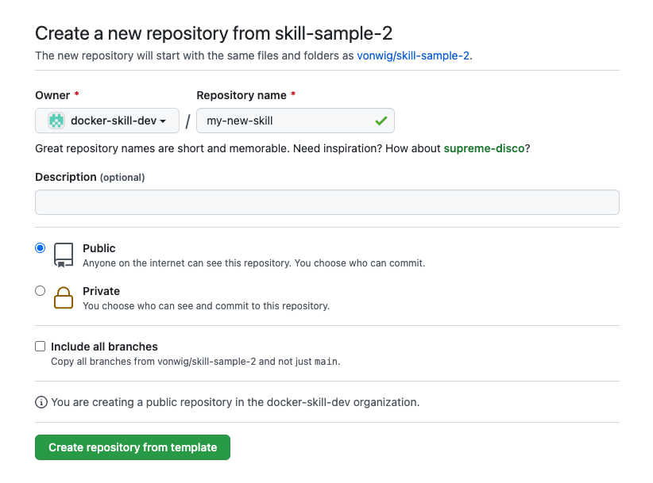
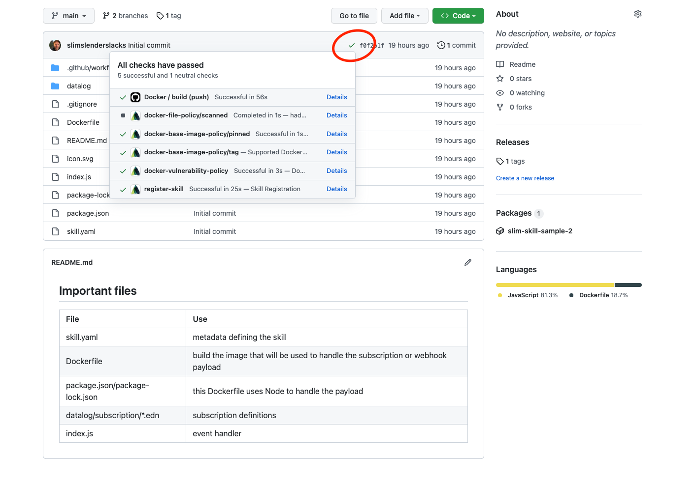
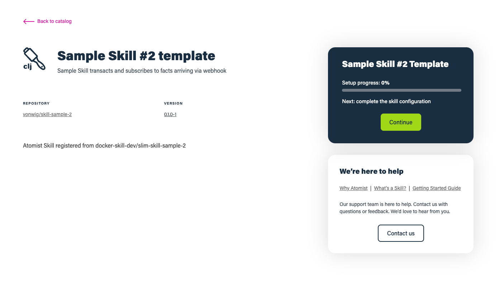
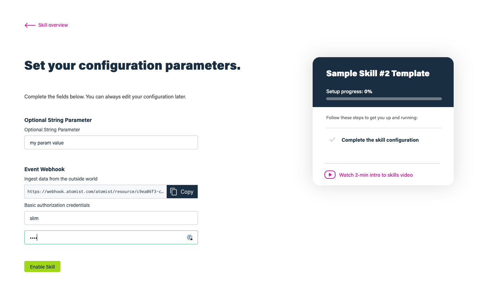

## Example Skill Repositories

This skill illustrates the basic layout for a skill that exposes a webhook, defines a schema for new facts, and then observes those facts.  It does not require any integrations (it is connected to real-world events besides the ones that come in on its own webhook).

| Sample Repo | Summary | Template | Details |
| :---------- | :------- | :----  | :---- |
| [Simple skill showing subscription, schema, and webhook parameter](https://github.com/vonwig/skill-sample-2) | creates a webhook and transacts a simple fact, which then triggers a subsciption (does not require any integrations) | [Create from template](https://github.com/vonwig/skill-sample-2/generate) | [jump to description](#basic-skill) |

The next three samples show the same use case but with handlers implemented using Go, JavaScript, and TypeScript.  Note that many of the files in these repositories are identical.  The handlers, and the Dockerfile, illustrate three different technology stacks.

Each skill subscribes to new GitHub pushes and then transacts facts about commit signatures. Since the subscription watches for new GitHub pushes, these skills will require the GitHub integration.

| Sample Repo | Summary | Template | Details |
| :---------- | :------- | :----  | :----- |
| [Sample Skill written in GO](https://github.com/atomist-skills/go-sample-skill) | uses GitHub integration to watch for pushes and transact facts about commit signatures | [Create from template](https://github.com/atomist-skills/go-sample-skill/generate) | [jump to description](#sample-skill-written-in-go) |
| [Sample Skill written in JavaScript](https://github.com/atomist-skills/js-sample-skill) | uses GitHub integration to watch for pushes and transact facts about commit signatures | [Create from template](https://github.com/atomist-skills/js-sample-skill/generate) | [jump to description](#sample-skill-written-in-javascript) |
| [Sample Skill written in TypeScript](https://github.com/atomist-skills/ts-sample-skill) | uses GitHub integration to watch for pushes and transact facts about commit signatures | [Create from template](https://github.com/atomist-skills/ts-sample-skill/generate) | [jump to description](#sample-skill-written-in-typescript) |

This next sample watches for a new SBOM being transacted against an image.  It will only see activity if there's an active Docker registry integration.

| Sample Repo | Summary | Template | Details |
| :---------- | :------- | :----  | :----- |
| [Sample Skill written in ClojureScript](https://github.com/vonwig/skill-sample-1) | watches for extracted SBOMs after a Docker image push | [Create from template](https://github.com/atomist-skills/skill-sample-2/generate) | [jump to description](#sample-skill-written-in-clojurescript) |

!!! Note
    Try out any of the skills above by clicking on one of the `Create from template` links.  If the new skill repository is in a GitHub organization linked to an Atomist workspace with [authoring enabled](workspace_setup.md), a new version of the skill will be automatically registered with your workspace.  It can be
    enabled using the [instructions here](skill_management.md).

### Basic Skill

This skill provides a useful starting point for an integration that takes input from a webhook, and then transacts data for other skills to consume.

### Sample Skill written in GO

This skill uses the Go module [`github.com/atomist-skills/go-skill`](https://github.com/atomist-skills/go-skill) to implement handlers for two subscriptions. 

The first subscription [`on_push`](https://github.com/atomist-skills/go-sample-skill/blob/main/datalog/subscription/on_push.edn) listens for pushes to a GitHub repository and transact details about the commit signature back into Atomist. The [`commit_signature.edn`](https://github.com/atomist-skills/go-sample-skill/blob/main/datalog/schema/commit_signature.edn) Datalog schema defines some new facts to represent commit signatures in our data model and link a signature to our existing `:git/commit` entity.

A second subscription [`on_commit_signature`](https://github.com/atomist-skills/go-sample-skill/blob/main/datalog/subscription/on_commit_signature.edn) subscribes to the creation of the link between a `:git.commit/signature` and its `:git/commit` via `(attributes-tx ?ctx ?signature :git.commit.signature/commit ?commit)`. The corresponding event handler function only logs details about the commit.

See [README.md](https://github.com/atomist-skills/go-sample-skill/blob/main/README.md) for more details.

### Sample Skill written in JavaScript

This JavaScript skill uses the NPM package [`@atomist/skill`](https://github.com/atomist-skills/skill) to implement handlers for two subscriptions. The functionality is the same as the [go-sample-skill](#sample-skill-written-in-go).

See [README.md](https://github.com/atomist-skills/js-sample-skill/blob/main/README.md) for more details.

### Sample Skill written in TypeScript

This skill uses the NPM package [`@atomist/skill`](https://github.com/atomist-skills/skill) to implement handlers for two subscriptions. The functionality is the same as the [go-sample-skill](#sample-skill-written-in-go).

See [README.md](https://github.com/atomist-skills/ts-sample-skill/blob/main/README.md) for more details.

### Sample Skill written in ClojureScript

See [READMD.md](https://github.com/vonwig/skill-sample-1/blob/main/README.md) for notes on how to test this skill in your own workspace.

## Trying a skill

### Generate from template

Use the `Create from template` links above to create a skill repository in your organization.  If your organizaion is [setup for authoring](workspace_setup.md), each push to the default branch will create a new version of the skill.

By default the `namespace` for your skill will be the GitHub organization of your repository, and the default `name` of the skill will be the repository name.  These can be changed in the `skill.yaml` file.  For example, use [this link](https://github.com/vonwig/skill-sample-2/generate) to create a new basic skill.



After creating your repository, you'll see GitHub check runs that show progress towards registration.



### Enable and Configure skill

Use the [instructions here](skill_management.md) to enable a version of the new skill in your workspace.  If you created the new repository in organization `ORG` with name `REPO`, then construct the following link in your browser.

```
https://go.atomist.com/catalog/skills/ORG/REPO?stability=unstable
```

Click on the green `Continue` button. 



After filling out the initial parameters, click `Enable Skill`.  In the case below, the skill exposes a webhook parameter, you can copy the new webhook url from this screen, and test it using `curl`. This webhook parameter was configured to use basic auth.

```
curl -X POST -H "Content-Type: application/json" -u <username>:<password> -d '{"data": 3.14}' $URL
```


