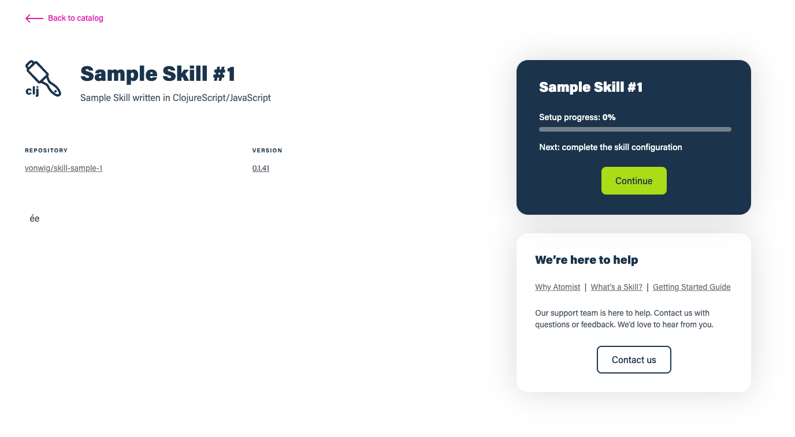
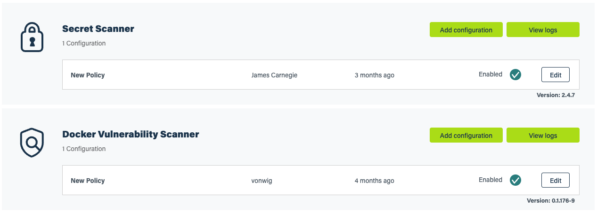

## Skill Management

### Enabling a skill

To enable a skill, you must know the `namespace` and `name` of the skill.  Construct and navigate to the url `https://go.atomist.com/catalog/skills/{namespace}/{name}?stability=unstable`. This will provide you with a form to configure the first set of parameters for your new skill configuration.

!!! Note
    We no longer support a gitops flow for skill enable/config.  However, we could write a skill to monitor a git repo and then converge skill configuration using our skill graphql apis (an `atomist/skill-configuration-skill`). Our previous model used git as the source of truth, and suffered from conflict resolution problems. Adding gitops on top of our current model is now straight forward.

When you navigate to the url above, you'll see a form customized for the skill you're enabling.
    

### Configuring a skill

You can find all of the configured skills in the [Manage Skills page](https://go.atomist.com/r/auth/manage/skills).  Use the edit buttons on the forms to make updates to the parameter values, or remove the skill configuration.

### Publishing a skill

Skills all start as private to the workspace that owns them.  They can be enabled and configured in only that workspace.  Users can share a skill with other workspaces by marking it as public. 

!!! todo
    Publish the api publish your skill to other workspaces.

### Promoting a skill

Skill versions can be tagged as `stable`, `unstable`, or `testing`. New versions of skill will be marked `unstable` by default.  Workspaces can choose to use `unstable` versions of skills; however, workspaces only pick up new versions when they are marked as either `testing` or `stable`.

!!! todo
    Publish the api to mark skills as either `stable` or `testing`.

!!! todo
    Document the difference between enabling `stable`, or `unstable` versions of skills
