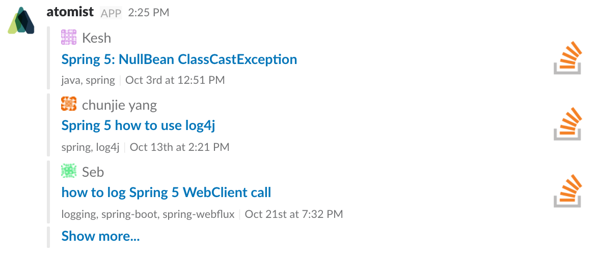

Creating bot commands and taking action when specific events occur is
easy with the Atomist development automation platform.  In the
following sections we will walk through simple examples of a bot
command and an event automation.

Before working through these examples,
{!prereq-items.md!}

## Bot commands

The Atomist development automation platform provides all the
infrastructure you need to create custom bot commands.  All you need
to provide are:

-   your command _intent_, i.e., the text users will type when they
    want to invoke the command
-   descriptions of your command's input parameters, and
-   the code implementing your command.

Atomist takes care of recognizing when someone invokes the bot command
by sending the intent to the Atomist Bot, collecting the required
parameters, and invoking the code implementing your command.  Plus,
the Atomist automation API provides methods for sending all manner
of [Slack messages][slack].

In this example, we implement a bot command that
searches [Stack Overflow][so] and replies with the results.  Here is
the code implementing this bot command:

```typescript
@CommandHandler("Query Stack Overflow", "search so")
@Tags("stack-overflow")
export class SearchStackOverflow implements HandleCommand {

    @Parameter({description: "your search query", pattern: /^.*$/})
    public q: string;

    public handle(ctx: HandlerContext): Promise<HandlerResult> {
        return axios.get(`${apiSearchUrl}${encodeURIComponent(this.q)}`)
            .then(res => this.handleResult(res, this.q))
            .then(msg => ctx.messageClient.respond(msg))
            .then(() => Success, failure);
    }
}
```

The code that _handles_ this command is implemented as
a [TypeScript][ts] class that implements the `HandleCommand`
interface.  We call such a class a _command handler_.  The class is
decorated with information about the command handler using the
`@CommandHandler` decorator:

```typescript
@CommandHandler("Query Stack Overflow", "search so")
```

The first argument is a description of the command handler and the
second argument is the intent Atomist associates with your handler,
and the message users will send the Atomist Bot when they want to
invoke your command.  The intent for this command is "search so".

Command input parameters are class instance variables decorated using
the `@Parameter` decorator, whose argument is an object supplying
parameter metadata like a description and a regular expression used to
validate the input parameter values.  This example has one parameter,
`q`, we'll search Stack Overflow for its value.

The code implementing the bot command is in the `handle` method.  This
method takes a single argument, a `HandlerContext`, which provides
access to a GraphQL client and, as used above, a client for sending
messages to Slack.  This `handle` method:

-   Queries Stack Overflow search API (using the [axios][] HTTP client
    library for Node.js)
-   Creates a Slack message from the Stack Overflow results using the
    `handleResult` method (not shown)
-   Responds to the original Slack message
-   Indicates that we successfully responded with the results, or
    sends a failure message

Let's try it out.

!!! hint
    Setting up, building, and running an automation client follows
    the same steps as any other standard TypeScript or JavaScript
    project.

First, let's clone the project containing the above code and all the
necessary project files.

```
git clone https://github.com/atomist-blogs/sof-command.git atomist/sof-command \
    && cd atomist/sof-command
```

Next we will install the project dependencies.

```
npm install
```

Then build the project

```
npm run build
```

Finally, we will start the client process on our local system.

```
npm start
```

This last command will start up the client, register the "search so"
bot command in your Slack team, and begin writing its logs to your
terminal.

Go ahead and test it by going to a channel in your Slack team that the
Atomist Bot has been invited to and send the bot the command intent.

```
@atomist search so q="spring 5"
```

If you do not provide a value for the query parameter, the Atomist Bot
will open a thread and ask you to enter it.  You should get a response
that looks something like the following image.



Congratulations, you've just created your own bot command!

[slack]: slack.md (Atomist Automation Slack Messages)
[so]: https://stackoverflow.com/ (Stack Overflow)
[ts]: https://www.typescriptlang.org/ (TypeScript)
[axios]: https://www.npmjs.com/package/axios (Axios HTTP Client)

## Event automations

Bot commands are useful for responding to user input, but what about
responding to activity within your development platforms?  You might
want the bot to react to GitHub pushes, updates to issues, pull
requests, or similar events.  Once again, the Atomist development
automation platform provides all the infrastructure you need to
automatically take action when specific events occur.  All you need to
provide are:

-   the type of event you want to react to and
-   the code implementing your event automation.

Atomist takes care of noticing when the events occur and and invoking
the code implementing your event automation, providing it with the
information you have requested about the event.

In this example, we implement an event automation that responds to
select commits pushed to a repository.  First, using
a [GraphQL subscription][subscription] we define the type of event we
want to be notified about.

```typescript
const Subscription = `
subscription FindReferencedGitHubIssue {
  Commit {
    sha
    message
    repo {
      owner
      name
      channels {
        name
      }
    }
  }
}`;
```

A GraphQL subscription begins with the keyword `subscription` followed
by a name for the subscription, `FindReferencedGitHubIssue` in this
case.  After the opening brace, you specify the type of the top-level
event you are subscribing to, `Commit` in this example.  Your
subscription then defines the structured data you want to receive for
each such event, navigating the data model's properties and
relationships to connect related data elements like commits,
repositories, and chat channels.

Each time a commit event occurs, Atomist gathers the event data you
have requested and sends it to your code implementing your event
automation, which we call an _event handler_.  Here is the event
handler code for this example:

```typescript
const Pattern = /[cC]rush(ed|ing)[\s]*#([0-9]*)/g;

@EventHandler("Find referenced GitHub issues and PRs in commit message", Subscription)
export class FindReferencedGitHubIssue implements HandleEvent<Commits> {

    public handle(event: EventFired<Commits>, ctx: HandlerContext): Promise<HandlerResult> {
        const commit = event.data.Commit[0];
        const referencedIssues: string[] = [];
        let match;
        while (match = Pattern.exec(commit.message)) {
            referencedIssues.push(`#${match[2]}`);
        }
        if (referencedIssues.length > 0 && commit.repo && commit.repo.channels) {
            const msg = `You crushed ${referencedIssues.join(", ")} with commit` +
                ` \`${commit.repo.owner}/${commit.repo.name}@${commit.sha.slice(0, 7)}\``;
            const channels = commit.repo.channels.map(c => c.name);
            return ctx.messageClient.addressChannels(msg, channels)
                .then(() => Success, failure);
        } else {
            return Promise.resolve(Success);
        }
    }
}
```

The code that _handles_ this event is implemented as
a [TypeScript][ts] class that implements the `HandleEvent` interface,
which takes a type parameter: the top-level event, `Commit` in this
case.  We call such a class an _event handler_.  The class is
decorated with information about the event handler using the
`@EventHandler` decorator:

```typescript
@EventHandler("Find referenced GitHub issues and PRs in commit message", Subscription)
```

The first argument is a description of the event handler and the
second argument is the GraphQL subscription we previously discussed.

The code implementing the event automation is in the `handle` method.
The first argument to the `handle` method is the event, which will
have the structure defined in the subscription.  Note that some
elements may be `null`.  The second argument is the handler context
object discussed above.  The `handle` code in this example

-   Extracts the commit from the event data
-   Finds all "crushing" issue and PR mentions in the commit message
    using a [regular expression][regex]
-   Sends a message to all channels linked to the repository informing
    everyone what issues and PRs were crushed
-   Indicates that we successfully processed the event, or sends a
    failure message

Let's see this event automation in action.  As above, we'll follow the
standard procedure for getting a TypeScript/JavaScript going:

```
git clone git@github.com:atomist-blogs/event-handler.git atomist/event-handler \
    && cd atomist/event-handler \
    && npm install \
    && npm run build \
    && npm start
```

To trigger this event automation, you need to make a commit in a
repository that is linked to a Slack channel.  The commit message
should include the word "Crushed" followed by a reference to an issue
in the form `#N`, replacing `N` with the number of the issue.  Once
you push that commit, the bot should send a message to the linked
channel letting everyone know you crushed it!


[subscription]: graphql.md#subscriptions
[regex]: https://developer.mozilla.org/en-US/docs/Web/JavaScript/Guide/Regular_Expressions (JavaScript Regular Expressions)
