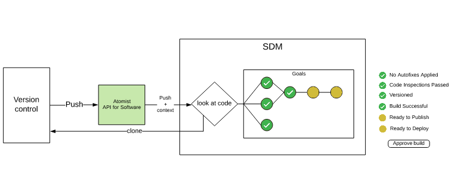
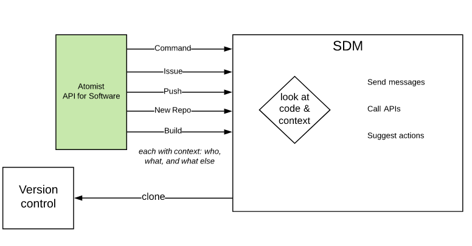
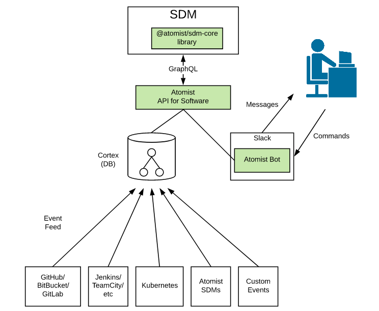
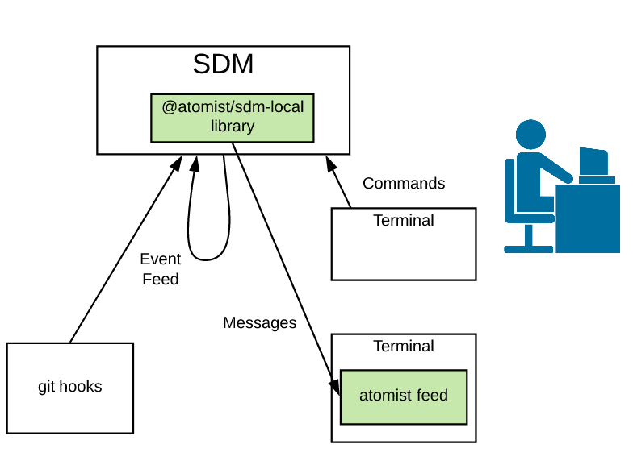

It all starts with a software delivery machine of your very own.  An
Atomist Software Delivery Machine (SDM) provides a high-level
interface for you to take action when things happen.  In much the same
way your CI build kicks off when you push to your repository, Atomist can
execute tasks like security scans, documentation publication, release
creation, and deployment.  Because you're using a real programming
language, not YAML or Bash, and you have access to a real ecosystem,
Node.js, you can create the richest delivery experience you can
imagine.

## API for Software

An SDM links up to the *API for software*, exposing:

-   *What we know*: The Atomist cortex, accessible through GraphQL
    queries and subscription joins
-   *What just happened*: An event, triggered by a GraphQL
    subscription, which is contextualized with the existing knowledge
-   *What you're working on*: A library that enables you to comprehend
    and manipulate the source code you're working on.

When a push occurs, the SDM gets all this context and the code. It decides what
delivery actions to take, and sets [goals][] accordingly.

A push is not the only event that matters in our software development.
The Atomist development automation platform ingests events from your
software development systems:

-   Source code repositories like [GitHub.com][gh]
    and [GitHub Enterprise][ghe]
-   Issue tracking systems like [GitHub][gh-issues] and [Jira][jira]
-   Continuous integration platforms
    like [Travis CI][travis], [CircleCI][circle],
    and [Jenkins][jenkins]
-   Application frameworks like [Spring][spring]
-   Runtime platforms like [Kubernetes][k8] and [Cloud Foundry][cf]
-   Custom events from _any_ other system you use

and makes them available via the Atomist API for software.

As Atomist ingests events, typically via webhook JSON payloads, it
automatically correlates them to each other: commits to pushes to
builds to deployments to running containers. This results in a data
model that represents your development flow.  The Software Delivery Machine subscribes to the most important events,
like a push to source control and a completed build. You can subscribe to more
events and take action when they occur, with the data model providing
the necessary context so your automations can always do the right
thing. 

The development automation platform also provides a simple yet
powerful interface for implementing custom chat bot commands,
also executable from your command line.  Atomist
provides all the infrastructure needed to recognize commands, collect
parameters, execute the code, and respond.  This lets you focus on
writing your command code, not boilerplate code and ceremony
around running bots. Instead of shell scripts that are useful to you, write commands
that help your whole team.

[gh]: https://github.com (GitHub.com)
[ghe]: https://enterprise.github.com/home (GitHub Enterprise)
[gh-issues]: https://guides.github.com/features/issues/ (Mastering GitHub Issues)
[jira]: https://www.atlassian.com/software/jira (Jira)
[travis]: https://travis-ci.org (Travis CI)
[circle]: https://circleci.com (CircleCI)
[jenkins]: https://jenkins.io/ (Jenkins)
[spring]: https://spring.io/ (Spring)
[k8]: https://kubernetes.io/ (Kubernetes)
[cf]: https://www.cloudfoundry.org/ (Cloud Foundry)
[ts]: https://www.typescriptlang.org/ (TypeScript)
[sdm]: https://github.com/atomist/sdm (Atomist SDM - TypeScript)
[sdm-core]: https://github.com/atomist/sdm-core (Atomist SDM - TypeScript)
[aac]: https://www.npmjs.com/package/@atomist/sdm (Atomist SDM Node Module)
[goals]: goal.md (SDM Goals)
[sdm-api]: https://atomist.github.io/sdm (Atomist SDM Framework API Documentation)
[packs]: ../pack/index.md (Atomist SDM Extension Packs)

## Coding your SDM

A software delivery machine uses the [@atomist/sdm][sdm] framework to specify the code delivery process
and other automations. You don't configure your SDM: you code it, by combining or writing functions in TypeScript (or JavaScript).

Some common setups, such as deliverying and maintaining Spring Boot apps or npm libraries, are provided in [extension packs][packs].
You can configure the whole pack, or use functions from the pack in your own setup.

## Connect your SDM

Atomist maintains two implementations of the API for Software:

-  Team mode: a complete, cloud-based service,
-  Local mode: an open-source, filesystem-based version that runs on your laptop.

An SDM is most useful when running for your whole team, connected 
to the Atomist API for software, Slack, and your version control. Run it on your laptop 
while you're testing and modifying the SDM, then in your favorite production environment (on-prem or in the cloud)
for ongoing use.

If you don't want to subscribe to the Atomist service and hook up Slack and GitHub/BitBucket/GitLab etc, 
you're in luck! Run your SDM in local mode, on your own machine. Receive push events from your own local commits,
 get messages in a terminal feed, and run trigger commands on the command line.

An SDM can also run locally, on your laptop. From there, either connect to the Atomist API for software (team mode), 
or run in local mode: respond to git commits, see messages in a terminal running `atomist feed`, and send
commands to Atomist from the command line.

The SDM is a persistent process that runs in the background, whether in local or team mode.

While the SDM is most valuable when it is coordinating delivery and
performing commands for your whole team, you can also test and operate
an SDM in local mode, on your laptop, without connecting to the
Atomist API.  Check the [Developer Quick Start][quick-start] for
instructions to get started locally.

[quick-start]: ../quick-start.md (Atomist Developer Quick Start)
