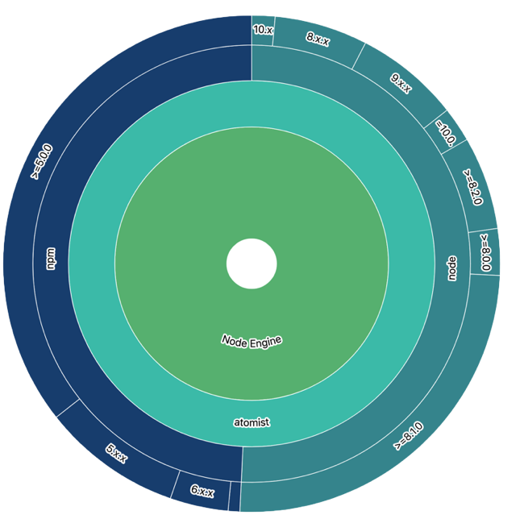

Aspects visualize technology usage across an organization. These concerns are captured from anything available in a Git repository, whether that's  the files themselves or data about committer activity. For example, use or create aspects that capture the following:

* The different software dependencies your repositories are using
* The different ports exposed in your Dockerfiles
* The dates your repositories were last updated

All of the different variants are presented in a [sunburst chart](https://en.wikipedia.org/wiki/Pie_chart#Ring_chart,_sunburst_chart,_and_multilevel_pie_chart), so that you can identify an aspect's drift amongst all of your repositories.

In this example, we’ll create an aspect that inspects [the `engines` field](https://docs.npmjs.com/files/package.json#engines) within a Node.js `package.json` file. We'll capture the different versions of `node` and `npm` required in our organization's Node repositories.



## Prerequisites

To set up, follow the steps in [Starting Locally](../quick-start.md). This will get you a running instance of org-visualizer. Then you can modify the code to add an aspect of your own.

## Foundations of an aspect

At its core, an aspect is generally comprised of two tasks:

1.  Decide what data represents a variant of the aspect
2.  Figure out how to parse that from the repository

All of the heavy lifting of iterating through an organization's repositories and generating the sunburst chart are handled for you, so if you know how to parse the data you're interested in collecting, you're already halfway towards building an aspect!

## Defining the data format and aspect type

Before writing our aspect, it's important to understand how we will store the information we've found. We know that every `package.json` engine has a `name` and a `version`, so let's define an interface with named keys, like this:

```typescript
export interface EngineData {
  name: string;
  version: string;
}
```

Furthermore, in order to avoid collisions with other Atomist aspects, we will define our aspect's name. This is also used to create unique fingerprints:

```typescript
export const NodeEngineName = "nodeEngine";
```

## Creating a fingerprint

Next, we'll create a fingerprint of our data. Aspects (and Atomist) rely on fingerprints to compare and updates changes made to the source repository. All that [a `Fingerprint` interface](https://atomist.github.io/sdm-pack-fingerprint/interfaces/_lib_machine_aspect_.fp.html) needs is some kind of data to store, and a sha to identify it. For our use case, we already know that we need to preserve an engine's name and version, so we can hash this combination without much effort.

A function to fingerprint our data might look like this:

```typescript
export function createEngineFingerprint(
  name: string,
  version: string,
): FP<EngineData> {
  const data = { name, version };
  return {
    type: NodeEngineName,
    name: "NodeEngine-" + name,
    abbreviation: "engines",
    version: "0.0.1",
    data,
    sha: sha256(JSON.stringify(data)),
  };
}
```

Here, we've provided a `name` and `version` which have been extracted out of package.json and passed into this method (we'll show how to do this next).  data = { lastCommitTime: new Date(r.stdout.trim()).getTime() };

## Extracting relevant data

Now comes the main portion of our aspect: pulling out the `engine` data from our package.json files. To do this, we'll need to:

* Define our method signature
* Fetch a package.json file
* Parse the `engine` data
* Fingerprint the `name` and `version` keys

The method signature for every extract method takes the same shape:

```typescript
const funcName: ExtractFingerprint<EngineData> = async p => { ... }
```

[An `ExtractFingerprint` function](https://atomist.github.io/sdm-pack-fingerprint/modules/_lib_machine_aspect_.html#extractfingerprint) takes in our project, and returns an array of fingerprints (or `undefined` if nothing is found).

There's no special sauce necessary, as Atomist provides [methods](project.md) for all sorts of file detection and parsing ([the tutorial on code transforms](/developer/first-transform/) has more information on this). First, let's grab that package.json file:

```typescript
const file = await p.getFile("package.json");
if (file) {
  // do something
} else {
  return undefined
}
```

If we have a package.json file, we'll grab its contents and then parse it:

```typescript
const jsonData = JSON.parse(await file.getContent());
const engines = _.merge(jsonData.engines || {});
```

After that, we'll pass the `name` and `version` keys to the `createEngineFingerprint` function we defined above:

```typescript
const fingerprints: FP[] = [];

for (const [name, version] of Object.entries(engines)) {
  fingerprints.push(createEngineFingerprint(name, version as string));
}

return fingerprints;
```

That's it! In more complex situations, you may want to introduce some additional error handling if your desired keys aren't found in a package.json file, or if they're malformed. In this case, not every package.json even _has_ an `engine` key, so we will just return an empty array.

A full example of the function might look like this:

``` typescript
export const extractNodeEngine: ExtractFingerprint<EngineData> = async p => {
  const file = await p.getFile("package.json");

  if (file) {
    const jsonData = JSON.parse(await file.getContent());
    const engines = _.merge(jsonData.engines || {});

    const fingerprints: FP[] = [];

    for (const [name, version] of Object.entries(engines)) {
      fingerprints.push(createEngineFingerprint(name, version as string));
    }

    return fingerprints;
  } else {
    return undefined;
  }
};
```

## Exporting the aspect

With the above groundwork laid out, our last task is to export the created aspect. When it comes to [constructing an `Aspect`](https://atomist.github.io/sdm-pack-fingerprint/modules/_lib_machine_aspect_.html), there are three important functions to define:

* `extract`: the fingerprinting function
* `toDisplayableFingerprintName`: this represents the name of the "inner" ring in our sunburst chart; in our case, it's the name of the engine
* `toDisplayableFingerprint`: this represents the name of the "outer" ring in our sunburst chart; in our case, it's the version of the engine

The `extract` method is our `extractNodeEngine` function defined above. The fingerprint displays are in two different formats:

* `toDisplayableFingerprintName` passes in a `name` argument. This is the same value that was used when creating our fingerprint in `createEngineFingerprint`. You can pass in the value directly, or, provide a method that takes this argument for additional string manipulation.
* `toDisplayableFingerprint` passes in the fingerprint data object directly.

A sample function to export this aspect might look like this:

```typescript
/**
 * Find the engines defined in a package.json file
 * @constructor
 */
export const NodeEngine: Aspect<EngineData> = {
  name: NodeEngineType,
  displayName: "Node Engine",
  extract: extractNodeEngine,
  toDisplayableFingerprintName: name => name.replace("NodeEngine-", ""),
  toDisplayableFingerprint: fpi => {
    return fpi.data.version;
  },
};
```

## Using the aspect

Add this Aspect to the list of aspects. In org-visualizer, this is in [`aspects.ts`](https://github.com/atomist/org-visualizer/blob/4c21d201f1fc16d6157fbf6d03ff1d6e23799e23/lib/aspect/aspects.ts#L61).

Now run org-visualizer and analyze some repositories, as described in [Starting Locally](../quick-start.md). Your aspect will appear in the visualizations.