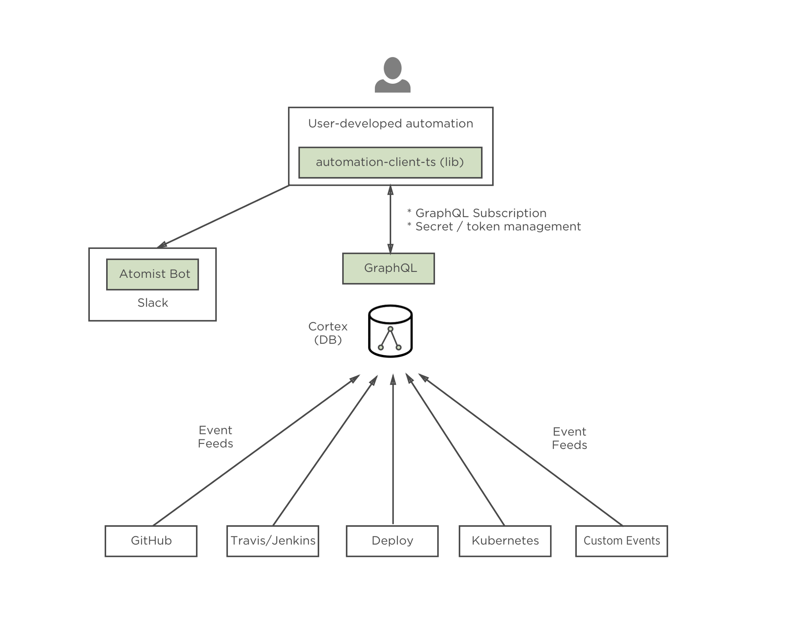

An automation client is a program that runs on your laptop or wherever you deploy it. It executes the automations you write, triggered by Atomist.



You interact with the Atomist development automation API via a
client [WebSocket][ws] connection.  WebSocket connections are
persistent, providing bidirectional communication between the client
and the API.  As such, the client process is a persistent process with
a lifecycle that is more like a traditional _server_ process.  This
section documents creating, building, and running an automation
client, discusses each part of the client lifecycle, and details the
structure and organization of a typical automation client project.

Before you can build and run your own automation client,
{!prereq-items.md!}

[ws]: https://en.wikipedia.org/wiki/WebSocket (WebSocket)

## Creating a client project

An automation client project is any project that connects to the
Atomist development automation API.  The reference implementation of
the automation client is the [automation-client-ts][client-ts]
library, which is written in [TypeScript][ts].  The combination of
TypeScript and [GraphQL][gql] provides an excellent development
experience, with excellent tooling and debugging support.

There are a few ways to create a new automation client project.  We
suggest using the [automation-seed-ts][seed] project as a seed for
your automation client project.

[client-ts]: https://github.com/atomist/automation-client-ts (Atomist Automation Client - TypeScript)
[ts]: https://www.typescriptlang.org/ (TypeScript)
[gql]: http://graphql.org/ (GraphQL)
[seed]: https://github.com/atomist/automation-seed-ts (Atomist Automation Client Seed Project)

### Slack

You can create your very own automation client project using the
Atomist bot.  You can run this bot command, which itself is
implemented as a command handler, with the following message to the
Atomist bot:

```
@atomist generate automation
```

The bot will ask you where you want to create it, what you want to
name it, and, once creation is complete, tell you where you can find
it.

### Command line

You can use the Atomist CLI to create a new automation project from
the automation-seed-ts project.  Run the following command, replacing
`PROJECT_NAME` with the name of your new project.

```
atomist execute NewAutomation --name=PROJECT_NAME
```

### GitHub

If you prefer the manual route, fixing up the project metadata
yourself, you can always just fork the [automation-seed-ts][seed]
project on GitHub.

## Building a client

Most automation client projects are written in [TypeScript][ts] and
run on [Node.js][node].  Building an automation client is the same as
any standard TypeScript or JavaScript project.  First you install the
project's dependencies

```
npm install
```

then build the project, linting the TypeScript, compiling the
TypeScript into JavaScript, generating other required files, and
running tests.

```
npm run build
```

[node]: https://nodejs.org/en/ (Node.js)

## Client configuration

The automation client will use the configuration you created when you
ran `atomist config` as part of the [prerequisites][atomist-config].
The configuration file, typically located under your home/user profile
directory at `.atomist/client.config.json`.  It is a standard JSON
file that will look something like:

```json
{
  "token": "abcdef0123456789abcdef0123456789abcdef01",
  "teamIds": [
    "TK421WAYA",
  ]
}
```

The `token` is your [GitHub personal access token][token] and the
`teamIds` are the Slack teams where you want to run your automations.
If you want to change the token or add/remove teams, you can just edit
this file directly.  Remember, whatever token you use, it must have at
least _read:org_ and we recommend it also have the _repo_ scope.

If you are managing several automation client projects for different
teams, you can override your user-level configuration using the
project-level configuration in each project, typically located at
`src/atomist.config.ts`.  A typical project configuration file will
look like this:

```typescript
import { Configuration } from "@atomist/automation-client/configuration";
import * as appRoot from "app-root-path";

// tslint:disable-next-line:no-var-requires
const pj = require(`${appRoot}/package.json`);

const token = process.env.GITHUB_TOKEN;

export const configuration: Configuration = {
    name: pj.name,
    version: pj.version,
    teamIds: [],
    token,
};
```

If the `teamIds` array exists and its length is greater than zero (0),
the value in the project configuration will be used.  If the
environment variable `GITHUB_TOKEN` exists and has non-zero length, it
will be used.  For more complex configurations, e.g., different teams
and tokens for different environments, you can use the [config][]
Node.js package to supply values for `teamIds` and `token`.

By default, all automations in your project will be registered with
the automation API when the client starts up
(see [lifecycle][lifecycle]).  If you only want a subset of your
automations active, you can explicitly list them using the `commands`
and `events` arrays in the `configuration` object:

```typescript
import { HelloWorld } from "./commands/HelloWorld";
import { NotifyOnPush } from "./events/NotifyOnPush";

export const configuration: Configuration = {
    name: pj.name,
    version: pj.version,
    teamIds: [],
    token,
    commands: [
        HelloWorld,
    ],
    events: [
        NotifyOnPush,
    ],
};
```

[config]: https://www.npmjs.com/package/config (config Node.js package)
[lifecycle]: #client-lifecycle (Atomist Automation Client Lifecycle)

## Starting a client

There are a few different ways to start the automation client,
depending on how you are running it.  If you are running the
automation client locally, you can use the standard NPM `start`
command.

```
npm start
```

If you are writing your own automations, you probably want a more
responsive testing environment, having the client restart any time you
make changes to the source code.  This fairly standard development
flow is available with the `autostart` command.

```
npm run autostart
```

When running in a production environment, you typically want to avoid
NPM and run Node.js directly to ensure signals get delivered properly
and you can provide guidance to Node.js's memory management subsystem.
Here's an example startup command for production environments:

```
node $NODE_DEBUG_OPTION --trace-warnings --expose_gc --optimize_for_size \
    --always_compact --max_old_space_size=384 node_modules/.bin/atomist-client
```

See `node --help` and `node --v8-options` for more detail on these
options.

## Client lifecycle

The automation client lifecycle will be familiar to those developing
persistent applications.

1.  **Authentication** - When the automation client starts up, it
    connects to the automation API and authenticates using
    the [GitHub personal access token][token] you have provided in
    your client configuration file.  This token has _read:org_ scope,
    allowing the automation API to establish who you are and your
    GitHub organization memberships.

2.  **Registration** - Once your identity has been established, the
    client registers its automations, i.e., the bot commands it
    provides and the events it wants to receive, with the Slack teams
    specified in your client configuration.  If Atomist does not
    recognize your Slack team or your GitHub identity is not connected
    to any member of that Slack team, registration will fail and the
    client will exit with an unsuccessful status.

3.  **Listening** - After authentication and registration is completed
    successfully, the WebSocket connection is established and the
    client begins listening for incoming messages from the API: bot
    commands and events fired.

4.  **Shutdown** - When the client receives a shutdown signal,
    typically `SIGINT` delivered by the PaaS or `Ctrl-C`, it
    de-registers with the API and gracefully shuts down.

[token]: prerequisites.md#github-token

## Project structure

Automation client projects are organized and behave like any standard
TypeScript project.

### package.json

The `package.json` file defines the metadata and dependencies for the
project.  In addition, this file defines the standard "NPM package
scripts", i.e., `npm run` commands, typically available in Node.js
projects.  Here's a summary of the NPM package scripts available in
most automation client projects.

Command | Description
------- | ------
`npm install` | install all the required packages
`npm run autostart` | run the client, refreshing when files change
`npm run autotest` | run tests every time files change
`npm run build` | lint, compile, and test
`npm run clean` | remove stray compiled JavaScript files and build directory
`npm run compile` | compile all TypeScript into JavaScript
`npm run fmt` | run tsfmt on TypeScript files
`npm run lint` | run tslint against the TypeScript
`npm run lint:fix` | run `tslint --fix` against the TypeScript
`npm start` | start the Atomist automation client
`npm test` | run tests

### build

The `build` directory contains the JavaScript sources output from
TypeScript compilation.

### config

The `config` directory is optional, used only when you use
the [config][config-js] Node.js package.

[config-js]: https://www.npmjs.com/package/config (Node-config)

### graphql

The `graphql` directory contains `.graphql` files defining
your [GraphQL][gql] queries, subscriptions, and mutations.  This
directory is optional, as you can define your GraphQL in strings
within the source code.  That said, it is recommended that you define
your GraphQL in `.graphql` files so you can realize the full benefit
of its type bindings in TypeScript.

### node_modules

The `node_modules` directory contains all the project dependencies, as
defined in the `package.json` and installed by NPM.

### scripts

The `scripts` directory contains various ancillary scripts.  For
example, this directory might have scripts for building the project on
CI, publishing the project as an Node.js package, and publishing the
project's [TypeDoc][typedoc].

[typedoc]: http://typedoc.org/ (TypeDoc)

### src

The `src` directory contains the TypeScript source code.

#### atomist.config.ts

The `atomist.config.ts` file contains automation client
project-specific configuration.
See [Client Configuration][client-config] for more details.

[client-config]: client.md#client-configuration (Atomist Automation Client Configuration)

#### commands

The `src/commands` directory contains the source code for commands.

#### events

The `src/events` directory contains the source code for event
handlers.

#### typings

The `src/typings` directory contains the auto-generated TypeScript
types for your GraphQL queries, subscriptions, and mutations.

### test

The `test` directory contains the automated tests for the project.
Typically these are unit tests written using [mocha][]
and [power-assert][].

[mocha]: https://mochajs.org/ (Mocha)
[power-assert]: https://github.com/power-assert-js/power-assert#readme (power-assert)

<!--
## Debugging with Visual Studio Code
-->
