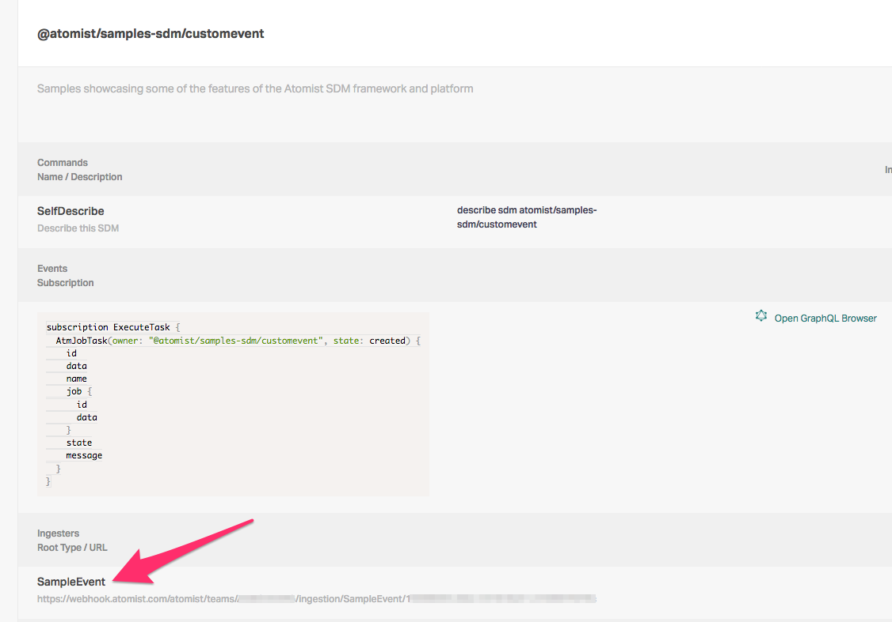

A powerful feature of Atomist is the ability to extend the default data model to include custom event types.
These custom events can be used to support new integrations within Atomist or to record additional data points related
to built-in event types.

Within the SDM framework developers can define new events by extending the GraphQL schema itself.  This is accomplished
by defining a custom `ingester`.  An ingester is created by defining a new `.graphql` file and using some Atomist
specific annotations.

## An Example Ingester

To create a new ingester, within your SDM project, create a new folder called
`<project root>/lib/graphql/ingester`.  To create a new ingester for a sample event, we'll define a new GraphQL file
within the new folder called `sampleEvent.graphql`:

```graphql
type SampleEvent @rootType {
    timestamp: String!
    message: String!
}
```

This simple file will create a new type in your GraphQL schema.  However, there is other activity happening with this
ingester because of the `@rootType` annotation.  This annotation causes the Atomist backend to create the required
indexes, mutations, and webhook endpoints so that you can add data for this type.

Once the new ingester is defined, it will need to be configured within your SDM so that this new type will be setup in
your Atomist workspace.  Within the SDM, add the new ingester:

```typescript
sdm.addIngester(GraphQL.ingester({ name: "SampleEvent" }));
```

Next, you can startup your SDM via the usual `atomist start` command.   Once the startup completes, you will now have a
custom event that has been added to your GraphQL schema.

## Utilizing the new custom event

There are two ways new data can be delivered for your new event - a REST endpoint(typically used by webhooks) or via the
SDM in the form a GraphQL mutation.  We'll explore both of these.

### REST Endpoint

After starting your SDM with the new ingester registered, you can retrieve your REST endpoint for the new event type
from either the SDM log or from the Atomist Web UI.  The Web UI is simpler, so that method will be discussed here.
Login to `https://app.atomist.com` and navigate to your workspace (if you have access to more then one).  On the left
-hand vertical menu, select `SDMs`.  Navigate in the list of SDMs to your instance, and click the down chevron on the
right-hand side.  Scroll  through the dialog until you see the `Ingesters` section.  Below `SampleEvent` (or whatever
you've named your event), you will see a URL with this format:
`https://webhook.atomist.com/atomist/teams/<TEAM>/ingestion/SampleEvent/<ID>`.



With the URL in hand, you can now post data to this endpoint from any source you like (provided it matches the schema
of the event you've defined).  Commonly, this data will come from a webhook configured in a tool used in your
delivery process.  The endpoint accepts `application/json` as a content type and requires no authentication.  You can
test this endpoint using curl.

For example (substitute your URL):
```
curl -d "{\"timestamp\": \"`date +%s`\", \"message\": \"hello world\"}" -H "Content-Type: application/json" -X POST https://webhook.atomist.com/atomist/teams/WORKSPACE_ID/ingestion/SampleEvent/ID
```

A successful response from the above command will look like:
```
{"correlation-id":"21f04ba7-86b9-404d-97bd-87961664a247","message":"successfully posted event"}
```

> Should there be failures the response will include a type and error message, as well as a non-200 HTTP response code.

### Using a GraphQL mutation

A GraphQL mutation can also be used to send event data to Atomist. When events need to be emitted from the SDM itself,
this is the common interface used.  Defining a custom ingester (as we did for SampleEvent) causes the Atomist backend to
automatically creates several mutations in your schema that can be used to ingest or remove data. These mutations are
automatically named after your event name. For example, SampleEvent will have three mutations created automatically:
ingestCustomSampleEvent, deleteCustomSampleEvent, and deleteCustomSampleEventById.

You can utilize the graphClient in the SDM to execute these mutations. The graphClient is accessible from within command
handlers and event handlers. To demonstrate this functionality, we’ll be defining a new command handler that will create
a SampleEvent via mutation the same way our curl command did previously.

Before we can successfully send data to the GraphQL server for this mutation, we do have to supply our SDM itself a
mutation file that it will use to create the body of the message that is sent to the GraphQL server.   Also, the tooling
used to start or build an SDM project can create Typescript types for this mutation dynamically.   By doing so, it
dramatically improves the development experience since your IDE is then able to inform you of what properties are
required when executing the mutation in the SDM.

To generate these types for our mutation, the first thing we’ll need is to download a copy of your modified schema.
To download a copy of this schema, first, start your SDM (with your custom ingester defined) and leave it running.
Next, navigate to the base directory of the running SDM and run the command `atomist gql-fetch`.  This command will
download your custom schema and place it into the `<project root>/lib/graphql` folder. This file will be used later when
we generate types for your mutation.

With our schema downloaded, we are ready to create the mutation file.  To do this, we first create a new folder called
`<project root>/lib/graphql/mutation`.  Within this folder, we'll create a new file called `AddSampleEvent.graphql`.

It's contents should look like this:
```graphql
mutation AddSampleEvent($data: CustomSampleEventInput!) {
    ingestCustomSampleEvent(value: $data)
}
```

> What is `CustomSampleEventInput`?  This type is automatically generated as part of your schema when your ingester was
> created to describe the shape of the data that the `ingestCustomSampleEvent` mutation accepts

With the mutation file added, we'll want to generate Typescript types for the newly added mutation.  We do this by again
navigating to the root of your SDM project and running the following command:

`npm run gql:gen`

This process consumes any GraphQL files you've defined (mutations, queries, or subscriptions) and creates Typescript
type definitions that you can use in your SDM code.

> Note: The types are generated in `<project root>/lib/typings/types.ts`

With our mutation file created and types generated we are ready to define our command handler; here's an example:

```typescript
import {AddSampleEventMutation, AddSampleEventMutationVariables} from "../../typings/types";
<...>

sdm.addCommand({
    name: "create-sample-event",
    intent: "create sample event",
    listener: async ctx => {
        await ctx.addressChannels("Sending custom sample event...");
        const result = await ctx.context.graphClient.mutate<AddSampleEventMutation, AddSampleEventMutationVariables>({
            name: "AddSampleEvent",
            variables: {
                data: {
                    message: `My new event from ${ctx.context.source.identity}`,
                    timestamp: Date.now().toString(),
                },
            },
        });

        await ctx.addressChannels(`New event id: ${result.ingestCustomSampleEvent}`);
        return Success;
    },
});
```

When this command is executed it will execute our mutation and create a new `SampleEvent`.  The returned value (in the
`result` variable) will be the actual id of this event.  This id can be used for filtering purposes when querying the
graph or running a delete mutation - but in this example we simply return this id to the calling user.

> See the [Samples](https://github.com/atomist/samples) repository for a working example of the code shown above.
