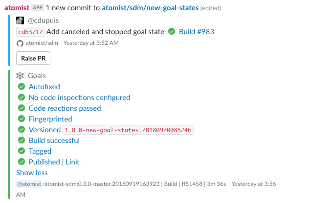

The most important SDM functionality relates to what
happens on a push to a repository. An SDM allows you to process a push
in any way you choose, but typically you want it to initiate a
delivery flow.

# Goals

An SDM allows you to set **goals** on push. Goals correspond to the
actions that make up a delivery flow, such as build and
deployment. Goals are not necessarily sequential--some may be executed
in parallel--but certain goals, such as deployment, have preconditions
(goals that must have previously completed successfully).

In Slack, a push notification with several goals looks like this:



Set goals wherever you configure your SDM, probably in `lib/machine/machine.ts`. This example comes
from [a Spring SDM](https://github.com/atomist-seeds/spring-sdm/blob/master/lib/machine/machine.ts).

You can instantiate create goals and add implementations to them. Here, an Autofix goal has one autofix registered on it; it will add license headers to any 
code file that doesn't have one yet, and make a commit.

```
    const AutofixGoal = new Autofix().with(AddLicenseFile);
```

You can group goals into sets. Here, two goals are grouped: code inspection (but no code inspections are registered) and the Autofix goal.

```
    const BaseGoals = goals("checks")
        .plan(new AutoCodeInspection())
        .plan(AutofixGoal);
```

You can specify ordering, if some goals should wait for others to succeed. Here, we don't want to start the build until after Autofixes have completed.
If the autofixes do anything, they'll make a new commit, and we don't bother building this one.

```
    const BuildGoals = goals("build")
        .plan(new Build().with({ name: "Maven", builder: new MavenBuilder(sdm) }))
        .after(AutofixGoal);
```

Finally, you can tell the SDM which goal sets to run on . Here, we set the BaseGoals (inspection and autofix) on every push. Then if 
this is a Maven project (identified by having a pom.xml), we do the build as well.

```
    sdm.addGoalContributions(goalContributors(
        onAnyPush().setGoals(BaseGoals),
        whenPushSatisfies(IsMaven).setGoals(BuildGoals),
    ));
```

## Built-in Goals

A goal object has some identifying information, code to fulfill the goal, and sometimes preconditions (goals that need to complete before this one can go). Some common ones have their own constructors:

### AutoInspect

Run an inspection on the code; if the code doesn't pass, you can fail the goals or require approval (a button push). To use it, you'll need to create one, set it on each push, and register inspections on it.

Instantiate an empty one:

```typescript
export const CodeInspectionGoal = new AutoCodeInspection();
```

And set it when you want it to run on a push. Here's the shortest way to run this goal on every push:

```typescript
    sdm.addGoalContributions(goalContributors(
        onAnyPush().setGoals(goals("Inspections").plan(CodeInspectionGoal))))
```

Now the fun part: register inspections on it. Check the [Inspections][inspection] page for more on how to write inspections.
Once you have an [AutoInspectRegistration][AutoInspectRegistration], register it on your goal:

```typescript
CodeInspectionGoal.with(MyAutoInspectRegistration)
    .with(AnotherInspectRegistration);
```

You can register any number of inspections. You can call `with` on the goal at any point in SDM configuration.

If no inspections are registered, the goal will succeed. If any registration's `onInspectionResult` returns "fail", the goal will fail. If none return "fail" but one returns "require approval", the goal will go to Waiting for Approval state until someone clicks the Approve button in Slack or on the Atomist dashboard. 

[AutoInspectRegistration]: https://atomist.github.io/sdm/interfaces/_lib_api_registration_autoinspectregistration_.autoinspectregistration.html (AutoInspectRegistration API Doc)
[inspection]: inspect.md (Automatic Code Inspections)

### Autofix

### PushImpact


## Custom Goals