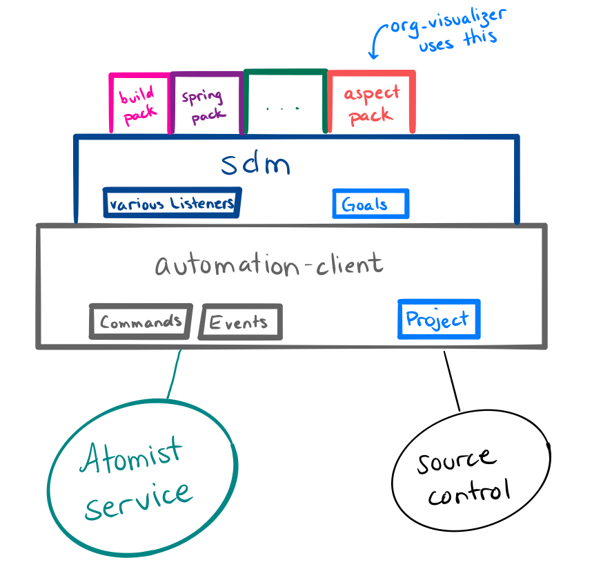

# Developing your Software Delivery Machine

Are you a developer who wants to streamline your team's work?

Are you charged with improving Developer Experience or Developer Productivity at
your organization?

Do you bear responsibility or oversight for more repositories than you can
inspect? Are checks and approvals slowing your teams' progress?

Atomist is a platform for automating many parts of development, especially tasks
that are painful at scale.

This includes collaborating with people in chat, investigating code across many
repositories, applying changes across them, delivering code, and many other
automations.

## About this Developer Guide

The Developer Guide section of these docs is for people writing automations that
run on the Atomist platform.

If your team uses Atomist, and you want to understand the built-in features,
start in [Using Atomist](../user/index.md).

If you want to see examples of the kinds of automation Atomist makes feasible,
this is a good place to be.

## Instructions

Once you have a local SDM up and running, here are some things you can do with
it:

-   Add a [chat command](commands.md)
-   Add an [autofix](autofix.md)
-   Add a [code inspection](inspect.md)
-   Add a [custom goal](goal.md) for your team's specific need

Also check out some [fuller tutorials](tutorials.md)

## Concepts

In your own SDM, you have many tools available to automate your organization or
team's software development (including delivery). To provide all the options,
while making the common work easier, we layer some abstractions.

The Atomist service provides triggering, [chat integration](../user/slack.md),
and a [GraphQL interface](graphql.md) to events and the context around them.
Your software delivery machine connects to that service. This connection is
handled in the `@atomist/automation-client` [library][npm-automationclient].
That library works in terms of commands (which people trigger from chat) and
events. It also interfaces with source control; it clones repositories, makes
commits, pushes them, etc.

[npm-automationclient]:	https://npmjs.com/@atomist/automation-client "Automation Client library"
[npm-sdm]: https://npmjs.com/@atomist/sdm "SDM library"

On top of that, the `@atomist/sdm` [library][npm-sdm] provides a domain model
for software delivery. This library understands many of the events that people
want to react to, including new [issues](event.md#issues),
[new repositories](event.md#repository-creation), and the all-important push.
The push triggers [PushRules](set-goals.md), which result in [Goals](goal.md),
which the SDM knows how to execute. The Goals include familiar activities like
Build and Deploy, plus activities that you won't see in older build tools:
[AutoCodeInspect](inspect.md), [Autofix](autofix.md), and
[Fingerprint](fingerprint.md), for instance.

Learn more about the high-level concepts in [Architecture](architecture.md).

## Questions?

We are available in the [Atomist community Slack][join], or through the chat
icon at the bottom of this page. If you have requests or suggestions for this
documentation, find me in the #docs channel.

[join]: https://join.atomist.com/ "Atomist community Slack"
