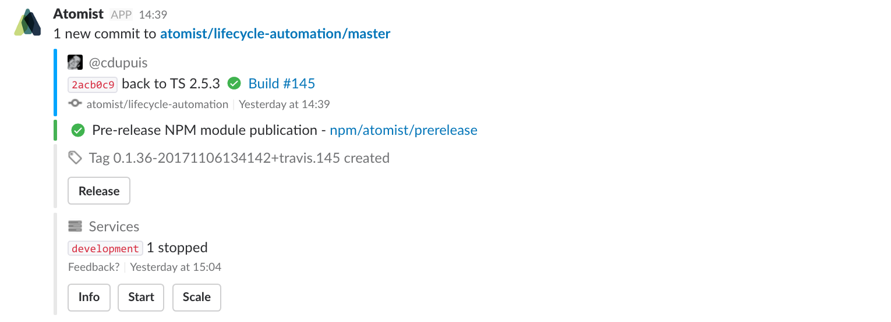
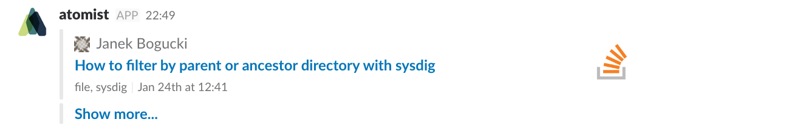

Atomist supports sending _rich_, _actionable_ and _updatable_ Slack
messages. Messages can be sent by an event handler or a command
handler.

*   _Rich_ messages take full advantage of Slack's native message
    formatting capabilities
*   _Actionable_ messages contain buttons and menus that trigger new
    commands on behalf of the user who clicked them
*   _Updatable_ messages can be rewritten with new content over time
    in response to new events and actions. This helps reduce the
    number of messages from the Atomist bot in a Slack channel.

Here's an example of a message with different
[`Attachments`](https://api.slack.com/docs/message-attachments) and
[`Actions`](https://api.slack.com/interactive-messages) from the
Atomist open source community Slack workspace.



If you're not familiar with the main concepts of Slack message formatting, you may want to read [Slack's documentation](https://api.slack.com/docs/message-formatting) before you read the following sections.

## MessageClient interface

Let's take a look at the [`MessageClient`](https://github.com/atomist/automation-client/blob/master/lib/spi/message/MessageClient.ts) interface.

```typescript
export interface MessageClient {

    respond(msg: string | SlackMessage, options?: MessageOptions): Promise<any>;

    addressUsers(msg: string | SlackMessage, userNames: string | string[],
                 options?: MessageOptions): Promise<any>;

    addressChannels(msg: string | SlackMessage, channelNames: string | string[],
                    options?: MessageOptions): Promise<any>;

    ...
}
```

The `MessageClient` provides access to methods for sending messages to Slack. It
allows you to address messages to users or channels by name or to simply send a
response message.

Generally the `MessageClient` is available from the `HandlerContext` parameter
to the `handle` method of [command][] and event handlers.

[command]: commands.md (Atomist Commands)

### Response messages

A response message is a message that is sent while handling a request to
run a certain command; they can therefore only be sent by command handlers.
Use the `respond` method to sending a response message. The Atomist platform takes
care of delivering the message into the right conversation in Slack.

The following example shows how to send a response message from a command handler.

```typescript
export class HelloWorld implements HandleCommand {

    public handle(ctx: HandlerContext): Promise<HandlerResult> {
        return ctx.messageClient.respond("Hello from Atomist")
            .then(() => Success, failure);
    }
}
```
### User and channel messages

Address messages to users by calling the `addressUsers` method,
providing one or more names of Slack users. To send a message to one
or more channels, call the `addressChannels` method.

!!! note
    If you want to send a direct message to a user in your Slack workspace,
    use the `addressUsers` method with the user name of the recipient.

Here is an example of sending a simple message into the `#general` channel of
your Slack workspace:

```typescript
export class HelloWorld implements HandleCommand {

    public handle(ctx: HandlerContext): Promise<HandlerResult> {
        return ctx.messageClient.addressChannels("Hello from Atomist", "general")
            .then(() => Success, failure);
    }
}
```

In this example, you are sending the message only to the `#general` channel. It is
possible to send the same message into more than one channel by simply providing
an array of channel names to the `addressChannels` method. The same works for
`addressUsers`.

## Formatting messages

In the previous section you saw how to address and send messages to Slack. This section covers
formatting simple and complex Slack messages. It also demonstrates how to add buttons and menus to messages.

### Simple messages

The `addressUsers`, `addressChannels` and `respond` methods accept a `string`
message as first argument. A simple `string` message can still have some basic
formatting.

Here are a couple of examples of simple messages:

| Code | Output |
|------|--------|
| `messageClient.respond("This is a plain message");` | This is a plan message |
| `messageClient.respond("This some *bold* text");` | This is some **bold** text |
| `messageClient.respond("This some _italics_ text");` | This is some _italics_ text |
| `messageClient.respond("Some multiline\ntext");` | Some multiline<br>text |

More details on Slack text formatting can be found their the [documentation](https://api.slack.com/docs/messages).

### Rich messages

For more complex, rich messages, Atomist provides the [`SlackMessage`](https://github.com/atomist/slack-messages) type as
part of the _@atomist/slack-messages_ NPM module.

The `SlackMessage` type can have `Attachments` and `Actions`. More details
on those concepts can be found in the [Slack documentation](https://api.slack.com/docs/message-attachments).

In order to create a formatted Slack message, simply build an instance of
`SlackMessage` with all desired properties. Here is an example:

```typescript
import * as slack from "@atomist/slack-messages";

const message: slack.SlackMessage = {
  attachments: [{
    fallback: "How to filter by parent or ancestor directory with sysdig",
    author_name: "Janek Bogucki",
    author_link: "https://stackoverflow.com/users/148440/janek-bogucki",
    author_icon: "https://www.gravatar.com/avatar/5ccd05d83049593205406ac74eacb323?s=128&d=identicon&r=PG",
    title: "How to filter by parent or ancestor directory withsysdig",
    title_link: "https://stackoverflow.com/questions/41827350/how-to-filter-by-parent-or-ancestor-directory-with-sysdig",
    thumb_url: "https://slack-imgs.com/?c=1&o1=wi75.he75&url=https%3A%2F%2Fcdn.sstatic.net%2FSites%2Fstackoverflow%2Fimg%2Fapple-touch-icon%402.png%3Fv%3D73d79a89bded",
    footer: "file, sysdig",
    ts: 1485258115
  }, {
    fallback: "Show more...",
    title: "Show more...",
    title_link: "http://stackoverflow.com/search?order=desc&sort=relevance&q=atomist"
  }]
};
```
Once the `SlackMessage` is created you can send it via the `MessageClient`:

```typescript
ctx.messageClient.respond(message);
```
This renders the following in Slack:



### Adding message buttons

In the previous section you saw how rich messages can be created and posted to
Slack. Now you'll see how to turn this message into an actionable message by adding a
button to it.

With Atomist, it's easy to bind Slack action buttons to command handlers. Such a
binding consists of three parts: the specification of the button as required by
Slack, a reference to the [command handler][command], and optional parameters that should be
pre-populated when invoking the command.

The button specification is defined by Slack in the [field guide](https://api.slack.com/docs/interactive-message-field-guide).
Here is an example of a button with a confirmation pop-up:

```typescript
import { ButtonSpecification } from "@atomist/sdm";

const buttonSpec: ButtonSpecification = {
    text: "Search Again",
    confirm: {
        title: "Search Again?",
        text: "Do you really want to run the search again?",
        dismiss_text: "No",
        ok_text: "Yes"
    },
};
```

With the following, you're preparing a [command handler][command] and its parameter to be
bound to the button. This example uses the `SearchStackOverflow`
command handler from the Atomist [blog series](https://the-composition.com/extending-your-slack-bot-part-1-commands-aaa4dbd47933).

```typescript
const handler = new SearchStackOverflow();
handler.q = "atomist";
```

Now that you have the `ButtonSpecification` and the command handler, you can bring this
all together into a Slack message button and send the message. Create the action
button by calling the `buttonForCommand` function, passing the
`ButtonSpecification` and the command handler instance:

```typescript
import { buttonForCommand } from "@atomist/sdm";

const message: slack.SlackMessage = {
    attachments: [{
        // ...
    }, {
        fallback: "Show more...",
        title: "Show more...",
        title_link: "http://stackoverflow.com/search?order=desc&sort=relevance&q=atomist",
        actions: [
          buttonForCommand(buttonSpec, handler),
        ],
    }],
};

return ctx.messageClient.respond(message)
    .then(() => Success, failure);
```

### Adding message menus

Message menus are very similar to message buttons in the way they are created and
added to the message. The main difference is that menus are defined with a `MenuSpecification`
instead of a `ButtonSpecification`.

Besides the name of the menu, a `MenuSpecification` allows you to define menu options
and option groups.

See the following example:

```typescript
import { MenuSpecification } from "@atomist/sdm";

const menuSpec: MenuSpecification = {
    text: "Issue Labels",
    options: [{
        text: "Bug", value: "bug",
    }, {
        text: "Enhancement", value: "enhancement",
    }, {
        text: "Invalid", value: "invalid",
    }],
};

const message: slack.SlackMessage = {
    attachments: [{
        // ...
        actions: [
          menuForCommand(menuSpec, handler, "label"),
        ],
    }],
};
```

To create the menu, `menuForCommand` is called with the menu details, the reference
to the command handler and the name of the parameter on the command handler that
the selected value of the menu should be bound to; in this example, the value of
the option will be bound to the `label` parameter.

## Message options

With `MessageOptions` actionable Slack message can be turned into _updatable_
messages; the `MessageOptions` interface provides important options to handle
and tune message updates and rewrites in Slack.

The following section describes the properties on the `MessageOptions`
interface and what they can be used for. But first, here is the interface:

```typescript
export interface MessageOptions {

    /**
     * Unique message id per channel and workspace. This is required
     * if you wish to re-write a message at a later time.
     */
    id?: string;

    /**
     * Timestamp of the message. The timestamp needs to be
     * sortable lexicographically. Should be in milliseconds and
     * defaults to Date.now().
     *
     * This is only applicable if id is set too.
     */
    ts?: number;

    /**
     * Time to live for a posted message. If ts + ttl of the
     * existing message with ts is < as a new incoming message
     * with the same id, the message will be re-written.
     */
    ttl?: number;

    /**
     * If update_only is given, this message will only be posted
     * if a previous message with the same id exists.
     */
    post?: "update_only" | "always";
}
```

The `id` property uniquely identifies a message in a channel or
direct message. It therefore must be unique in the scope of a channel
or direct message.

`ts` specifies the time in milliseconds of the message. If not set, it
defaults to the current time. This property is important to maintain correct
order of messages: the Atomist bot will not post a message with a `ts`
if there is a message for the same `id` but a later `ts` already in the channel
or direct message.

`ttl` or time-to-live defines the amount of time in milliseconds that a message can be updated, after which a new instance of the message is posted to the bottom of the Slack stream. So, when a message is received by the bot,
it compares the `ts + ttl` of the existing message with `ts` of the new
message; if `ts + ttl` is smaller, a new message ia posted to the bottom
of the Slack stream and the existing message is not rewritten. As long `ts + ttl`
is greater then `ts` of the new message, the existing message will be overwritten.

Lastly, the `post` property specifies whether a message should be posted only if
it is an update to a previously posted message with the same `id`. If
`post === "always"`, the message is always posted as a new message and never rewrites
a previous message.
will never rewrite a previous message.
