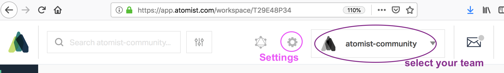
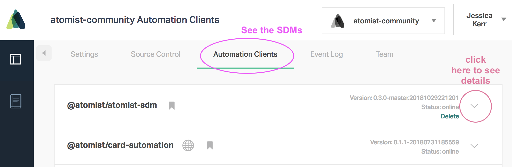
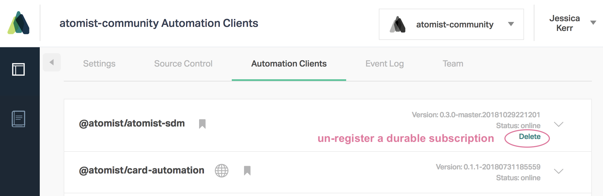

In team mode, your SDM connects to the Atomist service.

You get:

* triggering, on GraphQL subscriptions. Events are [saved up](#durable-subscriptions) while your SDM is down or restarting.
* chat integration. The `addressChannels`  function on listener and goal [invocations](invocation.md)
sends messages to [linked channels](../user/lifecycle.md#linked-channels) in Slack or MS Teams.
* queries to a persistent model. Execute GraphQL against the history of your commits, deployments, builds, etc.
* linkable [goal progress logs](logging.md#goal-progress-logs)

## What is necessary to enable team mode

You'll need an Atomist workspace for your team or organization. See [Getting started](../user/index.md) to sign up,
or ask your Atomist administrator to invite you to the team's workspace.

You'll need the workspace ID and an API key.

### Find the workspace ID

On the [web interface][dashboard], you can find the Workspace ID on the settings page (click the gear).

### Get an API key

You'll need an API key that identifies you to the Atomist service. [Get one here](https://app.atomist.com/apiKeys)
Obtain this from the [web interface][dashboard], by clicking on your username in the upper right.

[dashboard]: ../user/dashboard.md (Atomist web interface documentation)

### Provide the API key to the SDM

Supply the API in [configuration](config.md) -- the easiest way is by running `atomist config` in your terminal, or by
populating the API key in your `$HOME/.atomist/client.config.json` file.

## See your SDM registration

When your SDM registers with the Atomist service, you can see this registration in the Atomist web interface.

Go to [app.atomist.com](https://app.atomist.com), log in, and make sure your team is selected. Then click on the little "Settings" gear.

]

Choose "Automation Clients" from the tab. (This includes SDMs.) This will show you a list of registered SDMs and built-in automations. Click the little down arrow to expand information.

]

The detailed information on the registered SDM includes commands, event subscriptions, and a metadata section. The metadata section has clues about where it's running, such as the `system.hostname`. It also shows the `atomist.policy`: durable or ephemeral.

### Durable subscriptions

An SDM that starts up as durable (usually because you ran it with `ATOMIST_ENV=production`) will get all the events it subscribes to,
even if it is not up all the time. The Atomist service saves events for it (up to a point).
 This registration will remain active even when the SDM is down. Every unique name/version combination will
 remain active until you delete the registration in the web interface.

 Click "delete" to remove a durable registration. You'll need to do this when you upgrade your SDM to a new version, after you shut down the old version.

]

 In development mode, like when you're experimenting with an SDM on your laptop, you want `atomist.policy` to be `ephemeral`. Events are sent while the SDM is up, and ignored while it is down. The registration disappears when the SDM disconnects.

## More info

* See more about [deploying SDMs in production](sdm-deploy.md)
* Contrast with [local mode](local.md)
