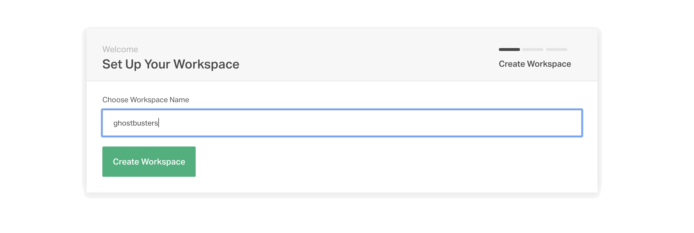
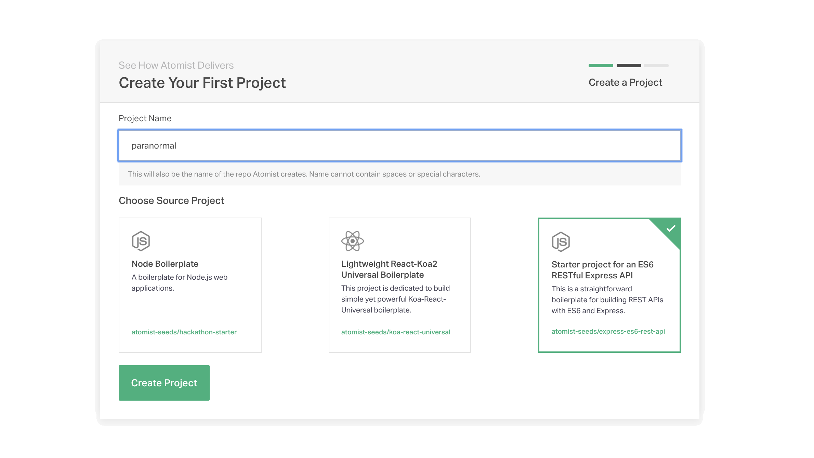
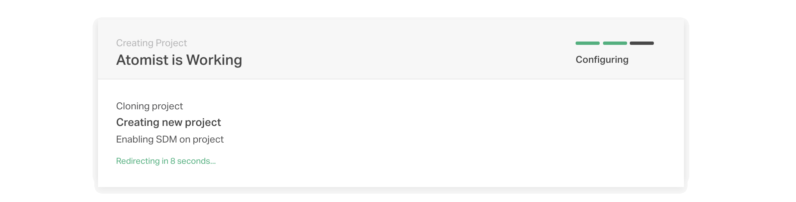
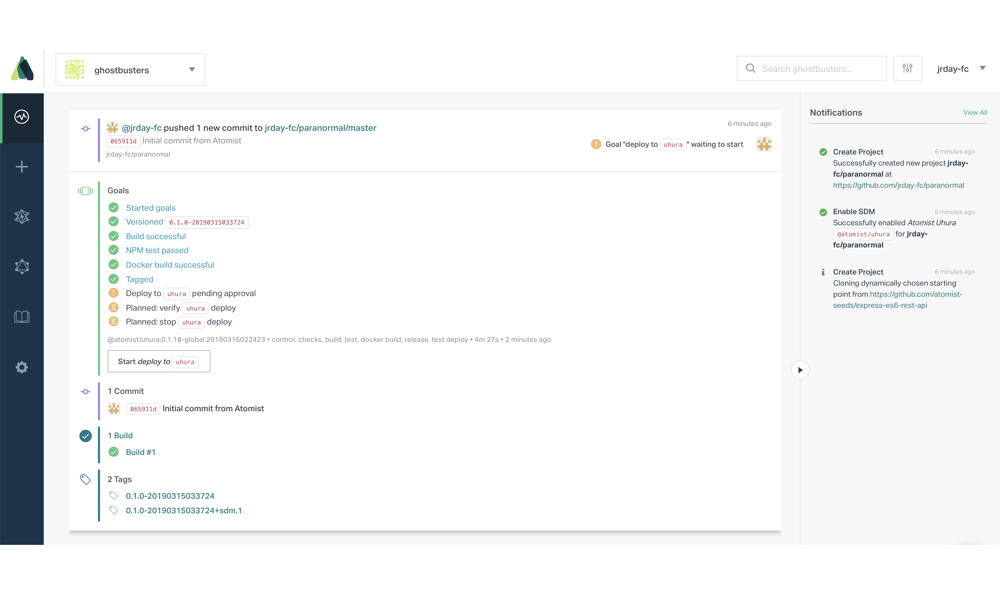
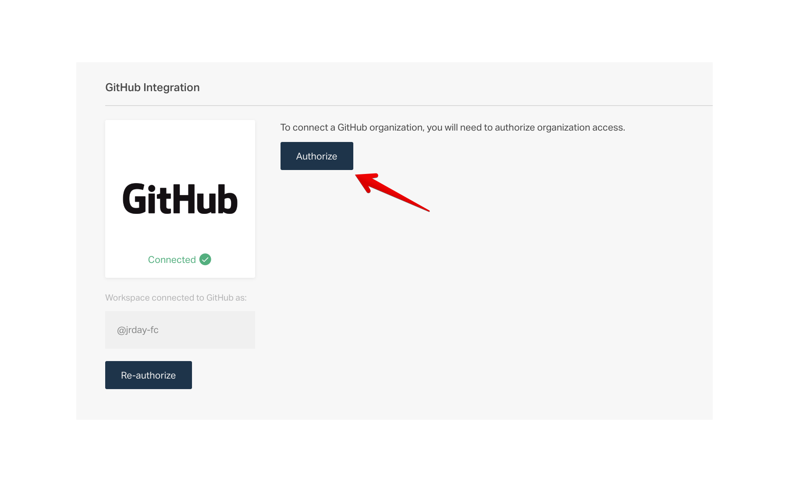
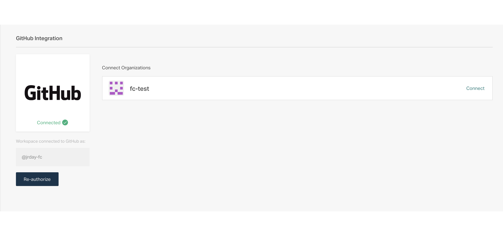
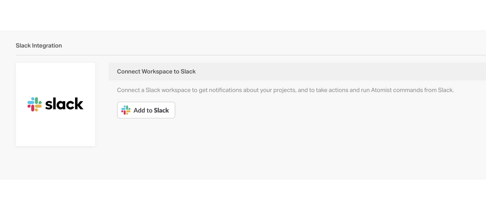
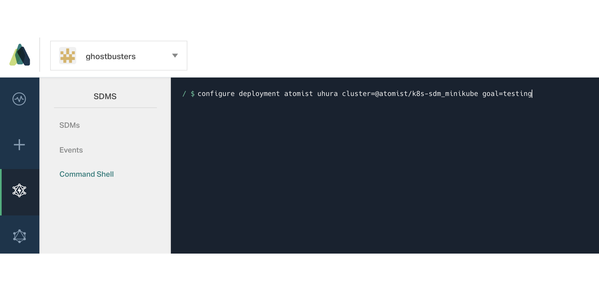
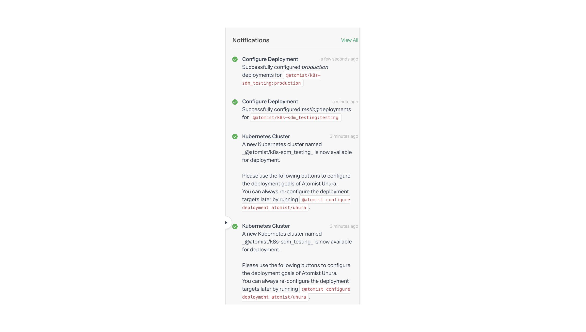
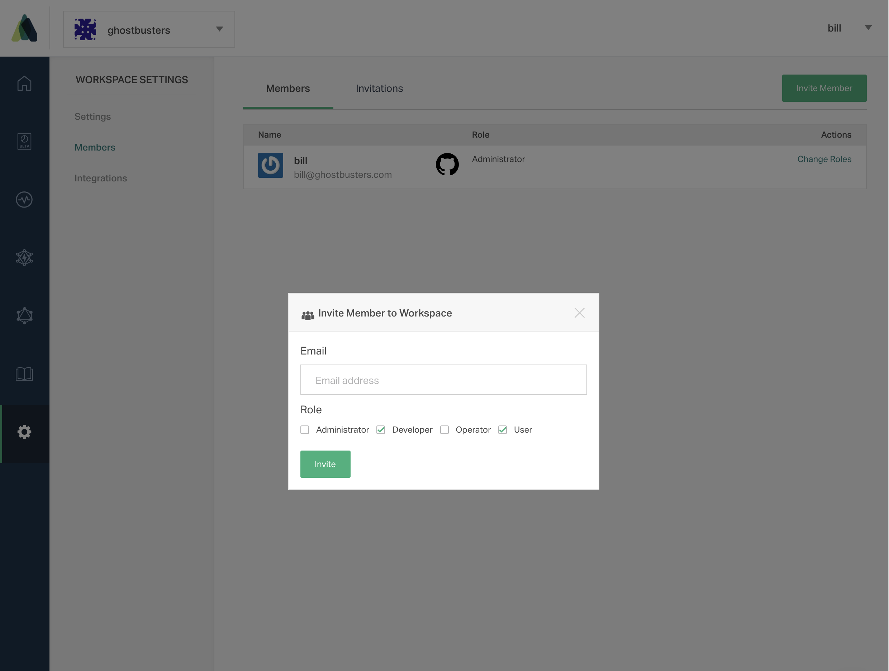

# Getting Started

The steps below are for first-time sign up, creating and delivering a project with Atomist in our Web app. This will give you an idea of what the delivery experience is like when you build it with Atomist.

If you prefer, you can set up and get started using Atomist with our [command-line interface][quick-start]. If you are looking to get started developing your own Software Delivery Machine right now, see the [Developer Quick Start][quick-start].

1.  **Go to** [https://app.atomist.com/user/signup][web-signup]
2.  **Sign up with your GitHub account** and authorize the Atomist app on GitHub
3.  **Name and create your Atomist workspace.** A workspace is the hub for your delivery activity.

4.  **Create a project.** Select one of the available project types to create.


5.  Atomist automatically starts delivery of the project. It gets built, tested, Docker built, and on the first commit, it will deploy to our hosted cluster. Click the **Start deploy to `uhura`** button to kick off the deploy.

You can verify that the project was deployed and is running by clicking on the `http` link in the `Deployed` goal.


!!! note "Note"
    Projects deployed to our hosted cluster run for ten minutes for the purpose of verifying delivery.
    After initial commit, subsequent commits will build, but not deploy to our hosted cluster.
    To enable deployment for future commits, configure your workspace to deploy to your own Kubernetes cluster.

# Next Steps

Now you have an Atomist account and workspace, and can create and deliver applications with it. The [Uhura][uhura]
Software Delivery Machine running in your workspace builds and delivers Node applications in Docker containers to
Kubernetes.

Explore and do more with Atomist.

* [Connect Atomist to a GitHub organization][connect-gh-org]. This lets you create projects here, and enable repositories for delivery.
* [Connect Atomist to a Slack workspace][connect-slack]. Get notifications and interact with Atomist via our Slack bot.
* [Configure deployment to your own Kubernetes cluster][configure-k8s].

## Connect Atomist to a GitHub organization

1.  Go to **Settings > Integrations** and click on View Integration for the GitHub integration.
2.  Click the `Authorize` button. You will be taken to GitHub to authorize Atomist for organization access.

3.  Once authorized, if you are a member of any organizations, they will show in the list.
4.  Click `Connect` on the organization(s) that you would like to use Atomist with.


## Connect Atomist to a Slack workspace

1.  Go to **Settings > Integrations** and click on Configure for the Slack integration.
2.  Click the `Add to Slack` button. You will need to permissions in your Slack workspace to add a bot.

3.  Follow the instructions, see [Slack in Using Atomist][slack] for more information.

## Configure Kubernetes Deployment Target
[configure-k8s]: #configure-kubernetes-deployment-target

### Prerequisites

* The Atomist command-line: `$ npm install -g @atomist/cli`
* A [kubectl][kubectl] install configured for your cluster context. You must have administator access to the cluster you are using. (kubectl and the Atomist command line need to be installed on the same computer.)
* An Atomist workspace where you are an administrator

### Steps

* Set up your local Atomist configuration, which will be written to `~/.atomist/client.config.json`
``` bash
$ atomist config
```
Follow the prompts to authenticate with GitHub and choose your Atomist workspace
``` bash
? Enter your api key from https://app.atomist.com/apikeys
    or hit <ENTER> to select an authentication provider
    to login with Atomist:

Select one of the following authentication providers
available to login with Atomist:
? Authentication Provider (Use arrow keys)
❯ GitHub

? Authentication Provider GitHub
Logged in as jrday-fc using GitHub

Validating API key ...
Select one or more workspaces:
? Workspaces (Press <space> to select, <a> to toggle all, <i> to invert selection)
❯ ◯ AOFOL8EI9 - ghostbusters
```
* Install the necessary Atomist components ([k8s-sdm] and [k8vent]) into your cluster (Important: this will install the components into the cluster your kubectl context is pointing at).
The [Kubernetes SDM][k8s-sdm] is a specialized software delivery machine responsible only for
deploying into Kubernetes, into the same cluster it is running in.
The [Kubernetes event service][k8vent] listens for Kubernetes events and transmits them to Atomist,
so that you can see where each of your applications is running.

``` bash
$ atomist kube --environment=<name_of_your_env>
```
* Go to [https://app.atomist.com/][web-app], and navigate to **SDMs > Command Shell** and run the commands below to configure deployment targets.


For testing environment:
```
$ configure deployment atomist/uhura cluster=@atomist/k8s-sdm_<name_of_your_env> goal=testing
```
Here, name_of_your_env can be `test` or `staging` or whatever you choose. For production:
```
$ configure deployment atomist/uhura cluster=@atomist/k8s-sdm_<name_of_your_env> goal=production
```
You will see two sets of notifications for cluster creation and deployment configuration.


Future pushes to projects will show testing and production deploy goals that will deploy into the Kubernetes cluster you just configured.

## Invite others to Atomist

Now that you hopefully have a functional workspace and have connected it to a GitHub organization, a Slack workspace and/or a Kubernetes cluster, it's a good time to invite some others to the party. You can invite people to your workspace to see what you've done and collaborate together on projects.

* Go to **Settings > Users** and `Invite Member`
* Provide the email address of the person you want to invite

* The person will receive an email invite with information about how to join the workspace. :tada:

## Want help?

If you don't have a functional workspace, or something didn't work for you, please let us know!
Contact us through intercom (the icon in the lower right), or in [Atomist community Slack][join],
or email support@atomist.com.

[connect-gh-org]: #connect-atomist-to-a-github-organization (Connect GitHub Organization)
[connect-slack]: #connect-atomist-to-a-slack-workspace (Connect Slack)
[quick-start]: quick-start.md (Atomist Developer Quick Start)
[web-signup]: https://app.atomist.com/user/signup (Sign Up)
[web-app]: https://app.atomist.com/ (Atomist Web)
[slack]: /user/slack (Slack)
[kubectl]: https://kubernetes.io/docs/tasks/tools/install-kubectl/ (kubectl)
[k8s-sdm]: https://github.com/atomist/k8s-sdm/ (k8s-sdm)
[k8vent]: https://github.com/atomist/k8vent/ (k8vent)
[uhura]: https://github.com/atomist/uhura/ (Uhura)
[join]: https://join.atomist.com (Atomist community Slack)