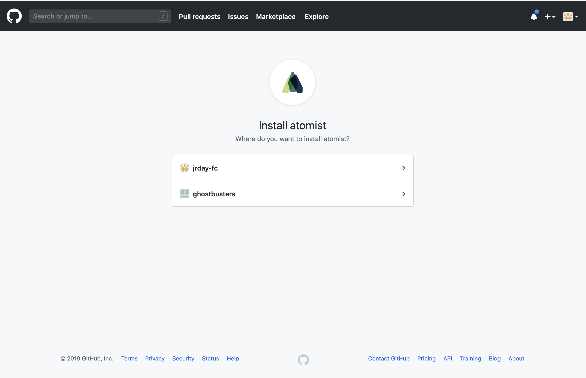
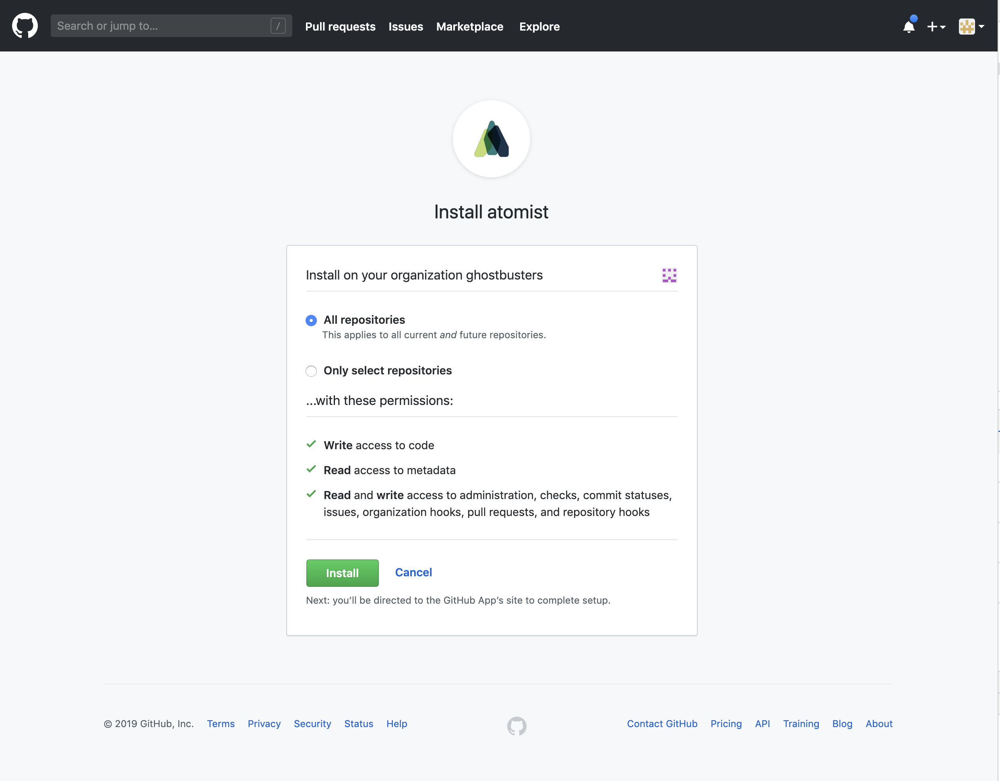

# Getting Started

After this Getting Started, you will be signed up with a new workspace on Atomist, connected to your GitHub organization or personal account, with access to your [Drift Report][drift-report].

If you are looking to get started developing on Atomist right now, see the [Developer Quick Start][quick-start].

1.  **Go to** [https://app.atomist.com/user/signup][web-signup]
2.  **Sign up with your GitHub account.** Authorize Atomist with GitHub to sign up.
3.  **Name and create your Atomist workspace.** Your workspace is your home on Atomist.

4.  **Configure GitHub Access.** Install the [Atomist GitHub App][atomist-gh-app] into your [GitHub organization][install-app-org] or [personal account][install-app-account] and configure access.

5.  See your **[Drift Report][drift-report]** for insight into technologies in use in your organization, and manage policies.
6.  **[Enable ChatOps][enable-chat]** for your Atomist workspace. Get actionable notifications and interact with Atomist via our chat bot.
7.  **[Invite team members][invite-team]** to your Atomist workspace

## Enable ChatOps

* Go to **Settings > Integrations** and click on Configure for the Slack integration.
* Click the `Add to Slack` button. You will need to permissions in your Slack workspace to add a bot.

* Follow the instructions, see [Slack in Using Atomist][slack] for more information.

## Invite team members to Atomist

Now that you have a workspace connected to a GitHub organization or personal account, it's a good time to invite some others to the party. You can invite people to your workspace to share your Drift Report and collaborate together on projects.

* Go to **Settings > Members** and `Invite Member`
* Provide the email address of the person you want to invite

* The person will receive an email invite with information about how to join the workspace. :raised_hands:

## Need help?

If you get stuck or something didn't work for you, please let us know!
Contact us through the messenger icon in the lower right of this page, find us in our [Slack][join],
or email support@atomist.com.

[atomist-gh-app]: https://github.com/apps/atomist (Atomist GitHub App)
[install-app-org]: https://help.github.com/en/articles/installing-an-app-in-your-organization (Install GitHub App in your organization)
[install-app-account]: https://help.github.com/en/articles/installing-an-app-in-your-personal-account (Install GitHub App in your personal account)
[enable-chat]: #enable-chatops (Enable ChatOps)
[invite-team]: #invite-team-members-to-atomist (Invite team members to Atomist)
[quick-start]: quick-start.md (Atomist Developer Quick Start)
[drift-report]: user/drift-report.md (Drift Report)
[web-signup]: https://app.atomist.com/user/signup (Sign Up)
[slack]: user/slack.md (Slack)
[join]: https://join.atomist.com (Atomist community Slack)