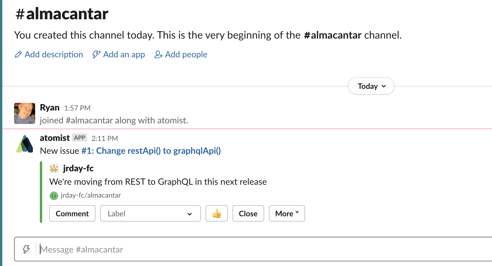

# Getting Started

## Get Up and Running In Minutes

It takes about fifteen minutes to complete this guided set of
steps. By the end, you will have a new skill enabled and you'll know
how to discover, configure, and use skills.

### Create an Account

There is nothing to install. Just [create your free account][signup]
and off you go. We use your GitHub ID to login.  You'll be prompted to
authorize Atomist to sign in.  This video takes you through the
process step-by-step.

  <iframe width="560" height="315" src="https://www.youtube-nocookie.com/embed/8Mr7rdIwMcc" frameborder="0" allow="accelerometer; autoplay; encrypted-media; gyroscope; picture-in-picture" allowfullscreen></iframe>

[signup]: https://go.atomist.com/user/signup (Atomist - Create Your Free Account)

### Enable a Skill

After creating your account, you will find yourself in the [catalog of
skills][catalog]. We're going to enable the GitHub Notifications
Skill.

1.  Choose the [GitHub Notification Skill][gh-notification].
2.  Click the **Get Started** button to configure the skill.
3.  Configure the [GitHub][github] and [Slack][slack]
    integrations.  These are both needed for the skill to send
    notification messages to Slack.
4.  Click **Enable Skill** to turn it on.  Once complete, you'll see
    **Enabled** for GitHub Notifications on the **Manage > Skills**
    page.
5.  Link at least one repository to one Slack channel. Channel linking is done in the **Manage > Integrations > Slack** configuration. This repository-channel linking is how the skill knows which channel to send messages to for a specific repository's activity.
6.  Create a test issue in a GitHub repository, look in the linked Slack channel for the notification message. For example:

    

Now you will get Slack notifications for all pushed commits, pull
requests, and issues.

!!! tip "Note"
    You control which channels will receive notifications, so you may want
    to start with just one repository linked to one Slack channel until
    you're ready to add more.

[catalog]: https://go.atomist.com/catalog (Atomist Catalog of Skills)
[gh-notification]: https://go.atomist.com/catalog/skills/atomist/github-notifications-skill (Atomist GitHub Notification Skill)
[github]: integration/github.md (Atomist GitHub Integration)
[slack]: integration/slack.md (Atomist Slack Integration)

## Next: Discover More Skills

With the GitHub and Slack integrations configured, you're ready to explore more skills. 

[Discover more skills >>][catalog]
