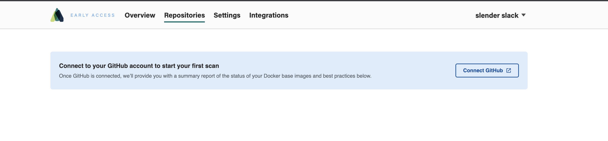

Atomist for DevSecOps is available in early access now.
Keep up to date with supported, current Docker base images and keep new vulnerabilities at bay.

[early-access]: https://atomist.com/devsecops (Request early access)

To get up and running quickly, simply sign up, select repositories, then get a summary of your
Docker security and start improving it.

### Create an account

1. Go to [atomist.com](https://atomist.com) and click the **Try Atomist** button in the top menu


2. Sign up using your GitHub ID. You will be asked to authorize login with your GitHub ID.


### Configure Image Registry

The easiest way to try out our image vulnerability analysis, is to use the [CLI](integration/local.md) to index images built on your local machine, upload the
Software Bill of Materials (SBOM) to Atomist, and [view the vulnerability analysis](https://dso.atomist.com/r/auth/overview/images).

To index images in your registry automatically, enable a [Registry Integration](https://dso.atomist.com/r/auth/integrations).
Specific instructions about each integration are included below.

| Integration | link to documentation |
| :----       | :-----  |
| DockerHub   | [configure namespace and personal access token](integration/dockerhub.md) |
| AWS ECR     | [use cloud formation template](integration/ecr.md) |
| Google GCR  | [uses gcloud](integration/gcr.md) |
| Google GAR  | [uses gcloud](integration/gar.md) |
| GitHub GHCR | [uses Atomist GitHub application](integration/ghcr.md) |
| Local CLI   | [Scan locally built containers](integration/local.md) |

### Linking Images to GitHub

Many images already have metadata that link them back to a git sha.  For example, an image build process can add `org.opencontainer` metadata.  An example of using the docker cli is shown here.

```
docker build \
    --label "org.opencontainers.image.revision=$(git rev-parse HEAD)" \
    --label "org.opencontainers.image.source=https://github.com/my-org/my-repo" \
    --label "com.atomist.containers.image.dockerfile=docker/Dockerfile" \
    -f docker/Dockerfile \
    -t $IMAGE_NAME \
    .
```

We have provided a set of [examples](integration/linking-images.md) for how to ensure that images are built with links back to a git sha.  Atomist also has a GitHub app so that we can link git activity to container images.  Install the GitHub app in the org containing the repositories used to build the images that you will be pushing. [Connect to GitHub](https://dso.atomist.com/r/auth/repositories) using the "Connect Github" link shown below.



Once you are redirected back to Atomist, you'll be asked to select a set of repos that are used to create container images.  If you are trying out Atomist on just a few repositories then select them here.  Selecting "All Repos" means that Atomist will start watching for images built from all existing and future repositories in this Organization.  Note that if Atomist detects Dockerfile FROM lines that could be pinned to digests and updated via pull request, it will begin raising automated pull requests.  We suggest that you start by selecting a few repositories during evaluation, and then switch to "All repositories" once you are comfortable Atomist.


### Initial Setup Complete

Atomist is now tracking new container images.  This includes updates to bills of materials, indexing images by package, and tracking both new and existing vulnerabilities.  You can search your images by vulnerability or package using the [image overview page](https://dso.atomist.com/r/auth/overview/images).  This view also breaks down vulnerabilities by layer so that you can see which vulnerabilities are added by layers you own, and which are pulled in from public images that you use.


### Next Steps

Teams use Atomist to protect downstream workloads from new vulnerabilities.  It's also used to help teams track and remediate new vulnerabilities that impact existing workloads.  In the next sections, we'll look at how teams can use atomist to gain visibility into container workload systems like Kubernetes.

* [Set up Image Policies](getting_started/checks.md) with rules that will run whenever a new Image is pushed to your registry
* [Create a Slack notification channel](integration/slack.md) to receive notifications about new security advisories impacting workloads.
* Atomist watches for new advisories from [public sources](getting_started/sources.md), but you can also add your own internal advisories.  Checkout how to [get started with your own advisories](getting_started/private-advisories.md).
* Use [kubernetes admission control](integration/kubernetes.md) to ensure that images conform to your policy before being admitted into different clusters or namespaces.
* Try adding another rule to add [secret scanning](getting_started/add-secret-scanner-check.md) to make sure that the sources used to build an image are always scanned for leaked secrets.
