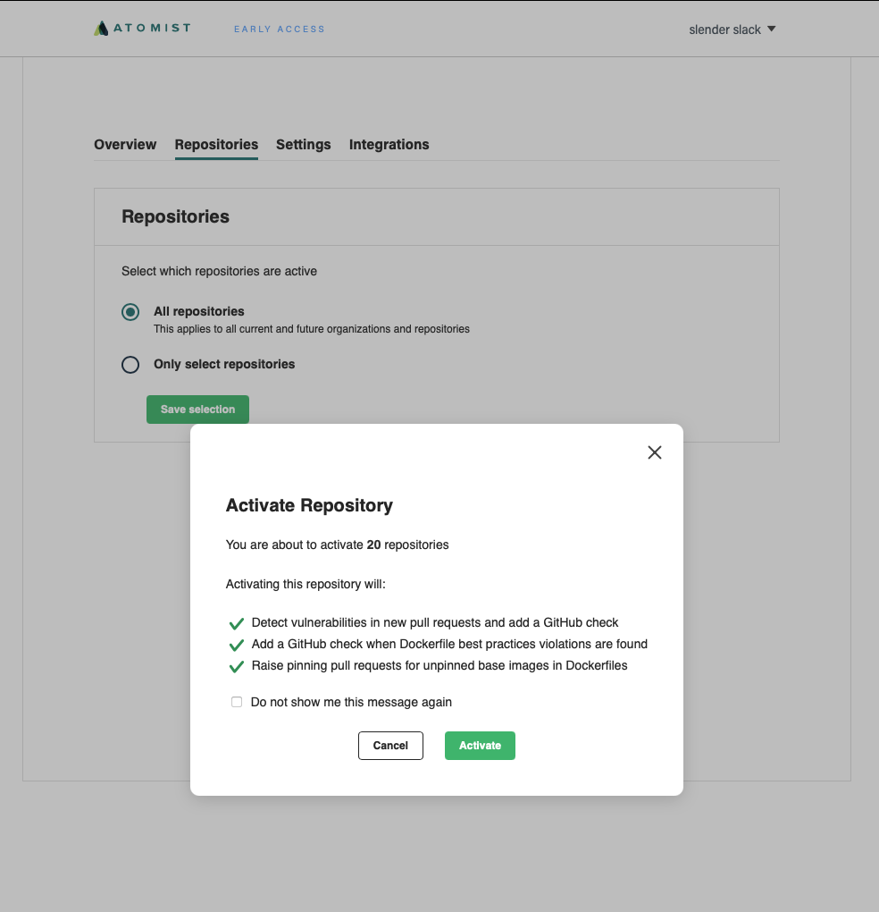

Atomist for DevSecOps is available in early access now. 
Keep up to date with supported, current Docker base images and keep new vulnerabilities at bay.

[early-access]: https://atomist.com/devsecops (Request early access)

Get up and running quickly. Simply sign up, select repositories, then get a summary of your 
Docker security and start improving it.

## Create an account

1. Go to [atomist.com](https://atomist.com) and click the **Try Atomist** button in the top menu

    

2. Sign up using your GitHub ID. You will be asked to authorize login with GitHub.

    

3. Connect your user account or a GitHub organization to Atomist. You will be asked to authorize 
and install the Atomist GitHub app. This allows Atomist to analyze the repositories you select.

    

4. Select repositories to analyze then activate the Docker policy. Be sure to select repositories 
that contain Dockerfiles. Once activated, the Docker policy will be used to analyze Dockerfiles in the 
selected repositories.

    

5. View the results in the **Overview** tab.

    

