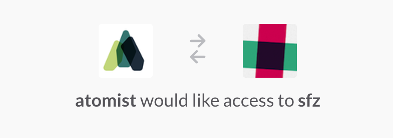
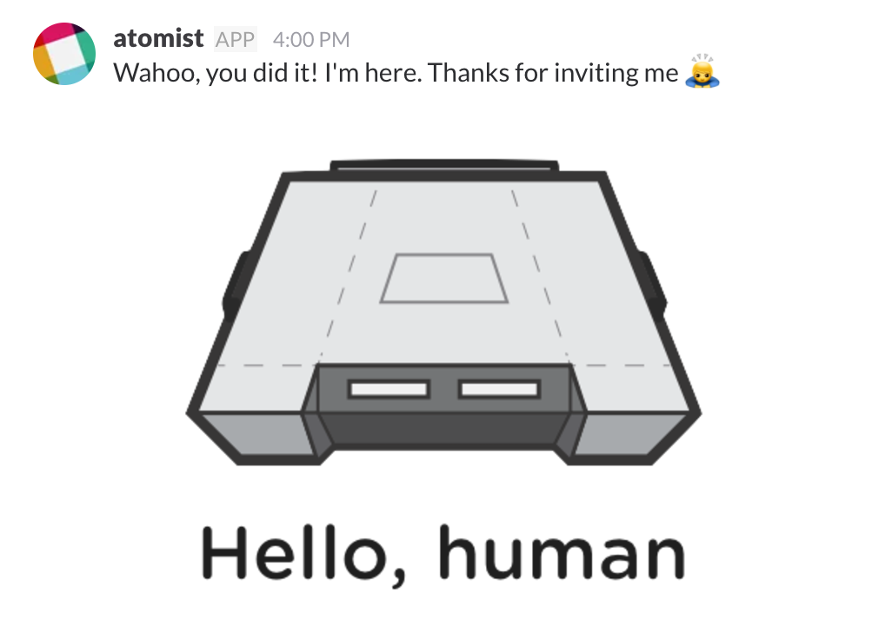

Welcome! So you want to get started streamlining your development with Atomist. You're in the right place. This is a companion to guide you through enrolling and getting started.

Here are the steps you're going to carry out in this guide:

- **Set up the `@atomist` bot** in your Slack team.
- **Connect Atomist to GitHub** – organization and user authorization, configuration.
- **Use Atomist notifications and actions for GitHub**.
- **Connect Atomist to Continuous Integration** - currently Travis CI or Jenkins are supported.
- **Get started with automated event handling** for common development flow activities.
- **Create your first custom Development Automation**

### **Before you get started...**

You'll want these in place before we get going:

* A Slack team where you can authorize the `@atomist` bot
* A GitHub org or user account to authorize the Atomist OAuth app

### **Set up Atomist in Slack**

With Slack and GitHub in place, you can now [authorize  Atomist](https://slack.com/oauth/authorize?scope=channels:read,channels:write,channels:history,im:read,im:write,chat:write:user,team:read,bot&client_id=9196525393.17722124420) for your Slack team.

At this point you'll be asked to sign into your team if you're not already signed in and to give Atomist permissions to:

* Access and modify information about your direct messages
* Access and modify information about your public channels
* Access information about your team
* Access content in your public channels
* Send messages as you (this is important so Atomist can do and report work on your behalf)

Once you have completed the authorization, you will be redirected to your Slack team where you should see a direct message from `@atomist` saying hello.

### Connect Atomist to GitHub

To get started helping streamline your development process you need to make Atomist aware of your code, and this means at the moment that you need to give Atomist credentials to connect to GitHub. Specifically you'll want to authorize the Atomist OAuth app.

In a direct message with `@atomist`, just ask to authorize GitHub like so:

First, if there is no GitHub organization associated with this Slack team, `@atomist` will show a message requesting you to authorize as shown above. Click on the "Authorize Atomist on GitHub" link.

In your default web browser, you will be taken to the GitHub authorization page for Atomist.

Click the "Authorize" button to authorize Atomist. You will be redirected to your Slack team in the browser.

Next, it's time to authorize your GitHub user with Atomist so that Atomist can automate actions on behalf of your GitHub user. Click on the "Authorize GitHub" link.

In your default browser, you will once again be taken to the GitHub authorization page. This time you are authorizing Atomist with your GitHub user.

Once again, click the "Authorize" button to authorize Atomist. You will be redirected to your Slack team in the browser.

Whew! Now that's done!

To be really useful, `@atomist` needs to be invited to the channels where you want it. Try inviting `@atomist` to a channel of your choosing. We suggest choosing a channel where you would like to receive notifications from a specific GitHub repo.

> [In `#sprockets` channel]:

> `/invite @atomist`

>[screen shot this ^ and - @atomist joined channel] - TBD got here to do screenshot.

`@atomist` listens for GitHub activity on a particular repo and notifies in its associated slack channel. In order to have `@atomist` listen to a specific repo and notify in the channel you just invited it to, it needs to know which repo to listen to. If one is not already set when you invite `@atomist` to the channel, it will ask you for a repo name.

> screen shot

> @atomist: which repo ?

> @jryanday: sprockets

> @atomist: Sweet! All set to go now.

Now Atomist can talk to GitHub, listen for activity in a specific repo, and notify in the Slack channel we just invited it to.

Now, let's do something with GitHub. Let's create a new issue.

> screen shot of  `@atomist create issue` sequence
> my first atomist issue ...

And because `@atomist` is also listening for GitHub activity, it gets the new issue event, and notifies in the channel.

> screen shot of bot message on issue creation, showing buttons

Notice that the notification about the new issue comes with some buttons to take actions, like `Assign` or `Bug` to label as a bug. Go ahead and label it as a bug by clicking on the bug button.

> screen shot of bot message attachment update that reflects a label was added

### Configure CI

Atomist can also listen for CI events, correlate them with the commits that triggered the build, and show contextualized notifications in the Slack channel.

To enable this, we need to connect Atomist to the CI system. Atomist currently works with Travis CI and Jenkins.

#### Travis CI

Once you have set up Travis for your organisation you should have permissions ready to go as Travis uses your GH user access token; there's usually no need for a separate authorization.

What you do need to do is enable your projects to be built using Travis. To do this you can take advantage of Atomist for a first little bit of development automation.

From Slack
* Need to configure projects by adding travis.yml to them
  - either ask for a repo with travis.yml
  - or run an editor to create one
* Create a simple commit, commit, watch notifications
* buttons in notification?

#### Jenkins

* pre-req: notifications plugin
* the setup steps
* make a commit to trigger a build, see notifications (make sure its working)
* buttons in notification?

#### Notifications

Now that CI is also configured, let's take a look at how Atomist handles CI events.

Make some change that will cause your CI to initiate a build. For example, if your CI is configured to build on commit to a branch, make a commit to that branch.

> screen shot example of editing sprockets/README.md

> commit it

> show bot notification message

### Build your first Development Automation

Right! You've seen some of the automation between issues, commits, builds that we provide out-of-the-box. Now, let's automate an action. In Atomist, that means writing a `handler` to be triggered by a certain type of activity. For example, perhaps you want to notify the team when an issue labeled 'bug' gets fixed.

* Run generator to create handler, or provide the code example
* Highlights:
  - Path expression to match issue labeled as bug that gets closed
  - message builder code and send

There, you did it! You just created a new automation, and taught the bot to listen for events and run that automation. Well done!

###s Takeaways / Where to go from here
