<!-- styles used here are from /stylesheets/extra.css -->

Welcome! So you want to get started with Atomist. You're in the right place. This is a companion to guide you through setup and getting started.

### **What this guide covers**

- **Set up the `@atomist` Slack bot**
- **Connect Atomist to GitHub**
- **Use Atomist notifications and actions for GitHub**
- **Connect Atomist to Continuous Integration**
- **Get started with development automation**
- **Create your first custom automation**
- **Where to get help**

### **Before you get started**

You'll need these in place before we get going:

> * A Slack team where you can authorize the `@atomist` bot

> * A GitHub org or user account to authorize Atomist

### **Set up Atomist in Slack**

With Slack and GitHub in place, you can now add the Atomist bot for your Slack team. When you are invited to the Private Alpha, you will receive an email invitation. Click the button in the email invitation to install the Atomist bot.

  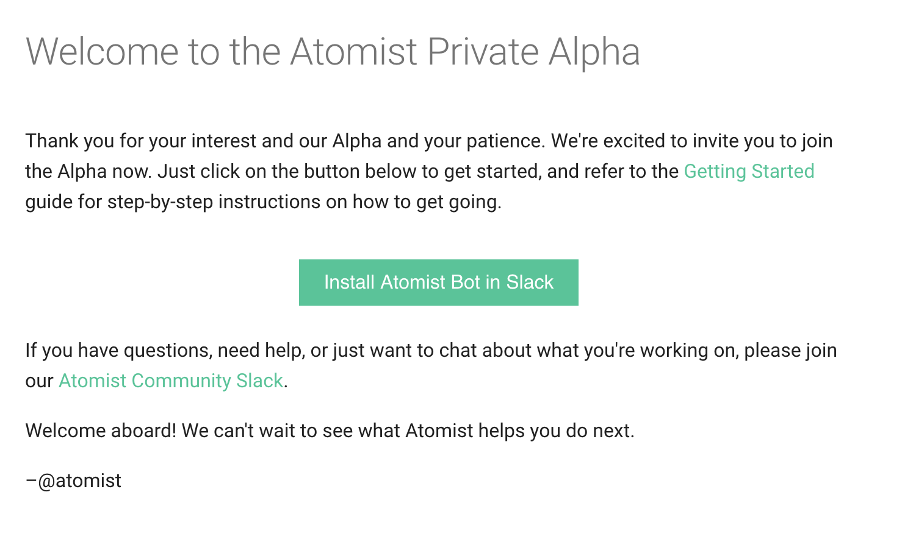

You'll be asked to sign into your Slack team if you're not already signed in. Provide your Slack domain and then your email address and password. If you have trouble signing in, see [Slack help](https://get.slack.help/hc/en-us/articles/212681477-Sign-in-to-Slack) on the topic.

  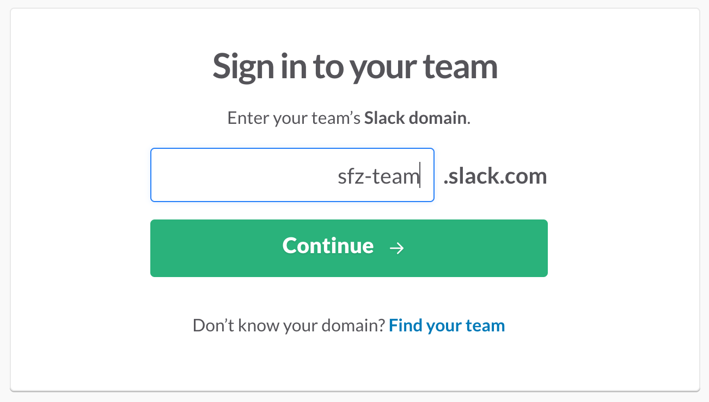

  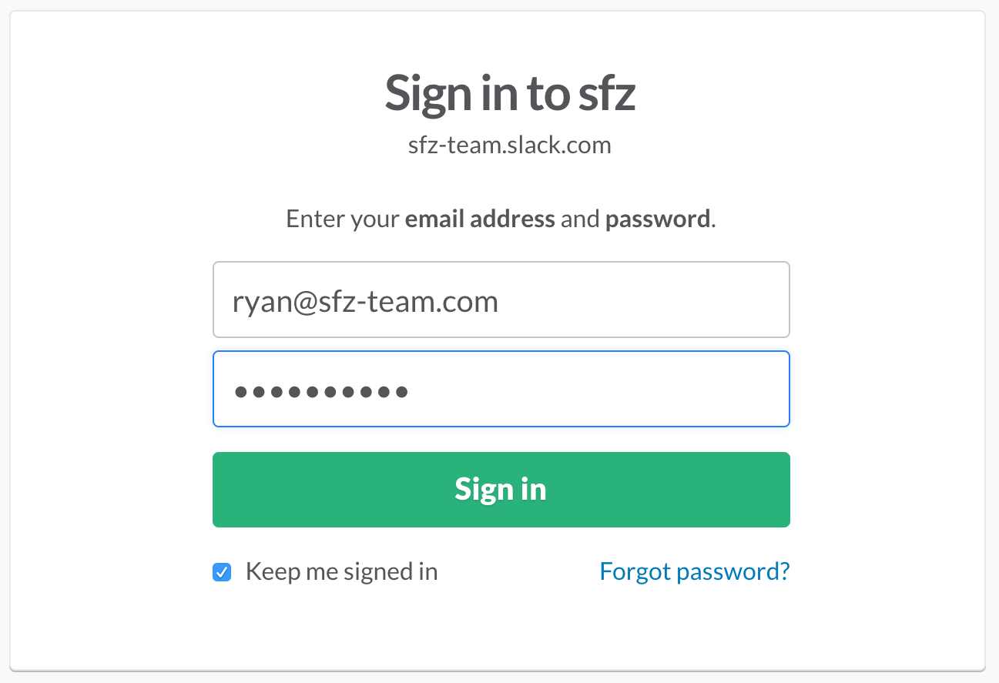

Next, you will see the authorization page for the Atomist app, including the Slack permissions requested. Confirm that the correct Slack team is selected and click "Authorize".

  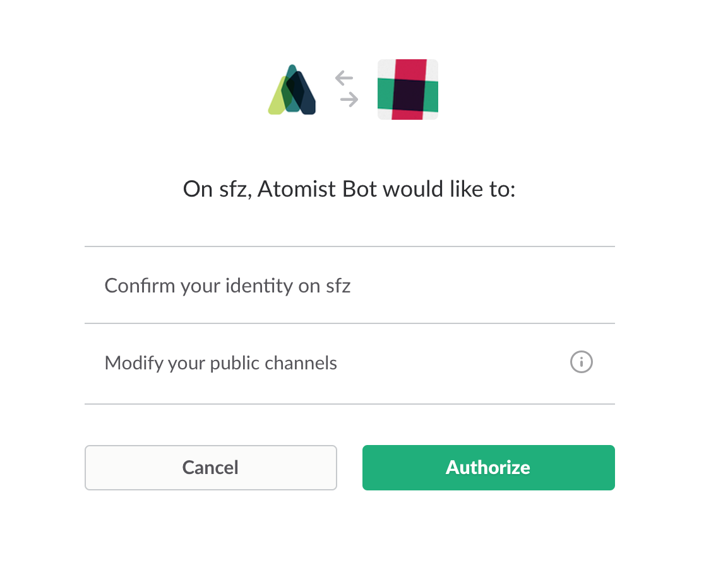

Once you have successfully authorized the Atomist bot in your Slack team, you will be redirected to a confirmation page. You can close this page and go back to Slack to continue this guide.

  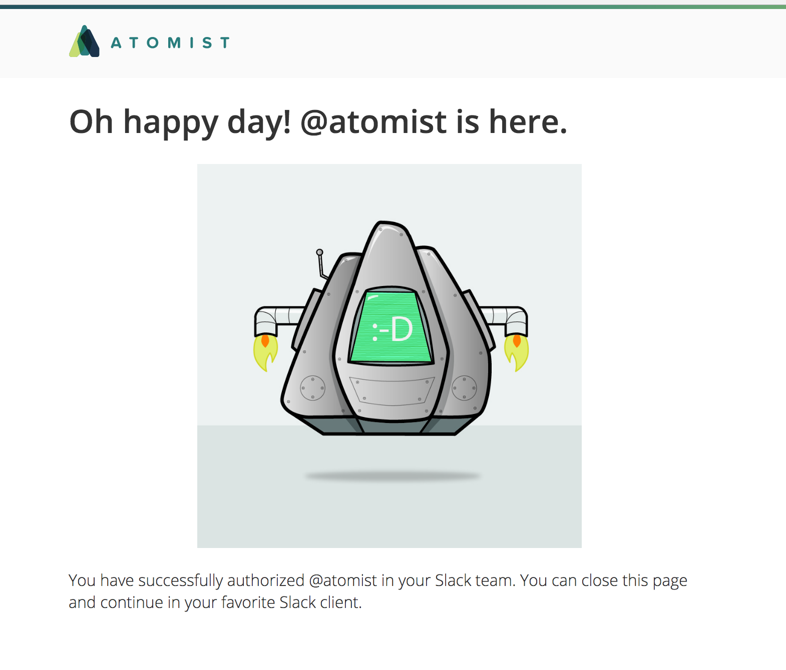

### Connect Atomist to GitHub

To get started helping streamline your development flow, Atomist needs access to your GitHub account. Specifically you'll want to authorize the Atomist OAuth app.

In a direct message with `@atomist`, just ask to authorize GitHub like so:

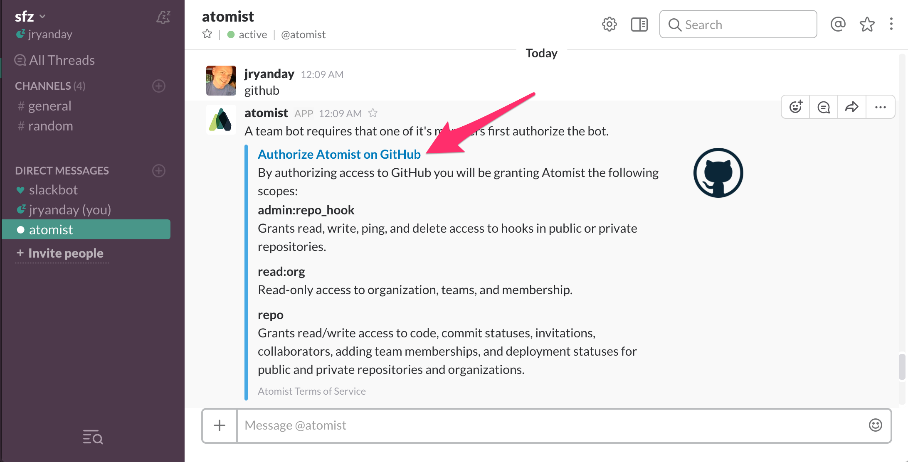

First, if there is no GitHub organization associated with this Slack team, `@atomist` will show a message requesting you to authorize as shown above. Click on the "Authorize Atomist on GitHub" link.

In your default web browser, you will be taken to the GitHub authorization page for Atomist.

Click the "Authorize" button to authorize Atomist. You will be redirected to your Slack team in the browser.

Next, it's time to authorize your GitHub user with Atomist so that Atomist can automate actions on behalf of your GitHub user. Click on the "Authorize GitHub" link.

In your default browser, you will once again be taken to the GitHub authorization page. This time you are authorizing Atomist with your GitHub user.

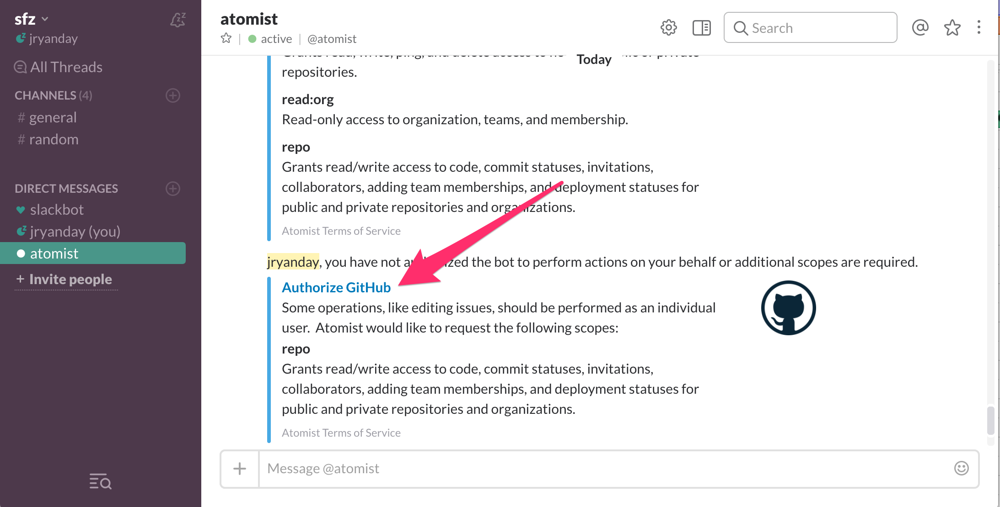

Once again, click the "Authorize" button to authorize Atomist. You will be redirected to your Slack team in the browser.

Whew! Now that's done!

To be really useful, `@atomist` needs to be invited to the channels where you want it. Try inviting `@atomist` to a channel of your choosing. We suggest choosing a channel where you would like to receive notifications from a specific GitHub repo.

> [In `#sprockets` channel]:

> `/invite @atomist`

>[screen shot this ^ and - @atomist joined channel] - TBD got here to do screenshot.

`@atomist` listens for GitHub activity on a particular repo and notifies in its associated slack channel. In order to have `@atomist` listen to a specific repo and notify in the channel you just invited it to, it needs to know which repo to listen to. If one is not already set when you invite `@atomist` to the channel, it will ask you for a repo name.

> screen shot

> @atomist: which repo ?

> @jryanday: sprockets

> @atomist: Sweet! All set to go now.

Now Atomist can talk to GitHub, listen for activity in a specific repo, and notify in the Slack channel we just invited it to.

Now, let's do something with GitHub. Let's create a new issue.

> screen shot of  `@atomist create issue` sequence
> my first atomist issue ...

And because `@atomist` is also listening for GitHub activity, it gets the new issue event, and notifies in the channel.

> screen shot of bot message on issue creation, showing buttons

Notice that the notification about the new issue comes with some buttons to take actions, like `Assign` or `Bug` to label as a bug. Go ahead and label it as a bug by clicking on the bug button.

> screen shot of bot message attachment update that reflects a label was added

### Configure CI

Atomist can listen for CI events, correlate them with the commits that triggered the build, and show contextualized notifications in the Slack channel.

To enable this, we need to connect Atomist to your CI system. Atomist currently works with Travis CI and Jenkins. Use the either the [Travis CI](#travis-ci) or [Jenkins](#jenkins) section to help you configure Atomist to connect with you CI.

#### Travis CI

Once you have set up Travis for your organization you should have permissions ready to go as Travis uses your GH user access token; there's usually no need for a separate authorization.

What you do need to do is enable your projects to be built using Travis. To do this you can take advantage of Atomist for a first little bit of development automation.

From Slack
* Need to configure projects by adding travis.yml to them
  - either ask for a repo with travis.yml
  - or run an editor to create one
* Create a simple commit, commit, watch notifications
* buttons in notification?

#### Jenkins

> **Note:** Atomist works with the [Notification plugin](https://plugins.jenkins.io/notification) for Jenkins, which is a requisite. The Notification plugin is what will send events to Atomist, so that we can notify and take action based on build events.

If you don't already have the Notification plugin installed, go to the Plugin Manager in the Jenkins admin interface, select it and complete the installation.

  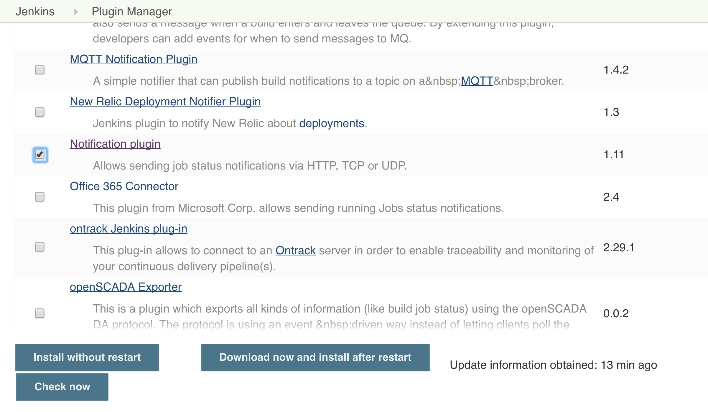

To enable the plugin, be sure to restart Jenkins after installation.

  

Now that the Notification plugin is installed and enabled, it's time to configure project Notifications settings. Select a project that you would like Atomist to get events from. Next, select "Configure".

  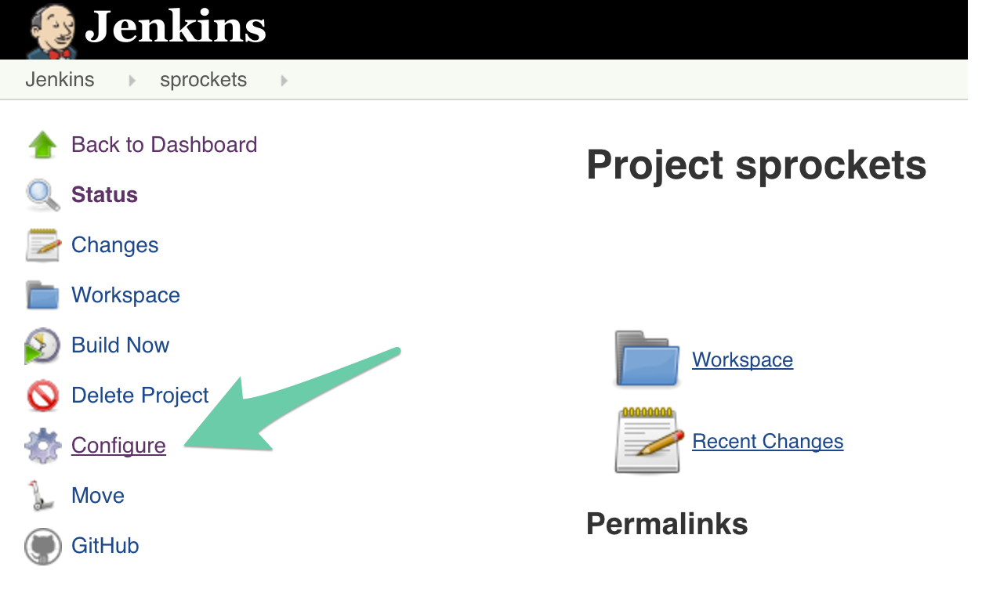

We're going to walk through setting up a webhook. In the Job Notifications section of the project configuration, click the "Add Notification" button.

  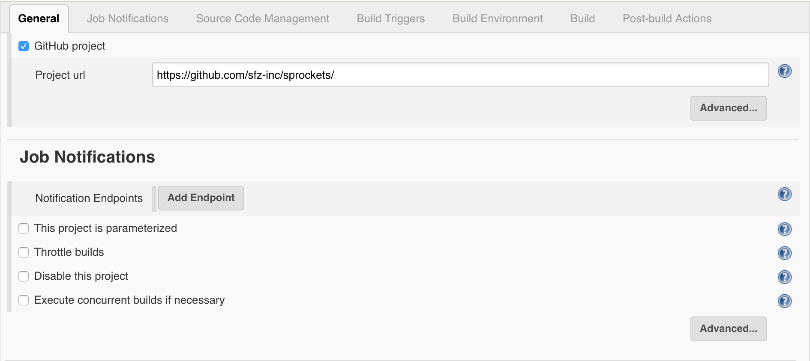

In the Notification configuration section, configure the endpoint URL as `https://webhook.atomist.com/jenkins` and check that the other parameters match the information shown below.

  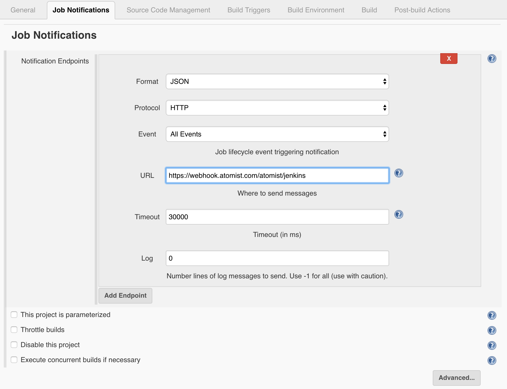

* make a commit to trigger a build, see notifications (make sure its working)
* buttons in notification?

### **In Action:** Notifications

Now that CI is also configured, let's take a look at how Atomist handles CI events.

Make some change that will cause your CI to initiate a build. For example, if your CI is configured to build on commit to a branch, make a commit to that branch.

> screen shot example of editing sprockets/README.md

> commit it

> show bot notification message

### Build your first Development Automation

Right! You've seen some of the automation between issues, commits, builds that we provide out-of-the-box. Now, let's automate an action. In Atomist, that means writing a `handler` to be triggered by a certain type of activity. For example, perhaps you want to notify the team when an issue labeled 'bug' gets fixed.

* Run generator to create handler, or provide the code example
* Highlights:
  - Path expression to match issue labeled as bug that gets closed
  - message builder code and send

There, you did it! You just created a new automation, and taught the bot to listen for events and run that automation. Well done!

### Takeaways / Where to go from here
