<!-- styles used here are from /stylesheets/extra.css -->

Welcome! So you want to get started with Atomist. You're in the right place. This is a companion to guide you through setup and getting started.

### **What this guide covers**

- **Set up the `@atomist` Slack bot**
- **Connect Atomist to GitHub**
- **Use Atomist notifications and actions for GitHub**
- **Connect Atomist to Continuous Integration**
- **Get started with development automation**
- **Create your first custom automation**
- **Where to get help**

### **Before you get started**

You'll need these in place before we get going:

> * A Slack team where you can authorize the `@atomist` bot

> * A GitHub org or user account to authorize Atomist

### **Set up Atomist in Slack**

With Slack and GitHub in place, you can now add the Atomist bot for your Slack team. When you are invited to the Private Alpha, you will receive an email invitation. Click the button in the email invitation to install the Atomist bot.

<div class="ss-container">
  
</div>

You'll be asked to sign into your Slack team if you're not already signed in. Provide your Slack domain and then your email address and password. If you have trouble signing in, see [Slack help](https://get.slack.help/hc/en-us/articles/212681477-Sign-in-to-Slack) on the topic.

<div class="ss-container">
  
</div>

<div class="ss-container">
  
</div>

Next, you will see the authorization page for the Atomist app, including the Slack permissions requested. Confirm that the correct Slack team is selected and click "Authorize".

<div class="ss-container">
  
</div>

Once you have successfully authorized the Atomist bot in your Slack team, you will be redirected to a confirmation page. You can close this page and go back to Slack to continue this guide.


<div class="ss-container">
  
</div>

### Connect Atomist to GitHub

To get started helping streamline your development flow, Atomist needs access to your GitHub account. Specifically you'll want to authorize the Atomist OAuth app.

#### Authorize Atomist for your GitHub Organization

In a direct message with `@atomist` just ask to authorize GitHub by entering `github`:


If there is no GitHub organization associated with this Slack team `@atomist` will show a message requesting you to authorize as shown above. Click on the "Authorize Atomist on GitHub" link and, in your default web browser, you will be taken to the GitHub authorization page for Atomist.


Click the "Authorize" button to authorize Atomist and you will then be redirected to your Slack team in the browser.

> ***NOTE***: If you have more than one GitHub organisation you will receive a Direct Message from Atomist to you at this point asking "In which GitHub org would you like to authorize @atomist?". The first 5 GitHub organisations you are a member of will be shown as buttons and you can either click on one of those to select the organisation to authorise Atomist with, or type in the name of the organisation if it is not shown.

#### Authorize Atomist to do work in GitHub on your behalf

With Atomist authorized for your organization it's time to authorize your own GitHub user with Atomist so that Atomist can automate actions on your behalf. In the Direct Message channel with Atomist you should see another message that is asking you to "Authorize GitHub":

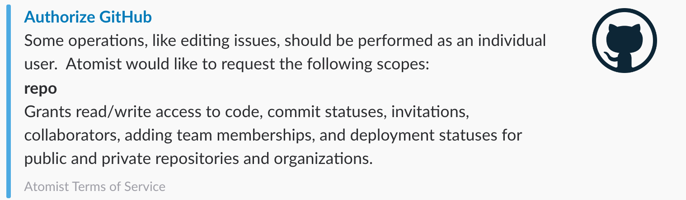


Click on the "Authorize GitHub" link and again, in your default browser, you will once be taken to the GitHub authorization page so that this time you can authorize Atomist with your GitHub user.

Click the "Authorize" button to authorize Atomist. You will be redirected to your Slack team in the browser and a new direct message from `@atomist` will be waiting:

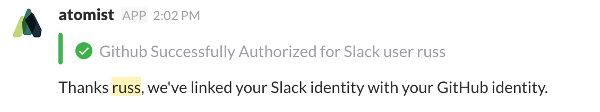

Whew! Authorizations all done we can now get Atomist doing some work!

### Putting Atomist to Work

Atomist can now be put to work to create a new project to work upon, or to work on an existing project.

### Use Atomist to Create a New Project

You can ask `@atomist` to create a new project for you either through a direct message or by addressing the bot on a channel it has been invited to. For our purposes here we'll assume you're starting the conversation in your Slack team's `#general` channel.

In the `#general` channel type:

```shell
@atomist generators
```

This will result in a list of project generators that `@atomist` can use on your behalf to create a new project in GitHub:

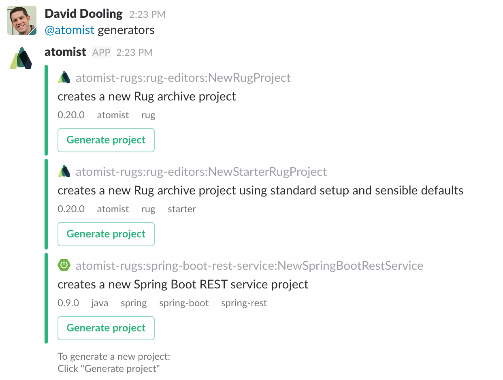

> ***NOTE***: You can create your own generators, amongst other customisations to Atomist using our Rug language and support. Creating and publishing your own generators will be a [Quick Start](../quick-starts) of its own soon.

While the full list *can* be useful if you're just browsing, for our purposes here we know we want to create a Spring Boot REST service and so we can narrow down the list by specifying some criteria:

```shell
@atomist generators spring
```

This time you should see an entry for the `NewSpringBootRestService` generator:

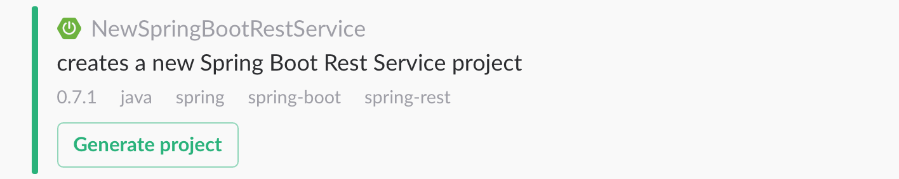

Click on the `Generate project` button and you'll begin the process of interacting with `@atomist` to create your new project.

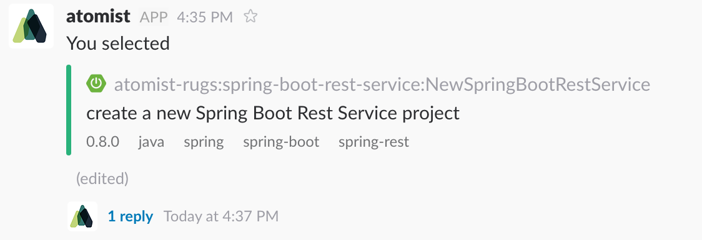

The response from `@atomist` is to create a new [Slack thread](https://get.slack.help/hc/en-us/articles/115000769927-Message-threads) for this conversation. Click now on the `1 reply` link to open up the thread in Slack:

<div class="ss-container">
  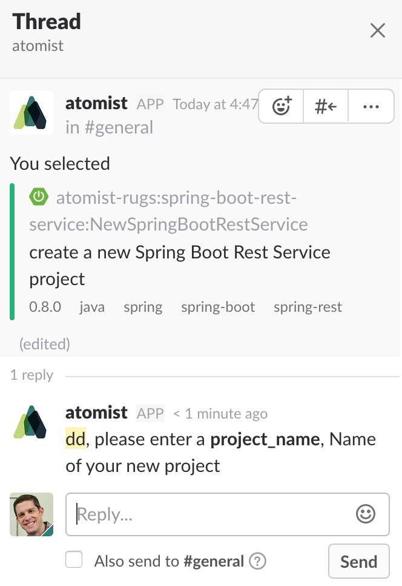
</div>

Now run through the questions from Atomist until you see a submission panel with a `Generate project` button. This the case of `NewSpringBootRestService` this should only be entering the `project_name` parameter for your new project:

<div class="ss-container">
  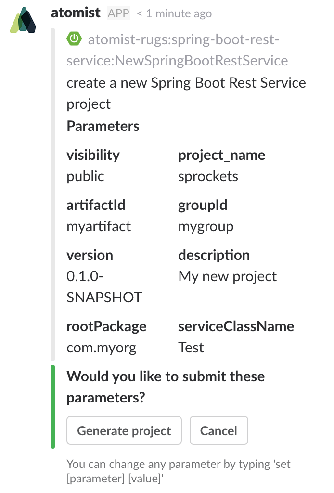
</div>

You can set any of the default parameters by typing in `set <parameter> <value>` before you click on `Generate project`.

Now click on `Generate project` and you'll see several things happen:

- In the thread `@atomist` will announce `One moment while I run the generator`.
- `@atomist` will go and create the repository for you in your GitHub organisation.
- `@atomist` will announce that it has `Successfully generated your project` in the main channel that the project creation thread was started in, in our case that would be `#general`. The announcement will also contain a link to the newly created project.
- `@atomist` will create a new channel in your Slack team for the new project, that will also be associated with the project's repository so when you want to work on that project, you do it in that channel.

Click on the project link to see your project in GitHub:

<div class="ss-container">
  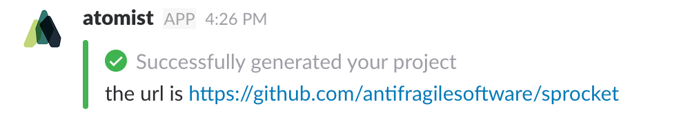
</div>

Clone from GitHub and you will have a working starting project, courtesy of Atomist.

### Use Atomist on an Existing Project by inviting it to an Existing Channel

To be really useful, `@atomist` needs to be invited to the channels where you want it. Try inviting `@atomist` to a channel of your choosing. We suggest choosing a channel where you would like to receive notifications from a specific GitHub repo.

> [In `#sprockets` channel]:

> `/invite @atomist`

>[screen shot this ^ and - @atomist joined channel] - TBD got here to do screenshot.

`@atomist` listens for GitHub activity on a particular repo and notifies in its associated slack channel. In order to have `@atomist` listen to a specific repo and notify in the channel you just invited it to it needs to know which repo to listen to. If one is not already set when you invite `@atomist` to the channel, it will ask you for a repo name.

> screen shot

> @atomist: which repo ?

> @jryanday: sprockets

> @atomist: Sweet! All set to go now.

Now Atomist can talk to GitHub, listen for activity in a specific repo, and notify in the Slack channel we just invited it to.

Now, let's do something with GitHub. Let's create a new issue.

> screen shot of  `@atomist create issue` sequence
> my first atomist issue ...

And because `@atomist` is also listening for GitHub activity, it gets the new issue event, and notifies in the channel.

> screen shot of bot message on issue creation, showing buttons

Notice that the notification about the new issue comes with some buttons to take actions, like `Assign` or `Bug` to label as a bug. Go ahead and label it as a bug by clicking on the bug button.

> screen shot of bot message attachment update that reflects a label was added

### Plugging Atomist into events from your Project Repository

With `@atomist` now successfully authorized you can use the bot to manipulate your repositories on GitHub. However another responsibility of Atomist is to be able to react to events that occur on your repositories as well.

To enable those repository events to promulgate into Atomist you need to configure a webhook from your GitHub organisation. Navigate to your organisations GitHub page and then click on `Settings` and, from the menu, `Webhooks`:

<div class="ss-container">
  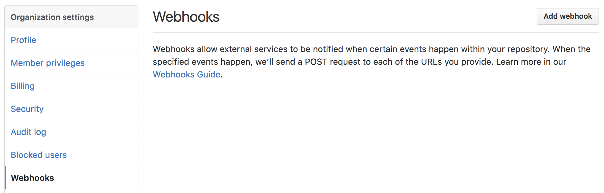
</div>

Click on `Add webhook` and then fill in the details shown below:

<div class="ss-container">
  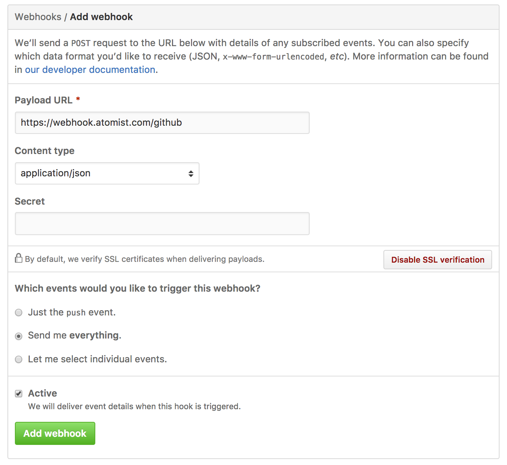
</div>

When you're done click on `Add webhook` and you should see the webhook added to the list for your organisation:

<div class="ss-container">
  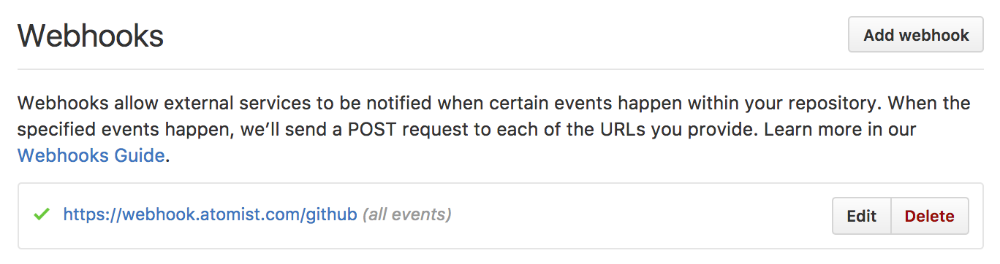
</div>

To see you new webhook in action, and how those events get interpreted in `@atomist`, make a small edit to one of the files in your repository (the `README.md` is usually a good candidate to make a small, inconseqential edit) either through the GitHub user interface or through a commit/push from a local edit.

When you have done the commit/push to master you should see those events happily appearing in your project's channel, `#sprockets` in our example here:

TBD.


### Configure Atomist with your CI

Atomist can listen for CI events, correlate them with the commits that triggered the build, and show contextualized notifications in the Slack channel.

To enable this, we need to connect Atomist to your CI system. Atomist currently works with Travis CI and Jenkins. Use the either the [Travis CI](#travis-ci) or [Jenkins](#jenkins) section to help you configure Atomist to connect with you CI.

#### Configuring Atomist with Travis CI

Once you have set up Travis for your organization you should have permissions ready to go as Travis uses your GH user access token; there's usually no need for a separate authorization.

What you do need to do is enable your projects to be built using Travis. To do this you can take advantage of Atomist for a first little bit of development automation.

From Slack
* Need to configure projects by adding travis.yml to them
  - either ask for a repo with travis.yml
  - or run an editor to create one
* Create a simple commit, commit, watch notifications
* buttons in notification?

#### Configuring Atomist with Jenkins

> **Note:** Atomist works with the [Notification plugin](https://plugins.jenkins.io/notification) for Jenkins, which is a requisite. The Notification plugin is what will send events to Atomist, so that we can notify and take action based on build events.

If you don't already have the Notification plugin installed, go to the Plugin Manager in the Jenkins admin interface, select it and complete the installation.

<div class="ss-container">
  
</div>

To enable the plugin, be sure to restart Jenkins after installation.

<div class="ss-container">
  
</div>

Now that the Notification plugin is installed and enabled, it's time to configure project Notifications settings. Select a project that you would like Atomist to get events from. Next, select "Configure".

<div class="ss-container">
  
</div>

We're going to walk through setting up a webhook. In the Job Notifications section of the project configuration, click the "Add Notification" button.

<div class="ss-container">
  
</div>

In the Notification configuration section, configure the endpoint URL as `https://webhook.atomist.com/jenkins` and check that the other parameters match the information shown below.

<div class="ss-container">
  
</div>


* make a commit to trigger a build, see notifications (make sure its working)
* buttons in notification?

### **In Action:** CI Notifications

Now that CI is also configured, let's take a look at how Atomist handles CI events.

Make some change that will cause your CI to initiate a build. For example, if your CI is configured to build on commit to a branch, make a commit to that branch.

> screen shot example of editing sprockets/README.md

> commit it

> show bot notification message

### Build your first Development Automation

Right! You've seen some of the automation between issues, commits, builds that we provide out-of-the-box. Now, let's automate an action. In Atomist, that means writing a `handler` to be triggered by a certain type of activity. For example, perhaps you want to notify the team when an issue labeled 'bug' gets fixed.

* Run generator to create handler, or provide the code example
* Highlights:
  - Path expression to match issue labeled as bug that gets closed
  - message builder code and send

There, you did it! You just created a new automation, and taught the bot to listen for events and run that automation. Well done!

### Where to go from here...
