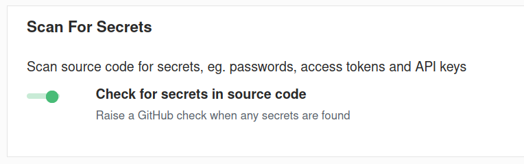
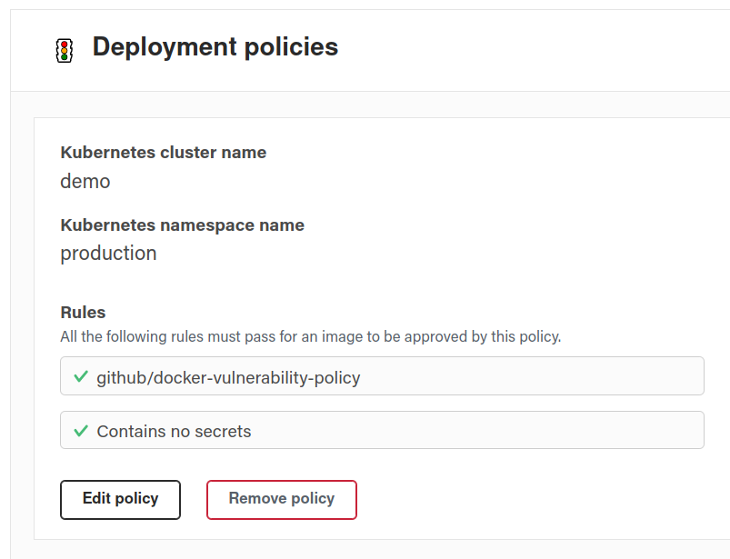

## Adding code Secret Scanning GitHub Check

### Overview

Prevent leaking API keys, access tokens, passwords and other sensitive data by keeping them out of your codebase. Secret Scanner detects and alerts you when secrets are committed in your code and configuration in a GitHub repository. It helps prevent secrets from being exposed by adding a failed GitHub Check when a secret is detected.

GitHub Checks like this one can be used as Image Policy Rules to protect workloads (e.g. Kubernetes Admission Control).

Secret Scanner automatically scans for access and API keys for Twitter, Facebook, Google, Stripe, Square, PayPal, AWS, Twilio, Mailchimp, Mailgun and Picatic API. Secret Scanner supports adding patterns to detect other secrets not detected by default. Add scanning support for other tools with a simple regular expression.

### Configuration

Enable the Secret Scanner [here](https://dso.atomist.com/r/auth/policies)

Add Secret Scanning to your Image Policy by following the instructions for [configuring image policy rules](checks.md).

Once configured, the policy should looking like this:

