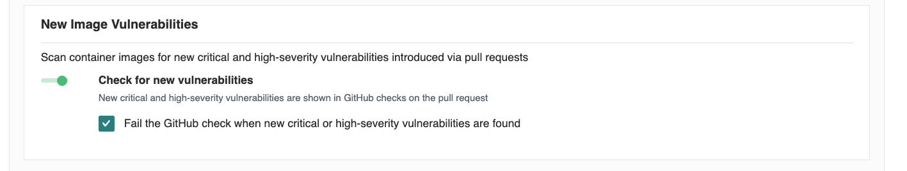
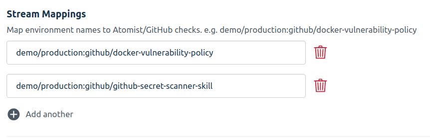

### Background

Atomist keeps tracks of checks that are performed on container images.  Examples of checks include the following.

* Does the image have the required `LABEL`s?
* Was the image created by a trusted builder?
* Was the image created from a known git commit sha?
* Has the image been scanned for vulnerabilities?
* Does the image contain any vulnerabilities that are not already present in the currently running version?

Each workload can define a set of mandatory checks.  This allows Atomist to wait for a new image to have all the necessary checks and then signal to a workload that a new candidate version is ready.  This works well with a gitops workflow where new candidate images can be pulled into a workload once they are ready.  Failing checks are made available to developers to indicate why a change was rejected, and these same checks drive tools like kubernetes admission controllers, to ensure that only fully checked images are admitted to selected namespaces.  The combination of gitops controllers, admission controllers, and pluggable image checks, gives teams the ability to plug consistent validation into their cloud native delivery.

### Enable Vulnerability Check

Start by checking whether a candidate image has additional vulnerabilities when compared to other versions already in existing workloads.  If you're building an image from a pull request commit, this policy will also compare vulnerabilites against any image built from the HEAD commit of your default branch.  [Enable the policy][settings] by navigating to your [settings page][settings].

In the section called `New Image Vulnerabilites`, select the check box that controls whether a GitHub check run should fail when _new_ critical or high severitare found.



[settings]: https://dso.atomist.com/r/auth/policies

### Choose Admission Checks

Now that we are checking images for new vulnerabilities, we can begin requiring that certain sets of checks pass before an image is ready to be admitted into an existing workload (for example, see the [section on kubernetes admission control](admission-control.md)).  We can select different checks for different environments.  For example, let's start with the requirement that a kubernetes cluster named `demo` with a namespace `production` requires the check configured above.  

This can be done by editing the [Deployment Policy](https://go.atomist.com/r/auth/manage/integrations/s/l/atomist/deploy-integration) and adding:

`demo/production:github/docker-vulnerability-policy` to the list of checks in the **Image Policy**:



#### Configuration via GraphQL

We can also configure by calling a GraphQL mutation.  Copy the following mutation into a file (e.g. rules.json)

```bash
cat <<'EOF' > rules.json
{"rules": ["demo/production:github/docker-vulnerability-policy"]}
EOF
```

Now execute the scripts below:

```bash
ATOMIST_WORKSPACE_ID=<workspace-id>
ATOMIST_API_KEY=<api-key>
```

* `workspace-id`
    * Grab your workspace ID from https://dso.atomist.com/r/auth/policies
* `api-key`
    * Used to authenticate with the Atomist API and managed here https://dso.atomist.com/r/auth/integrations


```bash
cat <<'EOF' > policy.graphql
mutation setPolicy($rules: [String!]!) {
  setConfigurationParameter(
    name: "deploy-integration", 
    namespace: "atomist", 
    parameter: {stringArray: 
                {name: "check-names", 
                 value: $rules}}, 
    configurationName: "policy-cfg") 
  {
    configured {
      skills {id}
    }
  }
}
EOF

curl -X POST \
     -d '{"query": "'"$(sed 's/"/\\"/g' < policy.graphql)"'", "variables": '"$(< rules.json)"'}' \
     -H "Authorization: Bearer ${ATOMIST_API_KEY}" \
     -H "Content-Type: application/json" \
     https://automation.atomist.com/graphql/team/${ATOMIST_API_KEY}
```


