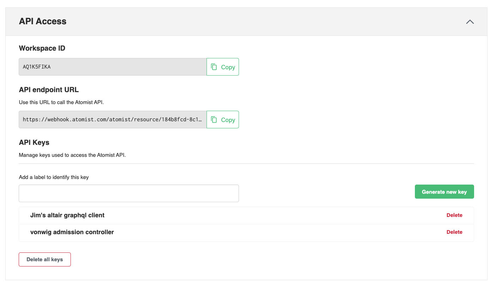

## Automatic Spec Updates

### Using the Flux kustomization controller

#### Choose a repository on GitHub

Either choose an existing gitops repository, or create a new one.  This will be the repository that you'll use to hold
the kubernetes specifications that will be synchronized with your cluster.

You can use a repository in your personal user org, or a GitHub Organization.  You'll need the name of the repository, the org name, and 
a personal access token with enough scope to access the repository.

```
GITHUB_USER=<org-or-user-name>
GITHUB_TOKEN=<personal access token>
GITHUB_REPO=<repo-name>
```

#### Install flux in your cluster

Requires environment variables `GITHUB_USER` and `GITHUB_TOKEN` to be set.  Use the `--personal` flag if you're using your personal org but
leave this flag out if you're using a shared GitHub organization.

```bash
flux bootstrap github \
   --owner=$GITHUB_USER \
   --repository=fleet-infra \
   --branch=main \
   --path=./clusters/my-cluster \
   --personal
```

#### Add at least one kustomization.yaml file

In a typical scenario, we are looking for candidate images that are _ready_ to
be pulled into the cluster.  A kubernetes deployment spec would have an entry that looks
like this.

```yaml
spec:
  containers:
    - image: gcr.io/project/service1
```

A `kustomization.yaml` that references this `deployment.yaml` file can update the `newTag` entry whenever
a new Image is ready.

```yaml
apiVersion: kustomize.config.k8s.io/v1beta1
kind: Kustomization
namespace: production
resources:
- deployment.yaml
images:
- name: gcr.io/project/service1
  newTag: v161
```

In this example, an image from a repository named `gcr.io/project/service1` can now be updated
via the flux kustomization controller.

If you're using the `$GITHUB_USER/$GITHUB_REPO` from above, then the kustomization.yaml, and the deployment.yaml, will need
to be committed to some sub-directory of `/clusters/my-cluster` (this was the value passed to `--path` above).  For example you could commit
these to `/clusters/my-cluster/service1_base`.

#### Configure automatic updates for this git repository

Now that Flux is monitoring this kustomizations, any updates to the `kustomization.yaml` file in the default
branch ref, will be synchronized by your cluster.

Every repository containing updateable kustomization.yaml files must
be included in the array of repo slugs.  Create a json file (e.g. repos.json)
and record the names of any gitops repos containing kustomization.yaml
files you might want to automatically update.

```bash
cat <<'EOF' > repos.json
{"repos": ["user-or-org/repos-name"]}
EOF
```

Now execute the scripts below to enable the automatic updates:

```bash
ATOMIST_WORKSPACE_ID=<workspace-id>
ATOMIST_API_KEY=<api-key>
```

* `workspace-id`
    * Grab your workspace ID from [the Integrations tab](https://dso.atomist.com/r/auth/integrations)
* `api-key`
    * Used to authenticate with the Atomist API and managed in [the Integrations tab](https://dso.atomist.com/r/auth/integrations)



```bash
cat <<'EOF' > policy.graphql
mutation setPolicy($rules: [String!]!) {
  setConfigurationParameter(
    name: "deploy-integration", 
    namespace: "atomist", 
    parameter: {stringArray: 
                {name: "gitops-repos", 
                 value: $repos}, 
    configurationName: "policy-cfg") 
  {
    configured {
      skills {id}
    }
  }
}
EOF

curl -X POST \
     -d '{"query": "'"$(sed 's/"/\\"/g' < policy.graphql)"'", "variables": '"$(< repos.json)"'}' \
     -H "Authorization: Bearer ${ATOMIST_API_KEY}" \
     -H "Content-Type: application/json" \
     https://automation.atomist.com/graphql/team/${ATOMIST_WORKSPACE_ID}
```

