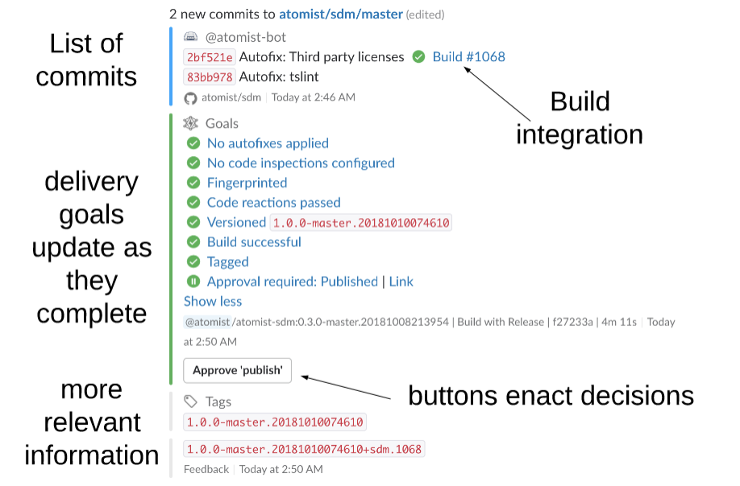

# Atomist - How Teams Deliver Software

Every serious business has its own development and delivery experience. Most of them
aren't what we want. We want to spend our time and focus solving problems for the business, but to do that well, 
we need to enact our own blueprint for software delivery.

So far, enterprises piece together pipeline tools, configured by a plethora of YAML or by hand in a GUI. For
anything interesting, we resort to a Bash script, the lowest common denominator of programming. 
We enroll myriad chatbots to spam our channels. We write how-to wiki pages and distribute hand-me-down scripts.
As our practices improve, older projects languish in prior standards. Meanwhile we shake our heads wistfully over 
the elegant flow of shiny new delivery tools -- they will never fit our real-world environment.

Atomist says, there is a better way. A world beyond pipelines, a world of little YAML and Bash,
a world where we code our way to an appropriate delivery experience, with higher coding standards, 
up-to-date application suites, and continual improvement.
And this way begins where we are, not with a big migration.

The new world is driven by events, not configuration, and we specify our reactions in a modern programming language.
These events are correlated to each other into a coherent model, an API for Software.
Developers and automations work together, coordinating in chat. Decisions are for people;
consistent execution of tedious tasks is for programs.

!!! tldr "Escape Bash and YAML"
    Tired of managing CI/CD Bash scripts and YAML config across dozens
    of repositories?  Use Atomist to tame the complexity and execute
    your best delivery process across all your repositories.

[www]: https://atomist.com/ (Atomist - How Teams Deliver Software)

## What is this better way?

Atomist lets you construct your delivery process in code -- but not too much code.
A service, a framework, and some libraries take care of the pieces that are common to every
development organization. Atomist works atop your existing toolchain, adding functionality 
and smoothing your experience; then you're free to improve it.

The crux of your development experience lives in your **software delivery machine** (SDM).
This is a service that runs wherever you choose to run it. Start with one of ours,
then make it yours. Your SDM is in TypeScript (or JavaScript works too), and comes with
a framework designed for software delivery and development automation. Write functions to make decisions
or take action, with access to all the code plus the context of the push or build or issue event.
All of this is open source.

While you can run an SDM independently and in private to help only yourself, the magic happens
when it connects to the Atomist service to respond to your whole team or organization.
The service provides triggering with rich events and custom commands, interactive chat integration,
and [built-in automations][lifecycle] like sweet chat messages for standard events like
code push and issue creation. These chat messages get _updated_ when new information comes in. They include
useful buttons to take action: raise a PR, label an issue, or approve the next step in the deploy process.

## But wait, there's more!

I've talked about how your delivery flow can be defined in code instead of Bash, 
in one open place instead of many narrow pipelines. I mentioned custom commands, where you can ensconce 
common developer activities in a convenient location, accessible from chat. These commands are code:
consistent, shared, versioned. You might have gleaned that because your Software Delivery Machine is code, you're
never limited to plugins, nor to anyone else's idea of the correct delivery mechanism; your SDM can integrate with your existing tools. [Keep the tools that are working for you][favorite-tools-blog], and integrate new ones
as you wish. Tie these together with an SDM, plus bonuses like [automatic CHANGELOG management][changelog-pack].

Your SDM gives you something else: the ability to manipulate code across all your projects with one command. 
Atomist libraries help you write code transforms--functions that operate on code--and the API for Software
turns those into branches, pull requests, or automatic commits on every deviating push. Bring code up to standards
and then keep it there.

Your SDM gives you something else: start new projects with the right code and setup, every time. Atomist generators
start from a real, working project and use code transforms to construct a starting point in a new repository. Set up
any other 

Your SDM can respond to [more events][events], and to custom events that you send. You can query your correlated events
using GraphQL. You can build chat commands, with updating messages and adding action buttons. 
You can [add integrations][pack]
and commands written by Atomist and the community, and contribute your own.

[changelog-pack]: pack/changelog.md (Changelog Pack)
[events]: developer/events.md (Events Documentation)
[pack]: pack/index.md (List of Packs)
[favorite-tools-blog]: https://the-composition.com/one-great-delivery-experience-your-favorite-tools-7f390f57d896 (One Great Delivery Experience, Your Favorite Tools blog)

## Stories

Check out some samples of what an Atomist SDM can do:

*  [Upgrade test files to a new standard][autofix-blog-test]
*  [Enforce custom code formatting][autofix-blog-stars]
*  [Deploy Spring Boot to Kubernetes][spring-boot-to-k8s-blog], and generate new projects, and manage versions of existing projects ([video][spring-one])
*  [Convert a migration script into a Slack command][schema-deploy-blog]

[spring-one]: https://www.youtube.com/watch?v=VDCHnTPknsI (Rod Johnson speaks at Spring One 2018)
[spring-boot-to-k8s-blog]: https://the-composition.com/deploy-your-spring-boot-application-to-kubernetes-in-3-mins-fdd37a212c6c (Christian Dupuis's Spring Boot to Kubernetes Blog)
[autofix-blog-test]: https://the-composition.com/making-change-stick-with-code-transforms-and-autofixes-587d19e0ba1b (Rod blogs about upgrading test file names)
[autofix-blog-stars]: https://the-composition.com/align-the-stars-programmatically-35dc5625f97d (Jess blogs about autofixing comment formatting)
[schema-deploy-blog]: https://the-composition.com/automation-story-graphql-schema-deployment-7893eb55ed18 (Jess blogs about graphql schema deploy)

## You might want to know

*  [Existing integrations][integrations]
*  [Architecture][]
*  [Security model][security]

[integrations]: user/integrations.md (Existing Atomist Integrations)
[security]: developer/security.md (Atomist Security Model)
[architecture]: developer/architecture.md (Atomist Architecture)

## Try it out
 
-   If you want to get started using Atomist in your team, with the [built-in
    chat integrations][lifecycle], go to the [Using
    Atomist][user] page to get Atomist installed in your Slack
    workspace, authorized in GitHub, and connected to your continuous
    integration system.

-   If you already are using Atomist and are interested in writing
    your own SDM, you can go to the [Developer
    Guide][dev-guide] to learn how to create and run your own
    SDM.

[user]: user/index.md (Atomist User Guide)
[quick-start]: quick-start.md (Atomist Developer Quick Start)
[dev-guide]: developer/sdm.md (Atomist Automations Developer Guide)
[lifecycle]: lifecycle.md (Built-in Chat Integrations)