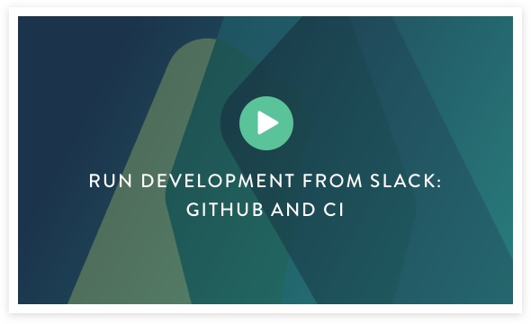

# Atomist Overview

Atomist enables you to ship software in less time and respond to
operational events more quickly. By automating tasks, integrating
tools, and providing timely, correlated, and actionable information,
Atomist makes software delivery faster, more standardized, and more
fun. For a glimpse of Atomist in action, check out the following video:

!!! important ""
    If you haven't done already, your first step is to check out the out-of-the-box features of Atomist by working through the [Getting Started][getting-started] section.

Atomist works with the platforms
and tools you already use, for example: [GitHub][] (including [GitHub Enterprise](https://enterprise.github.com/home)), [Slack][], [Travis CI][], [CircleCI][], and [Jenkins][].  Atomist also understands your code: Java, C#, JavaScript, Scala, Python, Clojure,
even Dockerfiles and Maven POMs.  Most importantly, Atomist
understands the relationship between your code, your tools, your
environments, and your running services and brings this information to
where your team collaborates: [Slack][].

[GitHub]: https://www.github.com
[GitHub Enterprise]: https://enterprise.github.com/home
[Slack]: https://slack.com/
[Travis CI]: https://travis-ci.org/
[CircleCI]: https://circleci.com/
[Jenkins]: https://jenkins.io/

-   [Get Started][getting-started] right now by introducing Atomist to your Slack team and GitHub organisation.
-   [Get a Tour of Atomist][user-guide] by exploring the User Guide.
-   [Learn how to][how-to-configure] customize your Atomist experience using configuration.
-   [Learn how to][how-to-customize] customize Atomist even further using our TypeScript-based Rug API.
-   Browse the [Reference Documentation][refdoc].

[getting-started]: getting-started/index.md (Atomist Getting Started)
[user-guide]: user-guide/index.md (Atomist User Guide)
[how-to-configure]: how-to-configure/index.md (How to Configure Atomist)
[how-to-customize]: how-to-customize/index.md (Hot to Customize Atomist)
[refdoc]: reference/index.md (Atomist Reference Documentation)

To stay up to date with Atomist and even get involved then you can:

-   Join the [Atomist Community Slack][slack]
-   Follow our blog, [The Composition][composition]
-   Follow [@atomist][twitter] on Twitter

[slack]: https://join.atomist.com/ (Atomist Community Slack)
[composition]: https://the-composition.com/ (Atomist Blog)
[twitter]: https://twitter.com/atomist (@atomist on Twitter)

