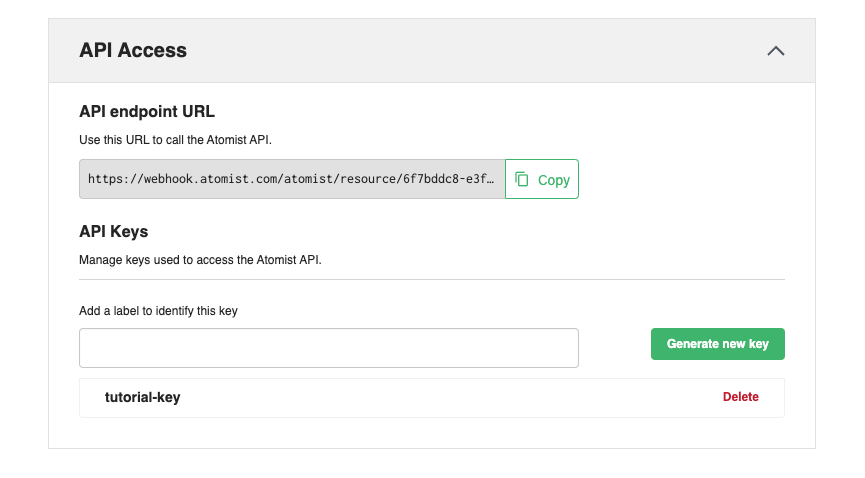

## Tracking Image Deployments

Atomist compares recent image vulnerabilty scans against the scans of images that are currently deployed.  
This level of tracking gives developers contexts about when security debt is both increasing and decreasing.  This can be integrated in several ways:

* steps in continuous deployment pipelines
* Kubernetes Admission Controllers (for kube-based deployments)
* calling api directly

## Api

Each Atomist workspace exposes an endpoint that can be called whenever an Image is deployed.  All subsequent scans will can now be compared against each recorded environment.  Lookup the endpoint url in the [Atomist app](https://dso.atomist.com/ACDANG5BG/integrations).



!!! Note
    you must create an api-key to use this endpoint.

The simplest form of interation is to call this api whenever a new image is deployed.  The default environment name is `deployed` - if you want to image scans, and GitHub checkruns to start comparing against a "deployed" image, then call:

```
$ curl \\
  -X POST \\
  -H "Content-Type: application/json" \\
  -H "Authorization: bearer api-oken" \\
  https://webhook.atomist.com/atomist/resource/39b472d9-c249-4ee2-80ec-bdbdbcb15026 \\
  -d '{"image": {"url": "gcr.io/atomist-container-registry/bot-service@sha256:698e0b6c22c8922b2c4ed257afbff40bcfe6597c744648f695f907598d3f6b5c"}}'
```

You must use the `digest` form of an image url.  Images tags can move.  They are not suitable for stable vulnerability comparisons.

### Options

The payload supports additional fields to support additional use cases.

```json
{
    "environment": { "name": "unique-env-name" },
    "image": {
        "url": "host/repository@digest",
        "name": "optional service name"
    },
    "platform": {
        "os": "linux",
        "architecture": "amd64",
        "variant": "optional variant"
    }
}
```

* use custom environment names to track different image versions in environments like `staging` and `production` 
* multi-platform image manifest lists are supported.  Add the platform details for the environments. Vulnerability scans are dependent on the platform.
* if you are deploying multiple images from the same container repository into one environment, it is mandatory that each `image` have a unique `name`.

