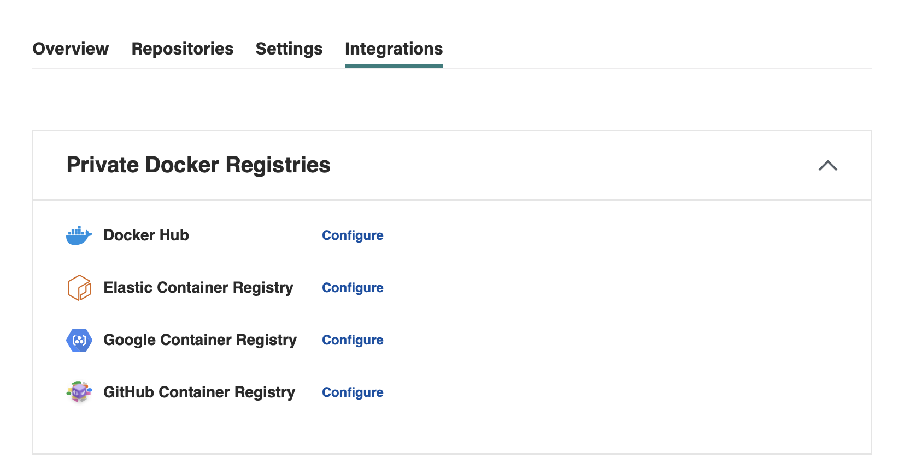
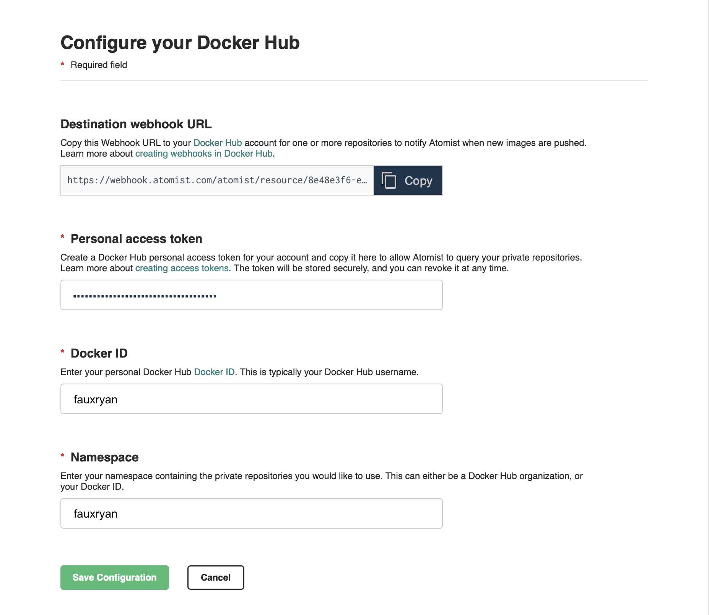

# Docker Hub

Atomist provides built-in support for images in public Docker Hub repositories. This is used to
analyze base images hosted on Docker Hub.  [Docker Hub][docker-hub] also supports webhook 
notifications for repositories in privately owned namespaces. Configure access to your private
namespaces as described below to enable Atomist to apply Docker policy to private images.

[docker-hub]: https://hub.docker.com/ (Docker Hub)

## Configuring

Navigate to the **Integrations** tab and click **Configure** next to the Docker Hub integration.

To configure the integration:

1. Enter a [Personal access token](https://docs.docker.com/docker-hub/access-tokens/) with _read_ access permission.
2. Enter the [Docker ID](https://docs.docker.com/docker-id/) corresponding to the personal access token.
3. Enter the namespace for your public or private image repositories. This can either be a Docker Hub organization, or your Docker ID.

## Creating Webhook on Docker Hub

Navigate to the Webhooks tab on [Docker Hub][docker-hub] for one of your repos and copy the 
**Destination webhook URL** from the Docker Hub integration configuration on Atomist 
into "Webhook URL" field on Docker Hub.

After clicking "Create", you'll see the Webhook listed under "Current Webhooks".

More documentation on webhooks can be found [here](https://docs.docker.com/docker-hub/webhooks/).

Atomist is now ready to track updates to this repository.

