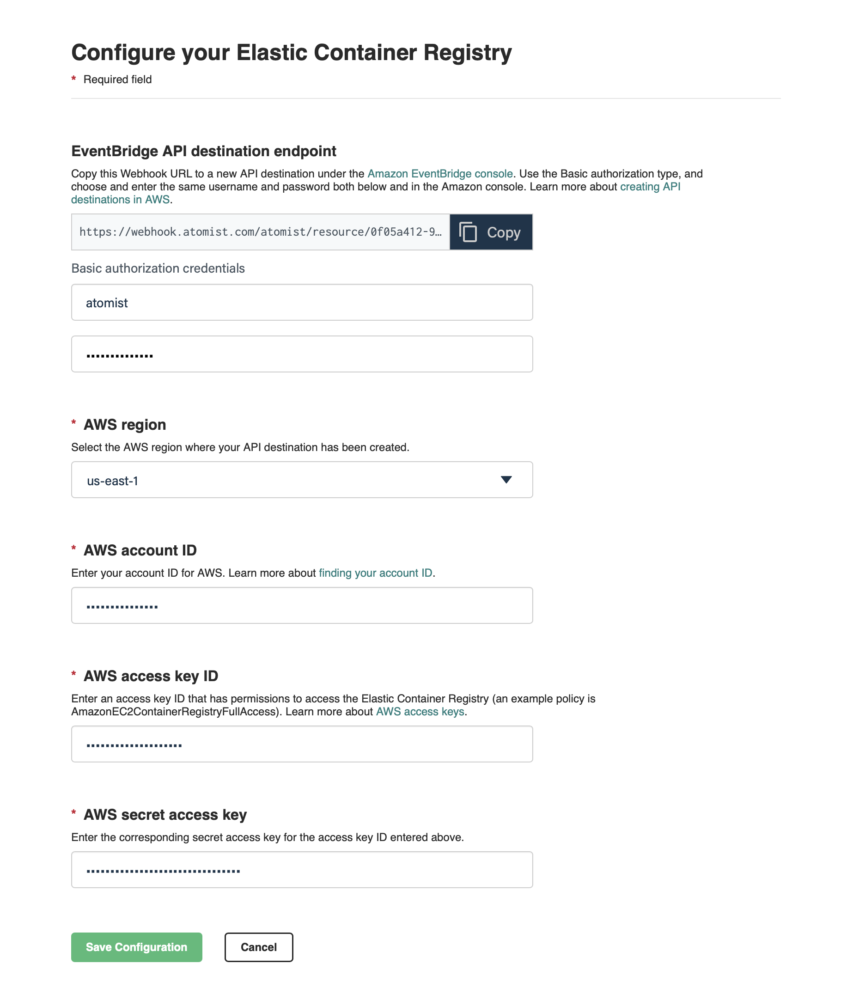

# Amazon Elastic Container Registry

There are two steps required to integrate Atomist and ECR.  Step one is configuring Atomist.  After this completing this
step, Atomist will be able to read Docker v2 api exposed by ECR.  Step two is configuring
AWS EventBridge.  After completing step two, Atomist will be notified when new images are pushed to ECS.

### Step 1:  Configuring Atomist

In this step, the user must tell Atomist about the account and region for the ECS instance.  We will also need the user
to enter an `access key id` and a `secret access key` which has permission to read the Docker v2 api.  We recommend
creating an account specifically for this integration and attaching the `AmazonEC2ContainerRegistryReadOnly` policy.
Providing atomist with credentials for this account will allow the integration to apply policy to images and metadata,
that have been pushed to ECR.

In this step, users must also choose a username/password combination that will be used when configuring AWS EventBridge
in the next step.

### Step 2:  Configuring AWS EventBridge

In the previous step, users were asked to enter basic auth credentials for an Atomist webhook.  The webhook url was
assigned by Atomist.  This url, combined with the credentials, are needed to configure AWS EventBridge.

This information will be needed to complete the configuration of AWS EventBridge.

From a high level, we'll need to create a new EventBridge rule.  However, this will roughly break down into three
individual steps:

1.  Create a rule `pattern`.  In this rule, it will be a pattern matching ECR events.
2.  Create a `target` for the new rule.  This is where we tell our rule about the Atomist webhook url.
3.  Create a new `connection` for the new `target`.  This is where we add the basic auth credentials that were created
    in step 1.

In the AWS UI, these three steps can be pulled together into the creation of one rule.

#### Create a rule

An easy way to get started is to use the AWS console.  The AWS EventBridge service has a "Rules" page where you can
create a new rule:

In the first part of the rule configuration, provide a rule `name` and `description`, and then define the pattern.  A
simple pattern that can be configured using drop-down menus is:

* `Service Provider`:  AWS
* `Service Name`:  Elastic Container Registry (ECR)
* `Event Type`: All Events

The configuration screen will look like this:

Using the "default" event bus is a good choice.

#### Add a Target and a Connection

After setting up the event pattern, you'll need to define a target for the rule.  The target type for webhooks is called
`API destination`.  You'll be able to create a new api destination in line. 

* the `API destination enpdoint` must be the webhook url copied over from Atomist.
* the `HTTP method` must be `POST`
* you can leave the `Invocation rate limit per second` blank.  ECR events are naturally rate limited.

Finally, the credentials for the target are added in a separate step.  This is where you'll need to copy in the basic
auth credentials that you configured on the Atomist side.  You won't need to add any custom http parameters or inputs.
The `Add Target` button at the bottom of this form is for adding `additional` targets.  You do not need to click this.

#### Create the Rule

The final step is to click the `Create` button at the bottom of the form.

The connection with Atomist will be live at this point.  Simply delete this rule to stop sending events to Atomist.

