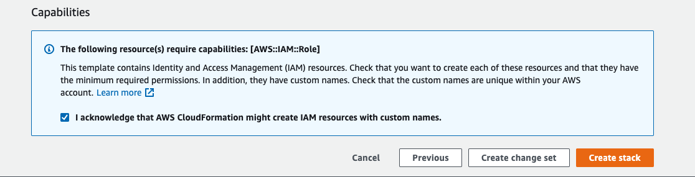

# Amazon Elastic Container Registry

Setup a connection between AWS ECR and Atomist.  After completing this setup, Atomist will be notified when Images are either Pushed or Deleted from your registry.  Atomist will also have read-only access to your registries.  This will enable Atomist to scan, and report on your Images.

!!! Steps
    1. Start configuring the Atomist [ECR Integration][new-integration]
    2. Create a stack using our public Cloud Formation template 
    3. Copy one Output value (a role ARN) from the stack back to Atomist.

[new-integration]: https://dso.atomist.com/r/auth/integrations/s/atomist/ecr-integration/new

### Step 1:  Start Configuration

Navigate to the [integration config page][new-integration].  You should be able to fill out all fields except the "Trusted Role ARN".  You will only know the role ARN after running cloud formation.

Choose basic auth credentials to protect the endpoint that AWS will use to notify Atomist when Images are pushed or deleted.  The url, and the basic auth credentials, will be parameters to the cloud formation template in the next step.

<figure style="text-align: center;">
  
</figure>

### Step 2:  Configure AWS

In order to simplify onboarding, we have created a public Cloud Formation template.  This template will create an IAM role to provide Atomist with read-only access to ECR.  It will also set up AWS Event Bridge to notify Atomist whenever Container Images are pushed or deleted.  This notification occurs over HTTPS using the url and the basic auth creds you configured in the previous step.

!!! Note
    How does Atomist protect you from a [confused deputy attack][confused-deputy]?  
    Our cloud template ensures that every customer has a unique `ExternalId`, 
    along with the appropriate condition on the IAM role statement.
    Atomist will always pass this ExernalId whenever we need to access resources in your account.

[confused-deputy]: https://docs.aws.amazon.com/IAM/latest/UserGuide/confused-deputy.html

You can inspect this stack in the Designer before creating it.  Before creating the stack, AWS will ask you to enter four parameters.  You must use the same values that you entered into the form above.

!!! Note
    Click on one of the "Launch Stack" buttons below to start reviewing the details in your AWS account

<table>
      <tr>
        <th>Region</th>
        <th>ecr-integration.template</th>
      </tr>
      <tr>
        <th>us-east-1</th>
        <td>
          
        </td>
      </tr>
      <tr>
        <th>us-east-2</th>
        <td>
          
        </td>
      </tr>
      <tr>
        <th>us-west-1</th>
        <td>
          
        </td>
      </tr>
      <tr>
        <th>us-west-2</th>
        <td>
          
        </td>
      </tr>
      <tr>
        <th>eu-west-1</th>
        <td>
          
        </td>
      </tr>
      <tr>
        <th>eu-west-2</th>
        <td>
          
        </td>
      </tr>
      <tr>
        <th>eu-west-3</th>
        <td>
          
        </td>
      </tr>
      <tr>
        <th>eu-central-1</th>
        <td>
          
        </td>
      </tr>
      <tr>
        <th>ca-central-1</th>
        <td>
          
        </td>
      </tr>
    </table>
    

Before creating the stack, AWS will ask for acknowledgement that creating this stack requires a capability.  This stack creates a role that will grant Atomist read-only access to ECR resources.

## Step 3: Copy Role ARN to Atomist

Once the stack has been created, there will be one output value that must be copied back to Atomist.  The `Value` for the Key `AssumeRoleArn` must be copied.

Copy the value into the field named "Trusted Role ARN".

Save the configuration.  Atomist will now test the connection with your ECR registry.  You'll see a green check mark beside the integration if a successful connection was made.

