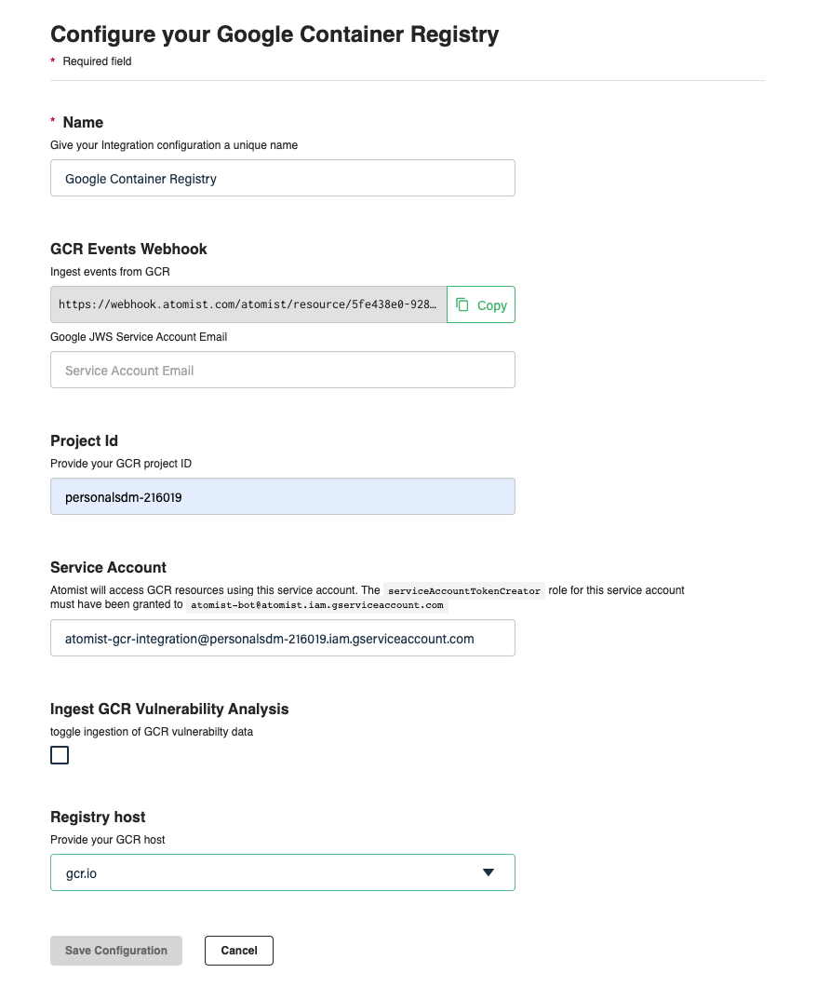
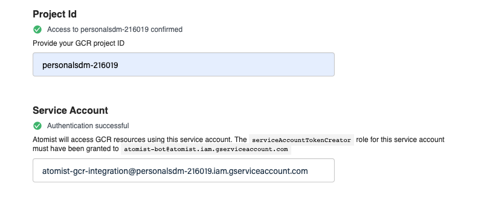
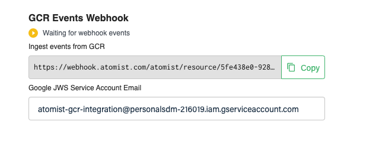
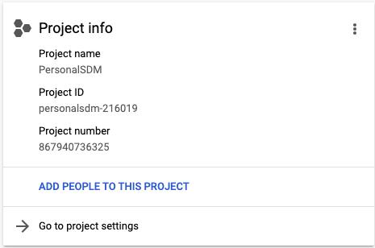
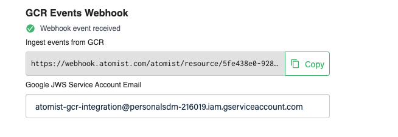

# GAR

The Atomist integration watches for new Images being pushed to the GAR
registry, and continuously monitors vulnerability databases for anything that
might impact you.  To setup the integration, a GAR administrator will need to
complete two steps:

1.  Create a service account and grant it the `roles/artifactregistry.reader` role
2.  Create a PubSub subscription on the `gcr` topic to notify when new Images are pushed 

## Step 1: Granting Atomist Read-Only Access to GAR

This procedure requires a project administrator because you'll be creating a
new service account, and two new iam bindings.  The service account can be called
anything (we've called it `atomist-gar-integration` in the example below).
After it is created, you'll enter the service account address, and the project
id into the GAR Integration form.  No credentials will need to be exchanged
because you'll have granted Atomist permission to create an access token for
this new service account.  The gcloud instructions below achieve three things:

1.  First step creates a new service account.  This service account represents
    how Atomist will access GCR on your behalf.
2.  Grant only the `roles/artifactregistry.reader` role to this service account.
    Permissions should be kept to only what Atomist needs for accessing GCR.
3.  Finally, grant Atomist permission to create an access token for this new
    service account.

Removing, or suspending, this service account will prevent any further access
to your GAR resources.  The `gcloud` instructions are included here:

```bash
SERVICE_ACCOUNT_ID="atomist-gar-integration"
PROJECT_ID="YOUR_GCP_PROJECT_ID"

# create the service account
gcloud iam service-accounts create ${SERVICE_ACCOUNT_ID} \
    --description="Atomist GAR Integration Service Account" \
    --display-name="Atomist GAR Integration"

# new service account should be granted read-only access to GCR
gcloud projects add-iam-policy-binding ${PROJECT_ID} \
    --member="serviceAccount:${SERVICE_ACCOUNT_ID}@${PROJECT_ID}.iam.gserviceaccount.com" \
    --role="roles/artifactregistry.reader"

# grant atomist access to this service account
gcloud iam service-accounts add-iam-policy-binding "${SERVICE_ACCOUNT_ID}@${PROJECT_ID}.iam.gserviceaccount.com" \
    --member="serviceAccount:atomist-bot@atomist.iam.gserviceaccount.com" \
    --role="roles/iam.serviceAccountTokenCreator"
```

Your `PROJECT_ID` as well as the address of the new service account must
configured in your Atomist workspace.  You'll also need to set the region for
your GCR instance.



Once these 3 pieces of information have been saved, Atomist will test the
connection.  You'll see some green check marks when a connection has been
established.



## Step 2: Configuring the Webhook

All GAR projects will have a pubsub topic named `gcr`.  Use the instructions
below to create a new PubSub subscription on that Topic.  This topic receives
notifications when new images are pushed to your registry.

Start by copying your workspace's unique webhook url. This will be the
`PUSH_ENDPOINT_URI` on your new subscription.



The integration form will show that no Webhook events have yet been received.
If your Google project was created recently (after April 2021), then the
subscription can be created with one step.  However, older projects will
require an additional grant.  The pubsub service account can not by default
sign outbound requests without this additional grant.  Atomist validates all
incoming push requests to ensure that they came from your account, and were
intended for Atomist.

The name of the `SUBSCRIPTION`.  We use `atomist-gar-integration-subscription` in the example below.  
The `PUSH_ENDPOINT_URL` must be copied from your Atomist workspace.  You can use the same service account email address that was created in the previous step.

The `PROJECT_NUMBER` is different from the `PROJECT_ID` but both can be found in your google cloud console dashboard.



```bash
SERVICE_ACCOUNT_EMAIL="${SERVICE_ACCOUNT_ID}@${PROJECT_ID}.iam.gserviceaccount.com"
SUBSCRIPTION="atomist-gar-integration-subscription"
PUSH_ENDPOINT_URI="COPY_THIS_FROM_ATOMIST"

# step is only needed if project created before April 2021
PROJECT_NUMBER="how do we look this up"
PUBSUB_SERVICE_ACCOUNT="service-${PROJECT_NUMBER}@gcp-sa-pubsub.iam.gserviceaccount.com"
gcloud projects add-iam-policy-binding ${PROJECT_ID} \
 --member="serviceAccount:${PUBSUB_SERVICE_ACCOUNT}"\
 --role='roles/iam.serviceAccountTokenCreator'

gcloud pubsub subscriptions create ${SUBSCRIPTION} \
  --topic='gcr' \
  --push-auth-token-audience='atomist' \
  --push-auth-service-account="${SERVICE_ACCOUNT_EMAIL}" \
  --push-endpoint="${PUSH_ENDPOINT_URI}"
```

After we've received our first successful image push, the integration page will indicate this with another green check mark.



[pubsub]: https://cloud.google.com/pubsub/docs/push
[pubsub-authentication]: https://cloud.googme.com/pubsub/docs/push#setting_up_for_push_authentication
[short-lived-credentials]: https://cloud.google.com/iam/docs/creating-short-lived-service-account-credentials
[gcr-access-control]: https://cloud.google.com/container-registry/docs/access-control
[pubsub-create]: https://cloud.google.com/sdk/gcloud/reference/pubsub/subscriptions/create
