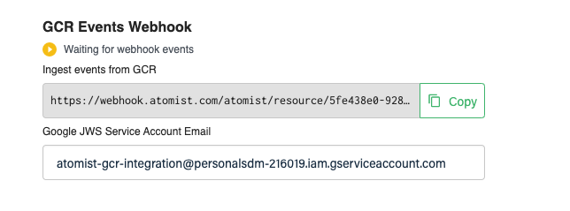
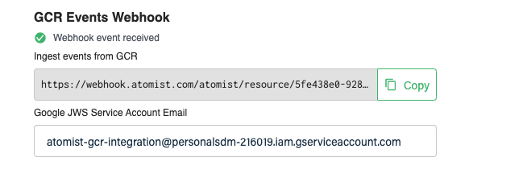

# GCR

The Atomist integration watches for new Images being pushed to the GCR registry, and continuously monitors vulnerability databases for anything that might impact you.  To setup the integration, a GCR administrator will need to complete two steps:

1.  Create a service account and grant it read-only access to GCR
2.  Create a PubSub subscription to notify when new Images are pushed 

## Step 1: Granting Atomist Read-Only Access to GCR

This procedure requires a project administrator because you'll be creating a
new service account, and two new iam bindings.  The service account can be called
anything (we've called it `atomist-gcr-integration` in the example below).
After it is created, you'll enter the service account address, and the project
id into the GCR Integration form.  No credentials will need to be exchanged
because you'll have granted Atomist permission to create an access token for
this new service account.  The gcloud instructions below achieve three things:

1.  First step creates a new service account.  This service account represents
    how Atomist will access GCR on your behalf.
2.  Grant only the `roles/storage.objectViewer` role to this service account.
    Permissions should be kept to only what Atomist needs for accessing GCR.
3.  Finally, grant Atomist permission to create an access token for this new
    service account.

Removing, or suspending, this service account will prevent any further access
to your GCR resources.  The `gcloud` instructions are included here:

```bash
SERVICE_ACCOUNT_ID="atomist-gcr-integration"
PROJECT_ID="YOUR_GCP_PROJECT_ID"

# create the service account
gcloud iam service-accounts create ${SERVICE_ACCOUNT_ID} \
    --description="Atomist GCR Integration Service Account" \
    --display-name="Atomist GCR Integration"

# new service account should be granted read-only access to GCR
gcloud projects add-iam-policy-binding ${PROJECT_ID} \
    --member="serviceAccount:${SERVICE_ACCOUNT_ID}@${PROJECT_ID}.iam.gserviceaccount.com" \
    --role="roles/storage.object"

# grant atomist access to this service account
gcloud iam service-accounts add-iam-policy-binding "${SERVICE_ACCOUNT_ID}@${PROJECT_ID}.iam.gserviceaccount.com" \
    --member="serviceAccount:atomist-bot@atomist.iam.gserviceaccount.com" \
    --role="roles/iam.serviceAccountTokenCreator"
```

Your `PROJECT_ID` as well as the address of the new service account must configured in your Atomist workspace.  You'll also need to set the region for your GCR instance.


Once these 3 pieces of information have been saved, Atomist will test the connection.  You'll see some green check marks when a connection has been established.


## Step 2: Configuring the Webhook

All GCR projects will have a pubsub topic named `gcr`.  Use the instructions below to create a new PubSub subscription on that Topic.  This topic receives notifications when new images are pushed to your registry.

Start by copying your workspace's unique webhook url. This will be the `PUSH_ENDPOINT_URI` on your new subscription.



The integration form will show that no Webhook events have yet been received.
If your Google project was created recently (after April 2021), then the
subscription can be created with one step.  However, older projects will require an additional grant. 
The pubsub service account can not by default sign
outbound requests without this additional grant.  Atomist validates all incoming push requests to ensure that they
came from your account, and were intended for Atomist.

The name of the `SUBSCRIPTION`.  We use `atomist-gcr-integration-subscription` in the example below.  The `PUSH_ENDPOINT_URL` must be copied from your Atomist workspace.  You can use the same service account email address that was created in the previous step.

```bash
SERVICE_ACCOUNT_EMAIL="${SERVICE_ACCOUNT_ID}@${PROJECT_ID}.iam.gserviceaccount.com"
SUBSCRIPTION="atomist-gcr-integration-subscription"
PUSH_ENDPOINT_URI="COPY_THIS_FROM_ATOMIST"

# step is only needed if project created before April 2021
PROJECT_NUMBER="how do we look this up"
PUBSUB_SERVICE_ACCOUNT="service-${PROJECT_NUMBER}@gcp-sa-pubsub.iam.gserviceaccount.com"
gcloud projects add-iam-policy-binding ${PROJECT_ID} \
 --member="serviceAccount:${PUBSUB_SERVICE_ACCOUNT}"\
 --role='roles/iam.serviceAccountTokenCreator'

gcloud pubsub subscriptions create ${SUBSCRIPTION} \
  --topic='gcr' \
  --push-auth-token-audience='atomist' \
  --push-auth-service-account="${SERVICE_ACCOUNT_EMAIL}" \
  --push-endpoint="${PUSH_ENDPOINT_URI}"
```

After we've received our first successful image push, the integration page will indicate this with another green check mark.



[pubsub]: https://cloud.google.com/pubsub/docs/push
[pubsub-authentication]: https://cloud.googme.com/pubsub/docs/push#setting_up_for_push_authentication
[short-lived-credentials]: https://cloud.google.com/iam/docs/creating-short-lived-service-account-credentials
[gcr-access-control]: https://cloud.google.com/container-registry/docs/access-control
[pubsub-create]: https://cloud.google.com/sdk/gcloud/reference/pubsub/subscriptions/create
