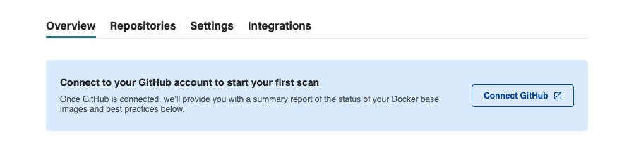
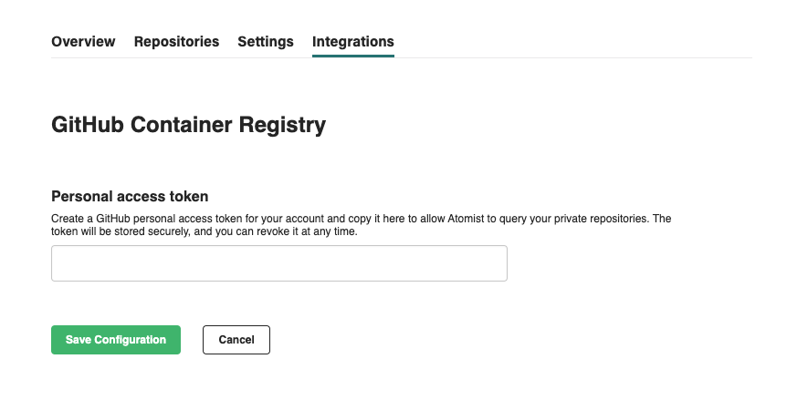
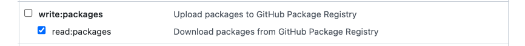

# GitHub Container Registry

!!! example
    1. Connect your GitHub user account or organization
    2. To enable "on push" scanning of private images, set a personal access token to use for container image pulls

### Step 1:  Connect your GitHub user account or organization

If you have not already connected a GitHub user account or a GitHub organization, do so by following the "Connect GitHub" steps. You will be redirected to GitHub to install the Atomist GitHub application. Be sure to install it into the GitHub user account or organization that contains your GitHub container registry.

!!! important
    Image scans are triggered by GitHub events sent to Atomist when a new image is pushed to your GitHub
    container registry.  In order for Atomist to be able to scan an image, the image must have a _Repository source_ 
    provided (see more below) and the Atomist GitHub app _Repository access_ must be configured to inlude the repository
    provided as the _Repository source_ for the image.
    
    For example, if the repository source for an image is listed as `https://github.com/org/repo1`, then the Atomist
    GitHub app must be connected to the `org` GitHub organization and must have `repo1` repository in the configured
    repository access.

### Step 2:  Enable the GHCR Integration  

The GHCR Integration must be enabled in order for Atomist to scan new images. Public images will be scanned without requiring a personal access token. To scan public images only, leave the _Personal access token_ field blank and click "Save Configuration". 

To scan private images, configure this integration with a GitHub personal access token that has [`read:packages` scope](https://docs.github.com/en/packages/learn-github-packages/about-permissions-for-github-packages).

### Ensuring images have a Repository source

Image scans are triggered by GitHub events sent to Atomist when a new image is pushed to your GitHub
container registry.  GitHub will only send events for images with a _Repository source_ provided.

There are two ways to set the repository source:

1. Build the image with a GitHub Action.  The GitHub repository containing the Actions workflow is 
set as the repository source automatically.
2. Add the `org.opencontainers.image.source` and `org.opencontainers.image.revision` labels to the
image. See our guide on [linking images and commits](https://docs.atomist.services/integration/linking-images/#setting-up-linking-for-your-docker-builds)
for details on how to set these labels.