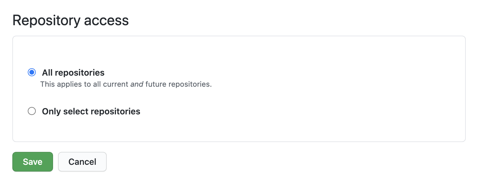
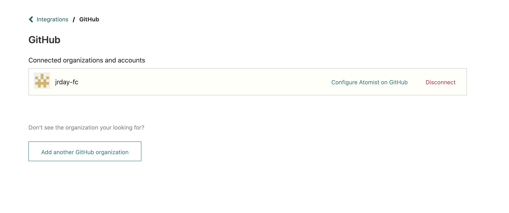

# GitHub

We provide a GitHub App so that skills can get events and information
from GitHub and take action on GitHub repositories.

Here is a video walking you through setting up the Atomist GitHub
integration.

  <iframe width="560" height="315" src="https://www.youtube-nocookie.com/embed/TLo3jDauKoU" frameborder="0" allow="accelerometer; autoplay; encrypted-media; gyroscope; picture-in-picture" allowfullscreen></iframe>

## Connect to GitHub

1. From **Manage > Integrations**, choose the GitHub integration.
2. Click **Connect to GitHub** and follow the authorization flow. You
   will be installing the [Atomist GitHub App][gh-app].
3. Install the Atomist GitHub App
    -   If your GitHub account is a member of one or more
        organizations, you will be asked to choose your personal
        GitHub account or a GitHub organization to install the Atomist
        GitHub app into.
    -   Otherwise, the Atomist GitHub app will be installed in your
        GitHub account.

!!! tip "Note"
    If you're unsure about what Atomist will have access to and what
    actions it will take, we suggest that you start by installing our
    GitHub app on your personal account only and limiting it to test
    repositories until you're comfortable expanding its access.
    
[gh-app]: https://github.com/apps/atomist (Atomist GitHub App)

## Manage Repository Access

We recommend installing the Atomist GitHub app with access to all
repositories.

However, if you wish to restrict access to selected repositories,
choose the **Configure Atomist on GitHub** option in **Manage >
Integrations > GitHub**.

## Disconnecting GitHub

You might want to disconnect GitHub when:

-   You want to change the GitHub organization or account that is
    connected to your Atomist workspace. To do so, disconnect the old
    GitHub organization or account first, then follow the instructions
    above for Connecting to GitHub to connect the new GitHub
    organization or account.
-   You want to remove Atomist access to a GitHub organization or
    account when you no longer need Atomist to have access.

To disconnect a GitHub organization or account:

1.  Visit **Manage > Integrations > GitHub** and click the
    **Disconnect** link. This removes the connection to your GitHub
    organization or account.
2.  Go to the [GitHub Applications settings page][gh-app-settings],
    then
    -   Find **atomist** on the Installed GitHub Apps tab, select
        **Configure**, then **Uninstall**. This removes the
        installation of the Atomist GitHub App from your GitHub
        organization or account.
    -   Find **atomist** on the Authorized GitHub Apps tab, select
        **Revoke**. This removes the authorization of the Atomist
        GitHub App from your GitHub organization or account.

[gh-app-settings]: https://github.com/settings/installations (GitHub Application Settings)
