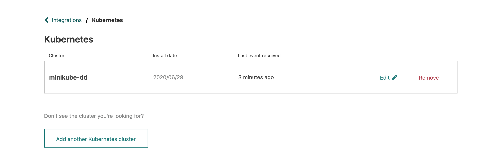

This integration works with a utility called [k8svent][] that we provide. k8svent is installed
on your Kubernetes cluster(s) and sends events to Atomist so skills can take action.

Here is a video walking you through setting up the Atomist Kubernetes
integration.

  <iframe width="560" height="315" src="https://www.youtube-nocookie.com/embed/wuRDAi9mQmY" frameborder="0" allow="accelerometer; autoplay; encrypted-media; gyroscope; picture-in-picture" allowfullscreen></iframe>

[k8svent]: https://github.com/atomist/k8svent (Atomist k8svent utility)

## Connect to Kubernetes

1.  From **Manage > Integrations**, choose the Kubernetes integration.
2.  Enter a name for the Kubernetes cluster you want to add.
    Typically this is something like "production" or "k8s-testing".
3.  Click **Add**.
4.  Copy the installation instructions from the popup.
5.  Paste the installation command into a terminal and hit **Enter**.

The installation command will use the [`kubectl`][kubectl] utility and
your current Kubernetes configuration context to install the Atomist
utility.  So make sure you have `kubectl` installed and configured to
operate on the cluster you are adding.

To add additional clusters, click **Add another Kubernetes cluster**
and repeat steps 2–5.

!!! error
    If you get an error when trying to install the Atomist Kubernetes
    integration, you may not have permissions to do so on your cluster.
    Ask your Kubernetes cluster admin for help.

[kubectl]: https://kubernetes.io/docs/reference/kubectl/overview/ (kubectl Overview)
