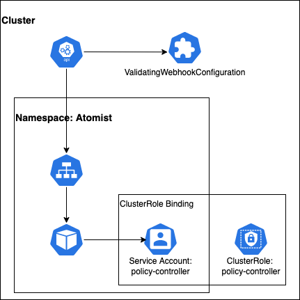

## Installation

### Prerequisites

1.  [openssl v3][openssl] (tested with `3.0.1`)
2.  [kustomize][kustomize] (tested with `v4.4.1`)
3.  [kubectl][kubectl] (tested with `v1.21.1`)
4.  kubectl must be authenticated and the current context should be set to the cluster that you will be updating

[openssl]: https://www.openssl.org/docs/man3.0/man7/migration_guide.html
[kustomize]: https://kubectl.docs.kubernetes.io/installation/kustomize/
[kubectl]: https://kubectl.docs.kubernetes.io/installation/kubectl/

### 1. Fork this repo

[Fork this repo](https://github.com/atomisthq/adm-ctrl/fork).

This repo contains a set of base kubernetes that you'll adapt using `kustomize`.

### 2. Api Key and Api Endpoint URL

Create an overlay for your cluster.  Choose a cluster name and then create a new overlay directory.

```
CLUSTER_NAME=replacethis
mkdir -p resources/k8s/overlays/${CLUSTER_NAME}
```

Create a file named `resources/k8s/overlays/${CLUSTER_NAME}/endpoint.env`.

The file will start out like this.

```properties
apiKey=<replace this>
url=<replace this>
```

The `apiKey` and `url` should be filled in with your workspace's values.  Find these in the [atomist app](https://dso.atomist.com/r/auth/integrations) and replace them in the file.

### 3. Initialize SSL certs and keystore

The kubernetes apiserver can only use HTTPS to send admission control requests.  This is true even when the admission webhook is running in the same cluster.  We can use a self-signed ca certificate, but we'll need to make the server certificate and private key available to the admission controller.  We'll also need to configure the apiserver to trust the self-signed CA certificate.   Since the keystore will need a password, generate a random password in a `password.txt` in the root of the project.

```bash
echo "changeme" > password.txt
```
This password will be used to set up the keystore, and also set as a kubernetes secret so the admission controller can use the keystore at runtime.

Update [lines 23 to 27](https://github.com/atomisthq/adm-ctrl/blob/main/cert.sh#L23-L27) in the `cert.sh` file at the root of this project.  Running this script
will generate the needed certificates, and keystore.

```bash
$ ./cert.sh
```

### 4. Update Kubernetes cluster

This procedure will create a service account, a cluster role binding, two secrets, a service, and a deployment.  All of these will be created in a new namespaced called `atomist`.



Create an overlay for customisations.

```
CLUSTER_NAME=replacethis
mkdir -p resources/k8s/overlays/${CLUSTER_NAME}
cp resources/templates/default_controller.yaml resources/k8s/overlays/${CLUSTER_NAME}/kustomization.yaml
```

This kustomization file will permit you to change the `CLUSTER_NAME` environment variable.  
In the initial copy of the file, the value will be `"default"`, but it should be changed to the name of your cluster.  This change is made to the final line in your new kustomization file.

```yaml
resources:
  - ../../controller
patchesJson6902:
- target:
    group: apps
    version: v1
    kind: Deployment
    name: policy-controller
  patch: |-
    - op: replace
      path: /spec/template/spec/containers/0/env/3/value
      value: "default"
```

Deploy the admission controller into the the current kubernetes context using the command shown below.

```bash
kustomize build resources/k8s/overlays/sandbox | kubectl apply -f -
```

At this point, the admission controller will be running but the cluster will not be routing any admission control requests to it.  Create a configuration to start sending admission control requests to the controller using the following script.

```bash
kustomize build resources/k8s/admission | kubectl apply -f -
```

[dynamic-admission-control]: https://kubernetes.io/docs/reference/access-authn-authz/extensible-admission-controllers/
