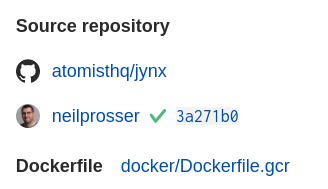

## About linking images

Configure image to Dockerfile linking to:

- See the status of the image and know if its safe to deploy
- Update GitHub with checks that report the scanning results
- See which repository the image was built from
- See the commit from which the image was built and know who pushed it



## How linking works with your Docker build process

Many Docker build processes consist of creating a working copy for a particular Git commit, and then executing a single-stage or multi-stage Docker build process.  The commit SHA and the Dockerfile that it used can be added to the resulting image with Docker image labels.  With this image metadata, any image pushed to a Docker registry can be linked back to the commit that generated it.

Atomist's Docker image linking support uses two Docker labels defined by the [Open Container Initiative image format specification](https://github.com/opencontainers/image-spec/blob/master/annotations.md).

- `org.opencontainers.image.revision` should be set to the SHA of the commit used during the build
- `org.opencontainers.image.source` should be set to the url of the GitHub repository used for this build process
- `com.docker.image.source.entrypoint` should be set to the relative path of the Dockerfile used to build this image.  This is not required if the Dockerfile is located in the root of the repository.

## Setting up linking for your Docker builds

There are several ways to add the labels needed for Docker image linking. If your Docker images are built as part of an automated build process, see the examples below for how to set up linking with several popular CI and build tools. If your Docker images are built manually or with a script, see the Command Line Docker build example.  Choose the approach that works best with your particular Docker build process.

### Command Line Docker Build

The `docker build` command supports adding labels directly from the command line.

```bash
docker build \
    --label "org.opencontainers.image.revision=$(git rev-parse HEAD)" \
    --label "org.opencontainers.image.source=https://github.com/my-org/my-repo" \
    --label "com.docker.image.source.entrypoint=docker/Dockerfile" \
    -f docker/Dockerfile \
    -t $IMAGE_NAME \
    .
```

This can also be done with `LABEL` instructions in the Dockerfile, and docker build args.  However, adding `--label` arguments has the advantage that you don't have to update existing Dockerfiles.  The labels will be added to the final image in multi-stage Docker builds. The example above assumes that the `docker build` process runs in an environment that has Git and that the command has been run in a checked out working copy.

### GitHub Actions

GitHub Actions workflows can also be updated to add label metadata to the image.  In the example below, we employ the `docker/build-push-action@v2` Action provided by [Docker in the GitHub Actions Marketplace](https://github.com/marketplace/actions/build-and-push-docker-images) and the variable `github.sha` to control the image labels.

```yaml
jobs:

  build:

    runs-on: ubuntu-latest

    steps:
    - uses: actions/checkout@v2
    - name: Log in to Docker Hub
      uses: docker/login-action@v1
      with:
        username: ${{ secrets.DOCKER_USERNAME }}
        password: ${{ secrets.DOCKER_KEY }}
    - name: Push to Docker Hub
      uses: docker/build-push-action@v2
      with:
        context: ./
        push: true
        file: ./Dockerfile
        tags: ${{ secrets.DOCKER_USERNAME }}/${{ github.event.repository.name }}:latest
        labels: |
          org.opencontainers.image.revision=${{ github.event.pull_request.head.sha || github.event.after || github.event.release.tag_name }}
          org.opencontainers.image.source=https://github.com/${{ github.repository }}
          com.docker.image.source.entrypoint=Dockerfile
```

The step named "Push to Docker Hub" handles the build and pushes each of the tags listed in the `tags` section.  The `labels` sections gives us full control over what labels are added to our images.

### Docker Hub Automated Builds

[DockerHub Automated Builds](https://docs.docker.com/docker-hub/builds/) automatically set variables `SOURCE_COMMIT` and `DOCKERFILE_PATH` in the automated build environment.  By creating a custom build hook, you can add `--label` instructions to the images built on Docker Hub.  In Docker Hub, a custom build hook is a file named `hooks/build` , located at the same level as the Dockerfile that will be run.

```bash
├── Dockerfile
└── hooks
    └── build
```

The contents of the `build` file should be something like:

```bash
#!/bin/bash

docker build \
  -t $IMAGE_NAME \
  --label "org.opencontainers.image.revision=$SOURCE_COMMIT" \
  --label "com.docker.image.source.entrypoint=$DOCKERFILE_PATH" .
```

The environment variables `IMAGE_NAME`, `SOURCE_COMMIT`, and `DOCKERFILE_PATH` are all set automatically by Docker Hub.

### Google Cloud Build

[Google Cloud Build](https://cloud.google.com/build) provides [default substitutions](https://cloud.google.com/build/docs/configuring-builds/substitute-variable-values), including `$PROJECT_ID` and `$COMMIT_SHA`.  Builds can be defined using a `cloudbuild.yaml` file in the repository.  Adding `--label` args to the `[gcr.io/cloud-builders/docker](http://gcr.io/cloud-builders/docker)` step is straight forward.

```yaml
steps:
- name: 'gcr.io/cloud-builders/docker'
  args: 
  - 'build' 
  - '-t' 
  - 'gcr.io/$PROJECT_ID/cj-test-docker' 
  - '--label' 
  - 'org.opencontainers.image.revision=$COMMIT_SHA' 
  - '--label' 
  - 'com.docker.image.source.entrypoint=docker/Dockerfile' 
  - '-f' 
  - 'docker/Dockerfile' 
  - '.'
images: ['gcr.io/$PROJECT_ID/cj-test-docker']
```

### AWS CodeBuild

[AWS Code Build](https://docs.aws.amazon.com/codebuild/latest/userguide/sample-docker.html)  uses [environment variables in build environments](https://docs.aws.amazon.com/codebuild/latest/userguide/build-env-ref-env-vars.html).  For GitHub Source triggers, the value of the environment variable `$CODEBUILD_RESOLVED_SOURCE_VERSION` will be set to the Git SHA. 

AWS Code Build defines steps in the `buildspec.yaml` spec.  The following example shows Docker build and push, where the build phase has been augmented with  `--label` args.

```yaml
version: 0.2

phases:
  pre_build:
    commands:
      - echo Logging in to Amazon ECR...
      - aws ecr get-login-password --region us-east-1 | docker login --username AWS --password-stdin $AWS_ACCOUNT_ID.dkr.ecr.us-east-1.amazonaws.com
  build:
    commands:
      - echo Build started on `date`
      - echo Building the Docker image...          
      - docker build -t base:latest --label "org.opencontainers.image.revision=$CODEBUILD_RESOLVED_SOURCE_VERSION" --label "com.docker.image.source.entrypoint=base/Dockerfile" -f base/Dockerfile .
      - docker tag base:latest $AWS_ACCOUNT_ID.dkr.ecr.us-east-1.amazonaws.com/base:latest      
  post_build:
    commands:
      - echo Build completed on `date`
      - echo Pushing the Docker image...
      - docker push $AWS_ACCOUNT_ID.dkr.ecr.us-east-1.amazonaws.com/base:latest
```

### Circle CI

[Circle CI](https://circleci.com/docs/2.0/building-docker-images/) makes the current Git SHA and REPOSITORY available 
in the [environment variables][circle-ci-built-ins] `$CIRCLE_SHA1` and `$CIRCLE_REPOSITORY_URL`.  
Adding labels to a `docker build` command in a job step is shown here.

```yaml
version: 2
jobs:
 build:
   machine: true
   steps:
     - checkout
     - run: |
         echo "$DOCKER_PASS" | docker login --username $DOCKER_USER --password-stdin

     - run: 
       name: docker build
       command: |
         docker build \
            --label "org.opencontainers.image.revision=$CIRCLE_SHA1" \
            --label "org.opencontainers.image.source=$CIRCLE_REPOSITORY_URL" \
            --label "com.docker.image.source.entrypoint=Dockerfile" \
            -t slimslenderslacks/app:latest .

     # deploy the image
     - run: docker push slimslenderslacks/app:latest
```

The configuration above assumes that the `Dockerfile` is located in the root of the project.  Use the relative
path from the root of the repository.

[circle-ci-built-ins]: https://circleci.com/docs/2.0/env-vars/#built-in-environment-variables
