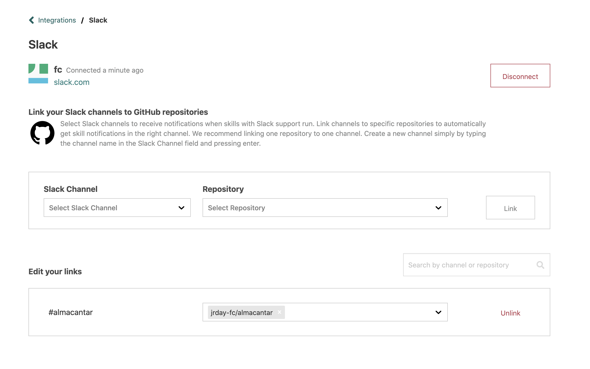

# Slack

Atomist has a powerful Slack integration to help your team leverage
the power of ChatOps.  Select the Slack channels where you'd like to
receive notifications when a given skill runs, and issue commands from
chat that run skills.

Here is a video walking you through setting up the Atomist Slack
integration.

  <iframe width="560" height="315" src="https://www.youtube-nocookie.com/embed/hSbPQn4ncUs" frameborder="0" allow="accelerometer; autoplay; encrypted-media; gyroscope; picture-in-picture" allowfullscreen></iframe>

Start here:

https://vonwig.slack.com/apps/A0HM83NCC-atomist?tab=more_info

## Connect to Slack

1.  From **Manage > Integrations**, choose the Slack integration.
2.  Click **Connect to Slack** and follow the Slack authorization
    flow. You will be adding the [Atomist Slack app][slack-app] to
    your Slack workspace.
    
[slack-app]: https://slack.com/apps/A0HM83NCC-atomist (Atomist Slack App)

## Linking Channels

Once your Slack integration is complete, you will need to link
channels to your GitHub repositories so that you receive notifications
in the right channels.

-   If you have not yet enabled the [GitHub integration][github],
    you'll need to do so before you can link channels.
-   Select a **Slack Channel** on the left, and one or more
    **Repositories** on the right, then click the **Link** button.
-   You can always add, edit and remove channel links in the **Manage
    > Integrations > Slack** page.
-   The `@atomist` bot will automatically be invited to linked channels.

[github]: github.md (Atomist GitHub Integration)

## Disconnecting Slack

You might want to disconnect Slack when:

-   You want to change the Slack workspace that is connected to your
    Atomist workspace. To do so, disconnect the old Slack workspace
    first, then follow the instructions above for Connecting to Slack
    to connect the new workspace.
-   You want to remove Atomist from a Slack workspace where you no
    longer need Atomist.

To disconnect your Atomist workspace from your Slack workspace:

1.  Visit **Manage > Integrations > Slack** and click the
    **Disconnect** button. This removes the Slack connection from your
    Atomist workspace.
2.  Go to the [Slack App Directory Manage Apps
    page][slack-manage-apps], find the Atomist app and select **Remove
    App**. This removes the Atomist Slack App from your Slack
    workspace.

[slack-manage-apps]: https://slack.com/apps/manage (Slack Manage Apps)
