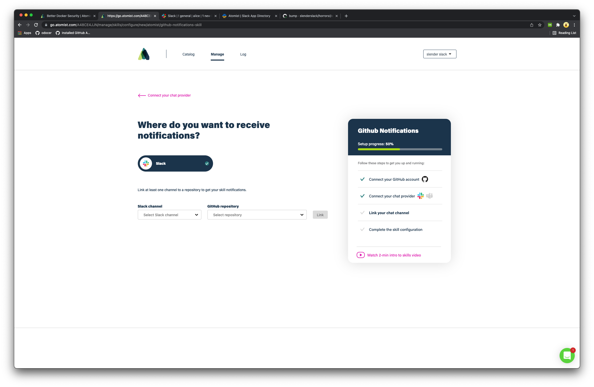

# Slack

Atomist has a powerful Slack integration to help your team leverage
the power of ChatOps.  After installing the bot, you'll need to link
some channels to GitHub repos.  The bot will only create notifications
in channels that have subscribed to them.

Start by installing the GitHub Notifaction Skill.  [Click here to start the install](https://go.atomist.com/catalog/skills/atomist/github-notifications-skill).

Use the "Continue" button on the right.

## Connect to Slack

In the next step, you'll be redirected to Slack so that you can install the Atomist application 
into your workspace.  This step can only be performed by a Slack user that has permission
to install new applications in the Slack workspace.

### 1. Redirect to Slack

### 2. Authorize the application

### 3. Redirect back to Atomist

After being redirected back to Atomist, you'll be asked to link a channel to one of your GitHub repositories. 

[slack-app]: https://slack.com/apps/A0HM83NCC-atomist (Atomist Slack App)

-   Select a **Slack Channel** on the left, and one or more
    **Repositories** on the right, then click the **Link** button.
-   You can always add, edit and remove channel links in the **Manage
    > Integrations > Slack** page.
-   The `@atomist` bot will automatically be invited to linked channels.

[github]: github.md (Atomist GitHub Integration)

### 4.  Complete Installation

## Disconnecting Slack

You might want to disconnect Slack when:

-   You want to change the Slack workspace that is connected to your
    Atomist workspace. To do so, disconnect the old Slack workspace
    first, then follow the instructions above for Connecting to Slack
    to connect the new workspace.
-   You want to remove Atomist from a Slack workspace where you no
    longer need Atomist.

To disconnect your Atomist workspace from your Slack workspace:

1.  Visit **Manage > Integrations > Slack** and click the
    **Disconnect** button. This removes the Slack connection from your
    Atomist workspace.
2.  Go to the [Slack App Directory Manage Apps
    page][slack-manage-apps], find the Atomist app and select **Remove
    App**. This removes the Atomist Slack App from your Slack
    workspace.

[slack-manage-apps]: https://slack.com/apps/manage (Slack Manage Apps)
