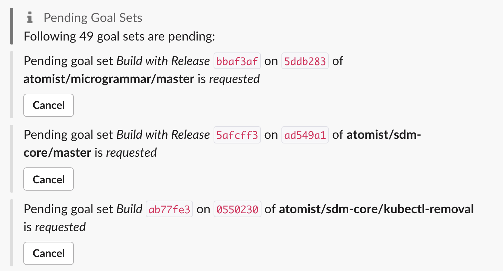

The Goal State pack adds commands for manually triggering and changing the status
of goals. It is built into the `@atomist/sdm-core` library.

[API doc](https://atomist.github.io/sdm-core/modules/_pack_goal_state_goalstate_.html#goalstate)
[GitHub](https://github.com/atomist/sdm-core)

## Usage

In your SDM configuration in `machine.ts`:

```typescript
sdm.addExtensionPacks(goalState());
```

## Commands

This extension pack adds these commands. Each one contains the name of the SDM
so that they don't clash with the same commands in other SDMs.

| Command Intent | Description | Parameters |
|----------------|-------------|---------|
| plan goals <name of sdm\> | add goals to a push, as if it had just come in. This adds an additional goal set. | [Repo Targeting][] |
| reset goals <name of sdm\>  | same as "plan goals" | [Repo Targeting][] |
| set goal state <name of sdm\>  | Manually change the state of a goal | [SetGoalStateParameters][apidoc-sgsp] and [Repo Targeting][] |
| cancel goal sets <name of sdm\>  | Cancel one or all goal sets on a push | *goalSetId* (optional) and [Repo Targeting][] |
| list goal sets <name of sdm\>  | List all in-process goal sets, with a "cancel" button for each | none |

## Examples

**List what an SDM is working on**, in any channel:

`@atomist list goal sets atomist/atomist-sdm`



In a channel [linked](../user/lifecycle.md#linked-channels) to a repository, **reset goals** on the last commit in the whatzit branch, which is handled by atomist/atomist-sdm:

`@atomist plan goals atomist/atomist-sdm --targets.branch=whatzit`

In any channel, ask my-favorite-sdm to **reset goals** on the
last commit of the default branch of the MyCompany/MyRepo repository:

`@atomist plan goals my-favorite-sdm --targets.owner=MyCompany --targets.repo=MyRepo`

[Repo Targeting]: ../developer/repo-targeting-params.md

[apidoc-sgsp]: https://atomist.github.io/sdm-core/classes/_pack_goal_state_setgoalstate_.setgoalstateparameters.html (API doc for SetGoalStateParameters)

[apidoc-core]: https://atomist.github.io/sdm-core (APIdoc for sdm-core)