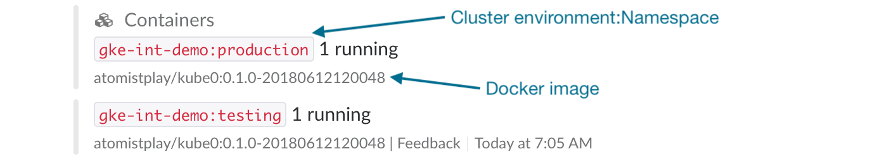

Atomist provides the easiest and most flexible way to get from ideas
and customer requests to a solution deployed in
[Kubernetes][kubernetes].  Once deployed, Atomist provides feedback on
the health of running applications and uses standard Kubernetes
mechanism for zero-downtime deployments.

[kubernetes]: https://kubernetes.io/ (Kubernetes)

## Overview

Before getting started, it is helpful to provide some information
about how Atomist interacts with Kubernetes.  Atomist is able to
deploy and update applications to Kubernetes as well as report back on
the health of those applications, providing feedback in the Atomist
web interface or Slack on deployments running containers across clusters
and namespaces in the concise, correlated manner users of Atomist
expect.

This integration has three parts: the [SDM extension pack](#sdm-extension-pack),
a [process for executing deploys](#Deploying-and-updating-applications) and a
 [process for transmitting events](#container-status).

###  SDM Extension Pack

The extension pack ([github](https://github.com/atomist/sdm-pack-k8), [API doc])
adds functions to your [SDM](../developer/sdm.md) for deploying to Kubernetes.

[apidoc](https://atomist.github.io/sdm-pack-k8/)

### Deploying and updating applications

The Atomist [k8-automation][] utility manages deploying and updating
applications.  It is able to create deployments to manage the runtime
of the application container, services to provide standard Kubernetes
discovery capabilities, and ingresses to provide the properly hosted
and secured external access to services.

The k8-automation utility runs inside each Kubernetes cluster you want
to deploy applications to, using a Kubernetes [service account][sa]
with only the permissions needed to create, read, update, and delete
namespaces, deployments, services, and ingresses.

[k8-automation]: https://github.com/atomist/k8-automation (Atomist k8-automation)
[sa]: https://kubernetes.io/docs/reference/access-authn-authz/service-accounts-admin/ (Kubernetes Service Accounts)

### Container status

The Atomist [k8vent][] utility watches pods in your Kubernetes cluster
and sends change events, e.g., container started and container
crashed, back to Atomist.

Like k8-automation, the k8vent utility runs inside each Kubernetes
cluster you want events from, using a Kubernetes [service account][sa]
with only the permissions needed to watch pod events.

[k8vent]: https://github.com/atomist/k8vent (Atomist k8vent)

### Role-Based Access Control (RBAC)

To perform their tasks, the Atomist utilities running within a
Kubernetes cluster need access to do so.  In modern, i.e., version 1.6
or greater, Kubernetes clusters, this access is provided using
[role-based access control (RBAC)][rbac].  Briefly, a service account
is created and bound to roles with the appropriate privileges.  The
pod is then configured to use the service account when accessing the
Kubernetes API using the in-cluster client.

Part of deploying the Atomist utilities to your Kubernetes cluster is
creating the needed RBAC resources.  To create RBAC resources, your
Kubernetes user needs admin privileges.  If your Kubernetes user does
not have admin privileges in the cluster or a namespace, someone whose
Kuberetes user has those privileges will need to deploy the Atomist
utilities.

If you see errors like the following when you try to deploy the
Atomist utilities to your Kubernetes cluster,

```
Error from server (Forbidden): error when creating "rbac.yaml": clusterroles.rbac.authorization.k8s.io "k8-automation-clusterrole" is forbidden: attempt to grant extra privileges: [...] user=&{YOUR_USER  [system:authenticated] map[]} ownerrules=[PolicyRule{Resources:["selfsubjectaccessreviews"], APIGroups:["authorization.k8s.io"], Verbs:["create"]} PolicyRule{NonResourceURLs:["/api" "/api/*" "/apis" "/apis/*" "/healthz" "/swagger-2.0.0.pb-v1" "/swagger.json" "/swaggerapi" "/swaggerapi/*" "/version"], Verbs:["get"]}] ruleResolutionErrors=[]
```

then your Kubernetes user does not have administrative privileges on
your cluster/namespace.  You will either need to ask someone who has
admin privileges on the cluster/namespace to create the RBAC resources
or try to escalate your privileges in the cluster/namespace.  In the
following commands, replace `USER` with your Kubernetes user name.
To attempt to provide your Kubernetes user with cluster admin
privileges, run:

```
kubectl create clusterrolebinding USER-cluster-admin-binding \
    --clusterrole=cluster-admin --user=USER
```

To attempt to provide your Kubernetes user with namespace admin
privileges, run:

```
kubectl create --namespace=NAMESPACE rolebinding USER-admin-binding \
    --clusterrole=admin --user=USER
```

Then run the command to deploy the Atomist utilities again.

!!! hint "GKE and RBAC"
    By default, the user you authenticate with a GKE cluster does not have
    sufficient permissions to install the Atomist Kubernetes utilities.
    To grant your user the necessary permissions, run the cluster-wide command
    above replacing `USER` in the commands above with
    `$(gcloud config get-value account)`:

    ```
    kubectl create clusterrolebinding \
        $(gcloud config get-value account)-cluster-admin-binding \
        --clusterrole=cluster-admin --user=$(gcloud config get-value account)
    ```

[rbac]: https://kubernetes.io/docs/admin/authorization/rbac/ (Kubernetes - Using RBAC Authorization)

If you see errors like the following when you try to deploy the
Atomist utilities to your Kubernetes cluster,

```
unable to decode "https://raw.githubusercontent.com/atomist/k8vent/master/kube/kubectl/cluster-wide.yaml": no kind "ClusterRole" is registered for version "rbac.authorization.k8s.io/v1beta1"
unable to decode "https://raw.githubusercontent.com/atomist/k8vent/master/kube/kubectl/cluster-wide.yaml": no kind "ClusterRoleBinding" is registered for version "rbac.authorization.k8s.io/v1beta1"
```

then either your `kubectl` CLI, Kubernetes cluster, or both are too
old and do not support RBAC.  Upgrade your `kubectl` CLI and
Kubernetes cluster or <a class="contact"
href="mailto:support@atomist.com" title="Contact Atomist">contact
us</a> for help in deploying the Atomist utilities.

### Cluster vs. namespace

The Atomist utilities can run in two modes: cluster wide and namespace
scoped.  If your Kubernetes user has cluster-admin role access, which
is typically the case if you created the cluster, you can and probably
should deploy Atomist utilities in cluster-wide mode.  This allows
these utilities to manage and report on applications across all
namespaces in your cluster.  If you are limited to managing Kubernetes
resources in a single namespace and your user has admin role access to
that namespace, you should probably install in namespace-scoped mode.
If your Kubernetes user has neither cluster-admin or admin role
access, you will need to ask someone who does to install the Atomist
utilities in your cluster.

If you want the Atomist Kubernetes utilities to report on and manage
resources in several but not all namespaces, you can deploy the
Atomist utilities using namespace-scoped mode multiple times, one time
for each namespace you want reported on and managed.

### Cluster environment

The Atomist Kubernetes utilities use the concept of a _cluster
environment_.  While the cluster environment is an arbitrary
description of the Kubernetes cluster to which you are deploying the
Atomist Kubernetes utilities, it is used to link application
deployment requests and cluster activity to the other activity in your
development flow.  Therefore it should be meaningful to you and your
team and unique across your organization's Kubernetes clusters.
Examples of good cluster environments are "production", "end-user",
"uat", "staging", etc.

The cluster environment you provide when installing the Atomist
Kubernetes utilities will be used when reporting on Kubernetes pod
container activity in development lifecycle messages.  For example,
the following image shows the containers that are running a specific
Docker image from a specific commit and build in various namespaces in
the Kubernetes cluster environment "gke-int-demo".



The cluster environment is used by k8-automation and your software
delivery machine (SDM) to coordinate application deployments and
upgrades.  Since you may be deploying k8-automation to multiple
Kubernetes clusters, the cluster environment is used as part of the
application deployment/update request to select the Kubernetes
cluster.

## Prerequisites

Before you connect Atomist and your Kubernetes cluster(s), you need a
few prerequisites.

### Atomist workspace

You must have an Atomist workspace.  If you do not already have one,
you can create one following the instructions in the [getting started
documentation][getting-started].

[getting-started]: index.md (Atomist - Getting Started)

### Kubernetes cluster

You must have a Kubernetes cluster and access to that cluster as a
user with either cluster-admin role privileges to run in cluster-wide
mode or admin role privileges within a namespace to run in
namespace-scoped mode.  If you do not have access to a Kubernetes
cluster, you can create one on your local system using [minikube][].

[minikube]: https://kubernetes.io/docs/getting-started-guides/minikube/ (Running Kubernetes Locally via Minikube)

## Installation

Several different methods for installing the Atomist Kubernetes
utilities are supported.  Choose the one that makes sense for your
situation.  If you aren't sure how to proceed, try the [Atomist
CLI](#atomist-cli) approach as it is the easiest.

### Atomist CLI

To use the Atomist CLI to install the Atomist Kubernetes utilities,
you must have the [Atomist CLI installed and configured][dev-prereq].
You will also need the Kubernetes `kubectl` command-line utility
installed and configured to access your Kubernetes cluster with the
needed privileges.

Once you have the Atomist and Kubernetes CLIs installed and
configured, you can install the Atomist Kubernetes utilities one the
following commands.  Be sure to replace `CLUSTER_ENV` with a
meaningful name for you Kubernetes cluster/namespace and, if deploying
in namespace-scoped mode, `NAMESPACE` with the _existing_ namespace
you want to deploy the utilities to.

[dev-prereq]: ../developer/prerequisites.md (Atomist Developer Prerequisites)

#### Cluster-wide mode

To install the Atomist Kubernetes utilities in cluster-wide mode, able
to report on and manage resources in all namespaces, run the following
command.

```
atomist kube --environment="CLUSTER_ENV"
```

#### Namespace-scoped mode

To install the Atomist Kubernetes utilities in namespace-scoped mode,
run the following command for each namespace you want to deploy
them to.  Replace `NAMESPACE` with the namespace you want to deploy
the utilities to.

```
atomist kube --namespace="NAMESPACE" --environment="CLUSTER_ENV"
```

### Kubernetes CLI

If you have the `kubectl` command-line utility installed and
configured to access your Kubernetes cluster with the needed
privileges, you can install the needed Atomist utilities with the
proper configuration using the following commands.  Be sure to replace
`CLUSTER_ENV` with a meaningful name for you Kubernetes
cluster/namespace, `WORKSPACE_ID` with your Atomist workspace ID, and
`API_KEY` with a valid Atomist API key.  See the [developer
prerequisites][dev-prereq] for more information on Atomist workspace
IDs and API keys.

#### Cluster-wide mode

##### k8vent

To deploy k8vent in cluster-wide mode and have it report on changes to
all pod containers, run the following command.

```
kubectl apply --filename=https://raw.githubusercontent.com/atomist/k8vent/master/kube/kubectl/cluster-wide.yaml
kubectl create secret --namespace=k8vent generic k8vent --from-literal=environment="CLUSTER_ENV" \
    --from-literal=webhooks="https://webhook.atomist.com/atomist/kube/teams/WORKSPACE_ID"
```

##### k8-automation

To deploy k8-automation in cluster-wide mode with the ability to
manage applications in all namespaces, run the following command.

```
kubectl apply --filename=https://raw.githubusercontent.com/atomist/k8-automation/master/assets/kubectl/cluster-wide.yaml
kubectl create secret --namespace=k8-automation generic automation \
    --from-literal=config="{\"workspaceIds\":[\"WORKSPACE_ID\"],\"apiKey\":\"API_KEY\",\"environment\":\"CLUSTER_ENV\"}"
```

#### Namespace-scoped mode

In the commands below, replace `NAMESPACE` with the namespace you want
to deploy the utilities to.

##### k8vent

To deploy k8vent in namespace-scoped mode such that it will only
report on pod containers in a single namespace, run the following
commands.

```
kubectl create secret --namespace="NAMESPACE" generic k8vent \
    --from-literal=environment="CLUSTER_ENV" \
    --from-literal=webhooks="https://webhook.atomist.com/atomist/kube/teams/WORKSPACE_ID"
kubectl apply --namespace="NAMESPACE" \
    --filename=https://raw.githubusercontent.com/atomist/k8vent/master/kube/kubectl/namespace-scoped.yaml
```

##### k8-automation

To deploy k8-automation in namespace-scoped mode such that it will
only deploy and update resources in a single Kubernetes cluster
namespace, run the following commands.

```
kubectl create secret --namespace="NAMESPACE" generic automation \
    --from-literal=config="{\"workspaceIds\":[\"WORKSPACE_ID\"],\"apiKey\":\"API_KEY\",\"environment\":\"CLUSTER_ENV\",\"kubernetes\":{\"mode\":\"namespace\"}}"
kubectl apply --namespace="NAMESPACE" \
    --filename=https://raw.githubusercontent.com/atomist/k8-automation/master/assets/kubectl/namespace-scoped.yaml
```

### Helm

If you manage resources in your Kubernetes cluster with [Helm][helm],
you can install the Atomist Kubernetes utilities using Helm.  Replace
`API_KEY` with an Atomist API key, `WORKSPACE_ID` with your Atomist
workspace ID, and `CLUSTER_ENV` with a meaningful name for your
Kubernetes cluster/namespace.

!!! bug "Helm and Minikube"
    Due to a bug in the default minikube bootstrapper localkube,
    [kubernetes/helm#3135: Helm 2.7.0 creates RBAC resource
    fail][localkube-bug], if you want to manage RBAC resources using Helm
    in minikube, you must start minikube using the kubeadm bootstrapper.

    ```
    minikube start --bootstrapper kubeadm
    ```

    You can make kubeadm your default bootstrapper by running the
    following command.

    ```
    minikube config set bootstrapper kubeadm
    ```

[helm]: https://helm.sh/ (Helm Package Manager for Kubernetes)
[localkube-bug]: https://github.com/kubernetes/helm/issues/3135#issuecomment-344291890

#### Cluster-wide mode

To install all of the Atomist Kubernetes utilities in cluster-wide
mode, run the following `helm` command.

```
helm upgrade --install --namespace=atomist atomist-utilities \
    --repo=https://atomist.github.io/helm-charts atomist-utilities \
    --set=global.atomist.apiKey="API_KEY" \
    --set=global.atomist.workspaceIds="{WORKSPACE_ID}" \
    --set=global.atomist.environment="CLUSTER_ENV"
```

#### Namespace-scoped mode

To install all of the Atomist Kubernetes utilities in namespace-scoped
mode, run the following `helm` command for each namespace you want to
deploy them to.  Replace `NAMESPACE` with the namespace you want to
deploy the utilities to.

```
helm upgrade --install --namespace="NAMESPACE" "atomist-utilities-NAMESPACE" \
    --repo=https://atomist.github.io/helm-charts atomist-utilities \
    --set=global.atomist.apiKey="API_KEY" \
    --set=global.atomist.workspaceIds="{WORKSPACE_ID}" \
    --set=global.atomist.environment="CLUSTER_ENV" \
    --set=global.atomist.mode=namespace
```

## Updating

You can update to a new version of the Atomist Kubernetes utilities
using standard Kubernetes approaches.  If you installed the Atomist
utilities using the Atomist CLI or Helm, simply re-run the same
command you ran to install them.  If you are using `kubectl` you can
run the following commands, replacing `NAMESPACE` and `M.N.P` as
appropriate.

```
kubectl set image --namespace=NAMESPACE \
    deployment/k8vent k8vent=atomist/k8vent:M.N.P
kubectl set image --namespace=NAMESPACE \
    deployment/k8-automation k8-automation=atomist/k8-automation:M.N.P
```

You can always find the latest versions of
[k8-automation][k8-automation-latest] and [k8vent][k8vent-latest] on
their release pages.

[k8-automation-latest]: https://github.com/atomist/k8-automation/releases/latest (k8-automation Latest Release)
[k8vent-latest]: https://github.com/atomist/k8vent/releases/latest (k8vent Latest Release)

<!--

### Kubernetes

This automation works with [Kubernetes][kube], so you need a
Kubernetes cluster with a functioning ingress controller, such as
[ingress-nginx][].

If you do not have access to a Kubernetes cluster, you can create one
on your local system using [minikube][].  Once you have minikube
running, you can create an ingress controller in the cluster using the
ingress add-on.

```console
$ minikube start
$ minikube addons enable ingress
```

[kube]: https://kubernetes.io/ (Kubernetes)
[ingress-nginx]: https://github.com/kubernetes/ingress-nginx (Ingress nginx)
[minikube]: https://kubernetes.io/docs/getting-started-guides/minikube/ (Minikube)

## Configuration

You can run k8-sdm in either "cluster-wide" mode or
"namespace-scoped" mode.  In cluster-wide mode, k8-sdm is able
to deploy and update applications in any namespace but it requires a
user with cluster-admin role privileges to install it.  If you only
have access to admin role privileges in a namespace, you can install
k8-sdm in namespace-scoped mode, where it will only be able to
deploy and update resources in that namespace.

## Running

See the [Atomist Kubernetes documentation][atomist-kube] for detailed
instructions on using Atomist with Kubernetes.  Briefly, if you
already have an [Atomist workspace][atomist-getting-started], you can
run the following commands to create the necessary resources in your
Kubernetes cluster.  Replace `WORKSPACE_ID` with your Atomist
workspace/team ID and `TOKEN` with a GitHub token with "read:org"
scopes for a user within the GitHub organization linked to your
Atomist workspace.

```
$ kubectl apply --filename=https://raw.githubusercontent.com/atomist/k8-sdm/master/assets/kubectl/cluster-wide.yaml
$ kubectl create secret --namespace=k8-sdm generic automation \
    --from-literal=config='{"teamIds":["WORKSPACE_ID"],"token":"TOKEN"}'
```

[atomist-kube]: https://docs.atomist.com/user/kubernetes/ (Atomist - Kubernetes)
[atomist-getting-started]: https://docs.atomist.com/user/ (Atomist - Getting Started)

## SDM interface

The KubeDeploy event handler triggers off an SDM Goal with the
following properties:

JSON Path | Value
----------|------
`fulfillment.name` | @atomist/k8-sdm
`fulfillment.method` | side-effect
`state` | requested

In addition, it expects the SDM Goal to have a `data` property that
when parsed as JSON has a `kubernetes` property whose value is an
object with the following properties:

Property | Required | Description
---------|----------|------------
`name` | Yes | Name of the resources that will be created
`environment` | Yes | Must equal the value of the running k8-sdm instance's `configuration.environment`
`ns` | No | Namespace to create the resources in, default is "default"
`imagePullSecret` | No | Name of the Kubernetes image pull secret, if omitted the deployment spec is not provided an image pull secret
`port` | No | Port the container service listens on, if omitted the deployment spec will have no configured liveness or readiness probe and no service will be created
`path` | No | Absolute path under the hostname the ingress controller should use for this service, if omitted no ingress rule is created
`host` | No | Host name to use in ingress rule, only has effect if `path` is provided, if omitted when `path` is provided, the rule is created under the wildcard host
`protocol` | No | Scheme to use when setting the URL for the service endpoint, "https" or "http", default is "https" if `tlsSecret` is provided, "http" otherwise
`replicas` | No | Number of replicas (pods) deployment should have
`tlsSecret` | No | Name of existing [Kubernetes TLS secret][kube-tls] to use when configuring the ingress
`deploymentSpec` | No | Stringified JSON Kubernetes deployment spec to overlay on top of default deployment spec, it only needs to contain the properties you want to add or override from the default
`serviceSpec` | No | Stringified JSON Kubernetes service spec to overlay on top of default service spec, it only needs to contain the properties you want to add or override from the default

Full details for the `kubernetes` property can be found in the TypeDoc
for [`KubeApplication`][kube-app].

[kube-tls]: https://kubernetes.io/docs/concepts/services-networking/ingress/#tls (Kubernetes Ingress TLS)
[kube-app]: https://atomist.github.io/k8-sdm/interfaces/_lib_k8_.kubeapplication.html (Atomist - KubeApplication - TypeDoc)

-->
