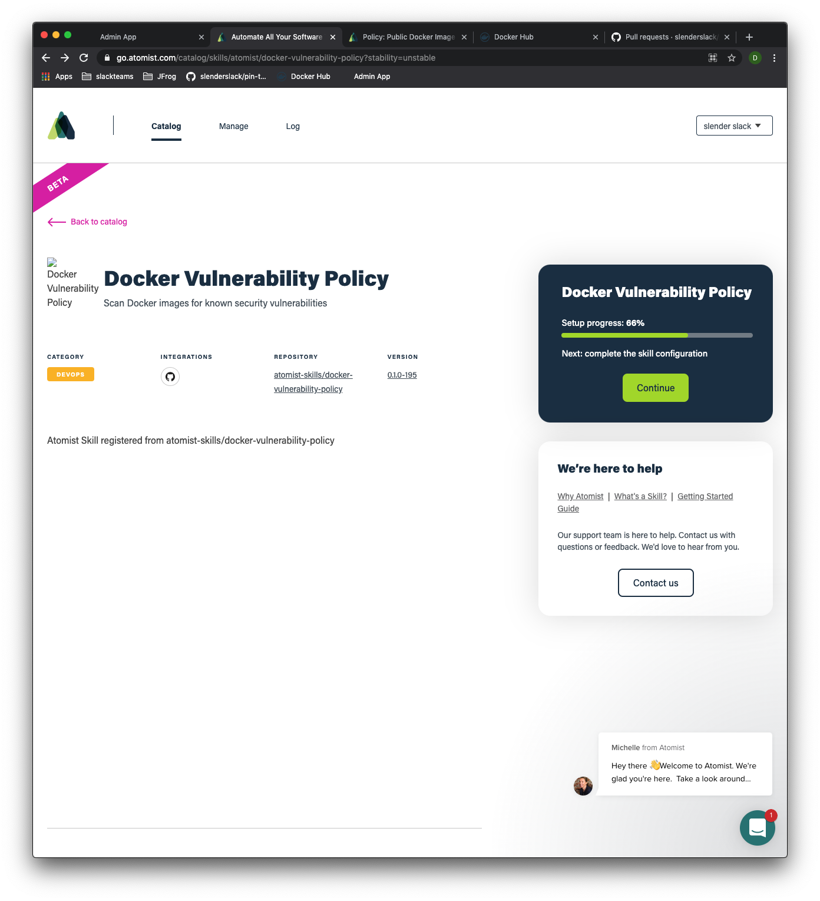

# Tutorial Steps

## Policy:  Docker Vulnerability

We'll start by enabling the
[Docker Vulnerability Policy](https://go.atomist.com/catalog/skills/atomist/docker-vulnerability-policy?stability=unstable).
This policy illustrates how data can effectively flow back to developers to help make better decisions about promoting
change. There are several concepts involved:

1. using GitHub Checks to push data back to developers
2. using Checks to inform github branch protection rules, and code reviews
3. setting baselines for cases where we want to start "improving" (reducing "noise" for existing projects)
4. integrating vulnerability data into GitOps promotion, and kubernetes admission control policies

As usual, the first step is to [enable the policy][docker-vulnerability-policy].

For this policy, you should also be able to enable it using the default settings.  The default settings use GitHub
Checks to ensure that image vulnerabilties in a development branch do not get "worse" than the ones already in main.

[docker-vulnerabilty-policy]: https://go.atomist.com/catalog/skills/atomist/docker-vulnerability-policy?stability=unstable
