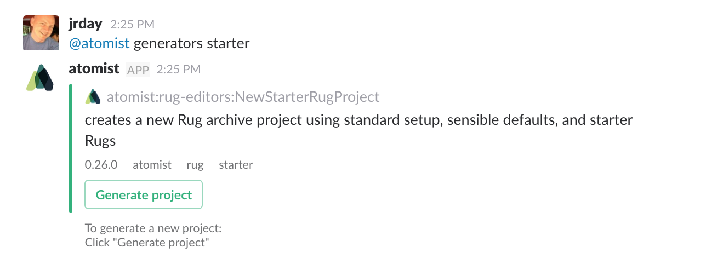
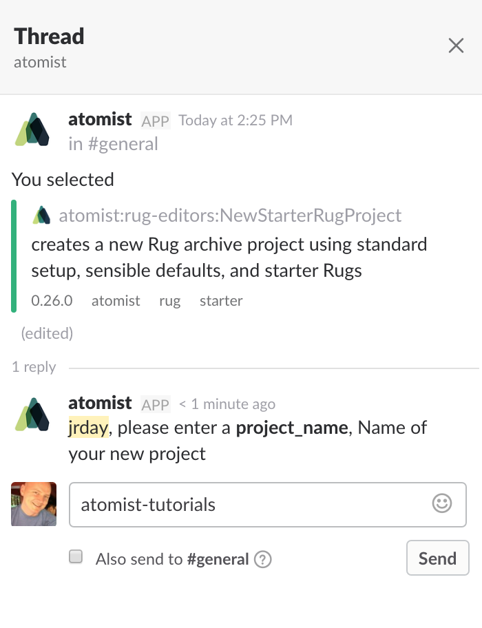
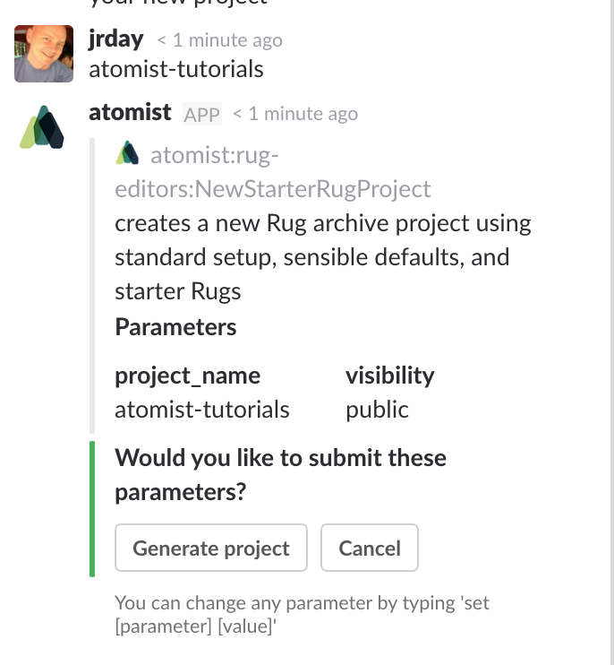

In the [Getting Started][gs] section, you connected Atomist to your
development systems and learned how to use some of the out-of-the-box
functionality that Atomist provides.  These tutorials will teach you
how to extend and customize Atomist, tailoring it to your own
development workflow and processes.

[gs]: /getting-started/index.md (Atomist Getting Started)

!!! tip "Prerequisites"
    For these tutorials, you will need to have:

    * Completed the [Getting Started][getting-started] steps so that Atomist Bot is in your
    Slack team and connected to your GitHub account.
    * A [Rug project][ugpj] to work in. If you have not yet created a Rug project or would like to build the tutorial in a new Rug project, see [Creating a new Rug Project][rug-create].
    * Rug CLI installed. [Quick setup][cli-quick] instructions below.

[getting-started]: /getting-started
[ugpj]: /user-guide/rug/projects.md
[rug-create]: /tutorials/#create-a-new-rug-project
[cli-install]: /user-guide/interfaces/cli/install.md
[cli-quick]: /tutorials/#rug-cli-quick-setup

## Creating a new Rug Project

We provide a generator that can be run from your Slack team to create a new Rug project using standard setup, sensible defaults, and starter Rugs.

In `#general` or any channel in your Slack team that Atomist Bot has been invited to, type this message:

```
@atomist generators
```

The Bot will respond with a list of project generators like following.

<div class="ss-container">
  
</div>

Click on the "Generate project" button for the `NewStarterRugProject` generator.

The Atomist Bot will respond with a message telling you what project
generator you created and then start a [thread][] off that message to
gather the information it needs to generate the project.  Click now on
the "1 reply" link below the message to open up the thread in Slack.
You will see that the Atomist Bot has asked you a question in the
thread.

[thread]: https://get.slack.help/hc/en-us/articles/115000769927-Message-threads

<div class="ss-container">
  
</div>

Type in a name for your new project and press `Enter`.  A new repository with this
name will be created, so the project name must be a valid GitHub repository name.

<div class="ss-container">
  
</div>

Now click on "Generate project" and the Bot will create the project in a new GitHub repository, then confirm with a message similar to the following.

<div class="ss-container">
  
</div>

You now have a starter Rug project to write new Rugs in. Click on the project link
to see your project in GitHub.


## Rug CLI Quick Setup

This is the quick version of the Rug CLI setup on Mac OS X using Homebrew. If you use
a different operating system or run into issues, please see the full
[Rug CLI installation][cli-install] documentation.

### Install Rug CLI

```console
$ brew tap atomist/tap
$ brew install rug-cli
```

### Configure Rug CLI GitHub Access

Configure GitHub access token for Rug CLI. If you have two-factor
authentication configure on your GitHub account, you will be prompted
for your second factor code as `MFA code`.

```console
$ rug login

  → Username : jrday
  → Password : **************

  Please provide a MFA code
  → MFA code : ******
```

### Configure Publishing

TBD
