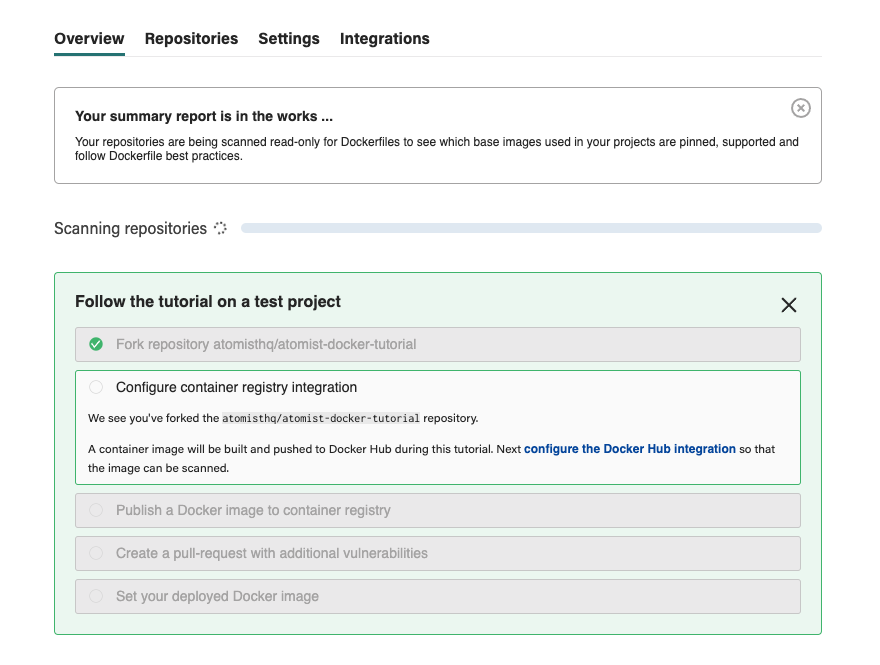

# Prevent new vulnerabilities in your containerized applications

!!! Summary 
    * Create free account - no credit card required
    * Install the Atomist GitHub Application
    * Fork a public [test repository](https://github.com/atomisthq/atomist-docker-tutorial)
    * Create one public Docker registry on your DockerHub account.

    (approximate time: 15 minutes)
    
    Visit our website to learn more about [Atomist](https://atomist.com/) and [vulnerability scanning](https://atomist.com/product/vulnerability-scanning)

In this tutorial, you'll enable scans on commits
that build container images from a public GitHub repository.  
We'll demonstrate that you can easily 
track pull requests that are about to introduce _new_ vulnerabilites (vulnerabilities
that are not already present in your deployed container image).

We have created an in-app guided flow to take you through the steps involved in setting up these scans.

