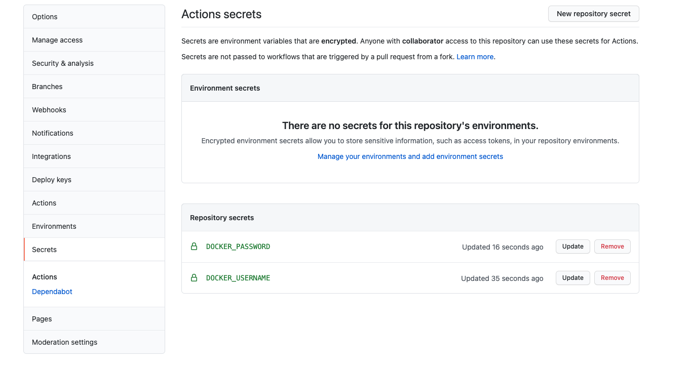
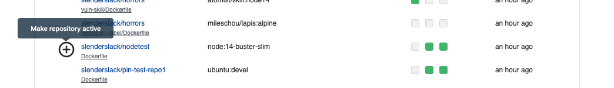
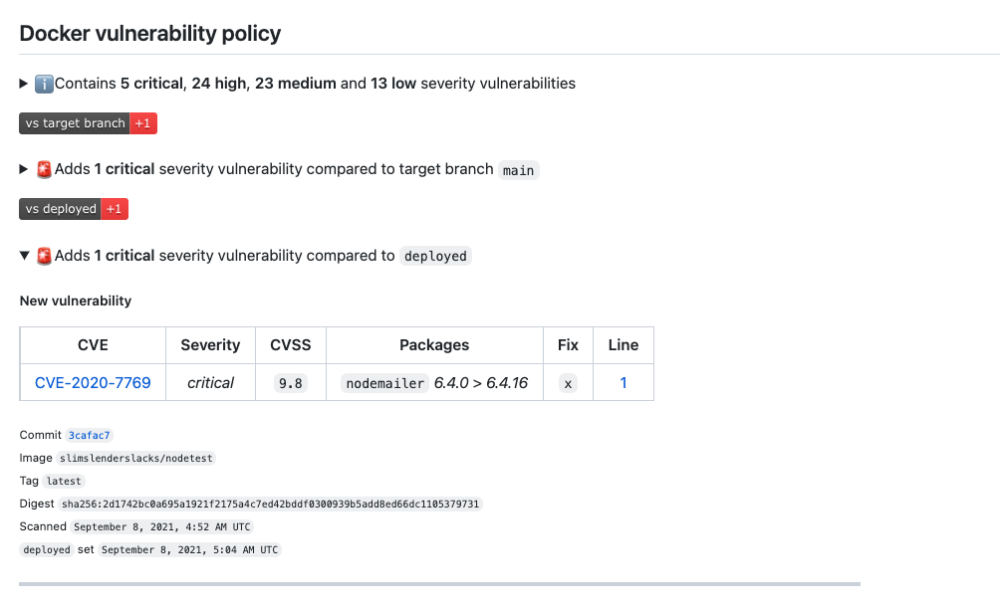
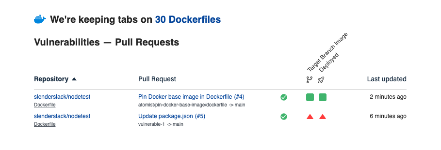

# Prevent new vulnerabilities in your containerized applications

!!! Requirements
    1. Create [free account](https://dso.atomist.com/user/signup) - no credit
       card required
    2. Install the [Atomist GitHub Application](https://github.com/apps/atomist)
    3. Create one public Docker registry on your DockerHub account.

    (approximate time: 15 minutes)

In this tutorial, you'll enable automatic GitHub CheckRuns for Commits
that build container images from Dockerfiles.  We'll demonstrate how you can
track pull requests that are about to introduce _new_ vulnerabilites (vulnerabilities
that are not already present in your deployed container image).

Find out about new vulnerabilities before merging.

<figure>
  
  <figcaption>GitHub Commit CheckRun (developers)</figcaption>
</figure>

## 1. Sign up

Start by creating a [free account](https://dso.atomist.com/user/signup).

{: style="width:300px;margin: 0 auto;"}

## 2. Fork the test repository

Fork [https://github.com/atomist/nodetest](https://github.com/atomist/nodetest) into
your GitHub user account.

## 3. Connect GitHub

Atomist typically starts by discovering Dockerfiles in your GitHub repositories
The presence of a Dockerfile is a good sign that this repository produces
container images - it's increasingly not the only sign ([`buildah`][buildah], 
[`jib`][jib], and [`buildpacks`][buildpack] are just a few of the alternatives).  

[buildah]: https://buildah.io/
[jib]: https://cloud.google.com/blog/products/application-development/introducing-jib-build-java-docker-images-better
[buildpack]: https://buildpacks.io/


When selecting repositories, select at least the `nodetest` repo that you just
forked.  You can also let Atomist scan for Dockefiles in your other repos.  Atomist
will not take any action without you activing a policy - it's safe to enable the
application on other repositories.

## 4. Configure Docker Hub integration

If you don't already have a [Docker Hub](https://hub.docker.com) account, you can [create one for free](https://hub.docker.com/signup). 

Create a new public repository called `nodetest`in your Docker Hub account. You
can delete this repository after finishing the tutorial.


Take note of the following requirements:

- Your **Docker Namespace** — this is the Docker ID you use to sign into Docker Hub
- The **Docker Repository** for use in this tutorial (we suggested you create a repo named `nodetest`)
- A **[Docker Hub Access Token](https://hub.docker.com/settings/security)** — Note that DockerHub has recently started limiting the number of personal access tokens that you can create from a free account. We’d have recommended creating a new personal access token but you may have to re-use an exisiting one.

In the [web app](https://dso.atomist.com), select the Integrations tab and choose 'Configure' for the Docker Hub integration.


Copy the webhook URL from the Docker Hub Integration settings page into [webhook configuration][dockerhub]
for your docker registry.

[dockerhub]: https://docs.atomist.com/integration/dockerhub/


{: style="width: 400px"}

Atomist will use events from this webhook to track images being pushed into this Docker Hub repository.

Save the configuration.  Atomist will test the connection and indicate with a green check mark if the connection was made successfully.

<figure>
  
</figure>

## 5. Configure a Docker Build

This project contains a GitHub actions workflow to build your Dockerfile.  Click
on the Actions tab in the forked repo and confirm that the workflow is enabled


This action requires three [secrets to be configured](https://docs.github.com/en/actions/reference/encrypted-secrets) in your new GitHub repo:

- `DOCKER_USERNAME` must be set to your Docker ID
- `DOCKER_PASSWORD` is an [Access Token for your Docker Hub account](https://hub.docker.com/settings/security)
- `DOCKER_REPOSITORY` is the name of the repository you created on Docker Hub (e.g. `nodetest` if you followed our suggestion). This is the repository that has the webhook pointing to Atomist.

After you’ve added these secrets, you should see 3 repository secrets.



## 6. Activate vulnerability policy and push a change

Navigate to the Overview tab in the [Atomist web app](https://dso.atomist.com), and activate the policy on your new repo. 



Confirm that you want the policy to be activated on this test repo.


Create a new push to your repository by incrementing the version number in
the `version.txt` file in the root of the `nodetest` repository.

Watch progress in the "Actions" tab.  It will take about 2 minutes for the GitHub action to build and push your
Dockerfile, after which DockerHub will notify Atomist that the image is ready to
be scanned for vulnerabilities.

The "docker-vulnerability-policy" check will show there are 5 critical and 24 high
vulnerabilities in this image (this could be a different number when you go
through the tutorial - vulnerabilities are always changing).


## 7. Simulate a Deployment

The number of ways to detect that an image has been deployed is infinite.  We might integrate:

* a kubernetes admission controller
* watch for closed JIRA issues
* gitops approaches like [fluxcd][flux] or [argocd][argo] 
* [Google Cloud Build][cloudbuild], [AWS CodePipelines][awscodepipelines], or [Azure Devops][azuredevops]
* .... etc to infinity

[flux]: https://fluxcd.io/
[argo]: https://argoproj.github.io/argo-cd/#:~:text=Argo%20CD%20is%20a%20declarative%2C%20GitOps%20continuous%20delivery%20tool%20for%20Kubernetes.
[cloudbuild]: https://cloud.google.com/build
[awscodepipelines]: https://aws.amazon.com/codepipeline/
[azuredevops]: https://azure.microsoft.com/en-us/services/devops/

Simulate an image being deployed by executing a `curl` command.

```bash
curl -X POST \
     -H "Content-Type: application/json" \
     -H "Authorization: bearer ${API_KEY}" \
     $API_URL \
     -d "{\"image\": {\"url\": \"${DOCKERHUB_NAMESPACE}/${DOCKERHUB_REPOSITORY}@${IMAGE_DIGEST}\"}}"
```

* **${API_URL} and ${API_TOKEN}** get these from the "Integrations" tab of the [Atomist web app](https://dso.atomist.com/). 

<figure>
  
  <figcaption>API endpoint and API key settings in Atomist web app</figcaption>
</figure>

* **${DOCKERHUB_NAMESPACE} and ${DOCKERHUB_REPOSITORY}** are copied from your
    DockerHub account
* **${IMAGE_DIGEST}** is the digest of the image you've just built.  You can
    copy this from docker hub.

<figure>
  
  <figcaption>Find that image digest on Docker Hub</figcaption>
</figure>

An example set of variables (changes these to match your local setup):

```bash
API_URL=https://webhook.atomist.com/atomist/resource/b570bc8b-ed3a-4ced-a52b-46276e6063b6
API_KEY=team::3765928D4DBD70E90174D03B54A239AE70FFE644CD02B87A64BA3F0846
DOCKERHUB_NAMESPACE=jrdayfc
DOCKERHUB_REPOSITORY=nodetest
IMAGE_DIGEST=sha256:47437c32047850d002df8bfb55a4cab196fd80900f1b70c6bc3f
```

Check out your `docker-vulnerability-policy` CheckRun again.  It will have
changed now that you have a baseline for comparison.

## 8. Introduce a new vulnerability

For those who have git and npm installed, clone the forked `nodetest` GitHub
repository, and insert a vulnerability.

```bash
$ git checkout -b vulnerable
$ npm install nodemailer@6.4.0
$ git commit -am 'introduce vulnerability'
$ git push origin -u vulnerable
```

You can also just edit the `package.json` directly on GitHub. 
Add the `nodemailer` dependency and push to a new branch named `vulnerable`.
Your updated package.json contents should be:

```jsx
{
  "name": "atomist.test",
  "version": "1.0.0",
  "description": "",
  "main": "index.js",
  "scripts": {
    "test": "echo \"Error: no test specified\" && exit 1"
  },
  "author": "",
  "license": "ISC",
  "dependencies": {
    "nodemailer": "6.4.0"
  }
}
```

Remember that this is a forked repo. Raise a pull request to target the main branch on this repo, not on `atomist/nodetest`. 

After pushing to the new `vulnerable` branch, raise a pull request. 

The action workflow in this repository is configured to build and push branches too.

## Summary

The check run on your commit will indicate if the pull request has introduced any problems that you should discuss with your AppSec team (hint: it has). Maybe you *are* the AppSec team?



The Overview tab will also show any open PRs that have been scanned:



# Try it on your own container projects

Add your own repositories with Dockerfiles — new commits and PRs will be scanned
for new vulnerabilities. Just follow the [steps above](#1-sign-up) and use your own repo instead of forking ours.

Vulnerabilities in the container [base image OS](https://aquasecurity.github.io/trivy/v0.19.2/vulnerability/detection/os/) and Bundler, Composer, Pipenv, Poetry, npm, yarn, Cargo, NuGet, Maven, and Go application dependencies are reported.

Message us [in the app](https://dso.atomist.com) if you need help.
