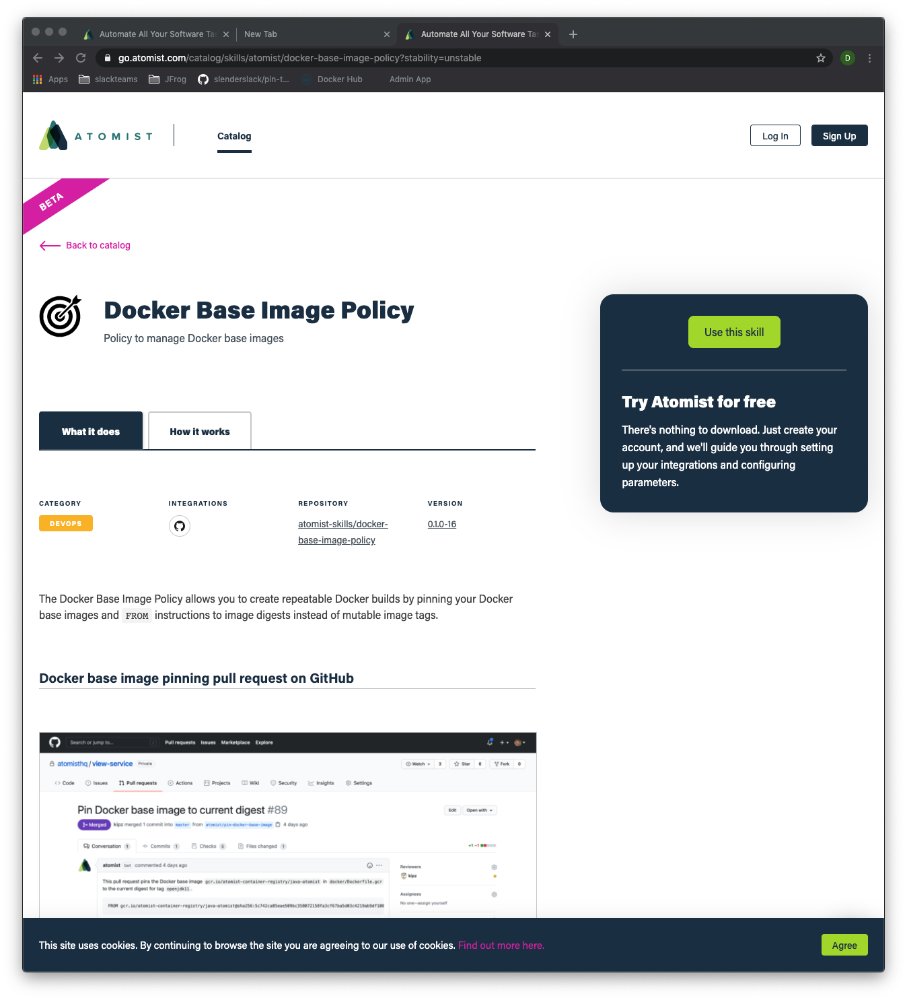
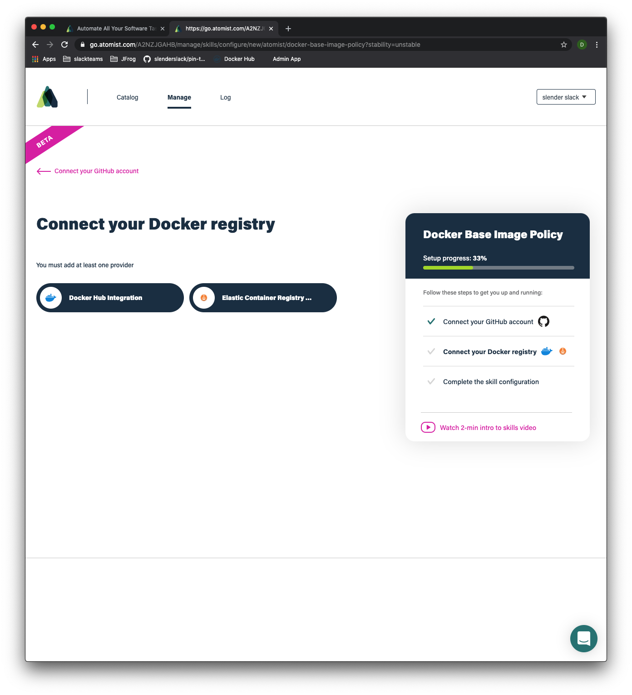
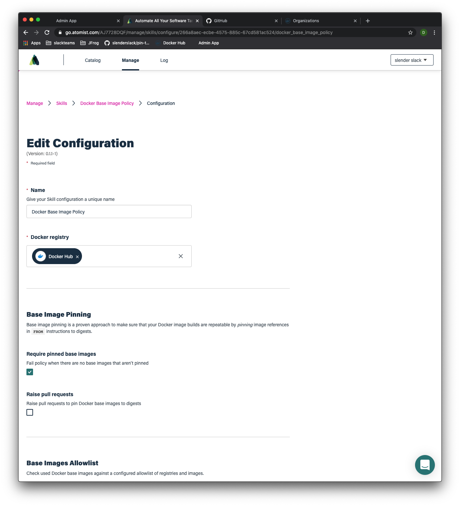

# Tutorial Steps

## Policy:  Public Docker Image Pinning

Achieves repeatable docker builds by switching Dockerfile `FROM` instructions to reference images by manifest (instead
of by tag).  Watches for updates to Tags and offers Pull Requests to developers when a new base image is available.

### Step 1:  Enable policy for public images stored on Docker Hub

This policy watches GitHub pushes for Dockerfiles with `FROM` instructions that reference *public* Docker Image Tags.
The policy will raise a PR to convert any Tag to a Docker digest.  It will then continue to raise PRs whenever that Tag
moves, even if the Dockerfile author switches the Dockerfile to a different Tag.

1. Start by enabling the [Docker Base Image
   Policy](https://go.atomist.com/catalog/skills/atomist/docker-base-image-policy).

Click the Green button "Use this skill" on the [Skill Page](https://go.atomist.com/catalog/skills/atomist/docker-base-image-policy).



2.  Enable the Skill.  This will take the user through the GitHub App integration, and selection of a Docker Registry.

To see a PR that pins to an image digest in a public Docker Hub repo, we won't need to configure an
integration to a private registry.  However, we will need to come back to this when we start tracking updates to tags in
private registries.  For now, you can use the "skip" button to move past this step.




3.  The Docker Base Image Policy configuration screen requires that you first configure the policy.  There are some
    options to customize how `FROM` line tags are managed.  The defaults are actually suitable for this demonstration
    so you can scroll to the bottom of this screen and just click the "Enable Skill" button. 



4.  Your policy is now watching the set of Repos that you have selected in the Atomist GitHub app.  To see this in
    action, try pushing a new Repo with a simple Dockerfile.   For example, create a new empty Repo in your test org
    called `pinning-test` and then:

```bash
$ export ORG=<replace with you org name>
$ mkdir pinning-test && cd pinning-test && git init
$ cat << END > Dockerfile
FROM ubuntu:devel
ARG REVISION
ARG SOURCE
LABEL org.opencontainers.image.revision=\$REVISION
LABEL org.opencontainers.image.source=\$SOURCE
CMD ["echo", "hello world"]
END
$ git add Dockerfile
$ git commit -m "initial commit"
$ git remote add origin git@github.com:$ORG/pinning-test.git
$ git push -u origin master
```

The Atomist GitHub application will detect the push, and then raise a Pull Request to pin your FROM line.


You'll also see that the policy ran in the "log" tab of your workspace.


Drill in to the Pull Request and note that Atomist has "pinned" the `FROM` clause to the current digest:


If you build using this version of the Dockerfile, you'll always get the same base image.  If the `devel` tag moves,
this repo will receive another pull request (ubuntu is a public docker registry).  This subsequent pull request makes
developers aware that the base image has been updated.  In a subsequent step, we'll also talk about how we detect which
vulnerabilities will be removed by merging this Pull Request.

As mentioned above, this scenario demonstrates tracking images in public registries.  It's a good starting point to walk
through some additional policies:

* What if your `FROM` instruction references an image in a private registry?
* What if you're using multi-stage Dockerfiles (multiple `FROM` clauses)?
* If given a Docker Image digest, can we track it back to the Dockerfile that produced it?  What about creating GitHub CheckRuns with Image scan vulnerability data.  Or tracking when an update to a base layer would remove a vulnerability?

The next step will be tackling private registries, and getting Image vulnerabilty data pulled back into the Developer
workflow.

### Step 2:  Integrating your private Docker Hub

1. Navigate back to the Docker Hub integration (or GCR or ECR) to add credentials and configure the webhook.


Validate that the `Namespace` for your private repositories is correct, and then enter the `Docker ID` and a `Docker Hub Personal Access Token` so that Atomist can query the repository when new Images and security scans are detected.  Finally, click the "Add webhook" button and then "Save changes".

At present, you have to go back to the Integration Config screen a second time to retrieve the webhook url.  We are fixing this but currently the process is:

1. add webhook
2. save configuration
3. return to Integration config to see the webhook url


There will now be a Webhook URL in the config screen (see screenshot above).

This webhook url should be set on a pinning-test repository (which could be private).  The webhook configuration will be at a url like [`https://hub.docker.com/repository/docker/{namespace}/{repo-name}/webhooks`](https://hub.docker.com/repository/docker/slimslender/pinning-test/webhooks) where you'll replace both `namespace` and `repo-name`.  


"Create" the webhook above and you should see that you now have a Webhook configured.  


Unfortunately, Docker Hub requires per repository webhook configuration through their web ui, and does not provide a way to create them programatically.  The situation is much better for both GCR and ECR.

On the next `docker push` to this Repo, Atomist will create a GitHub check to indicate that the Docker Image was successfully pushed, and linked back to a GitHub Commit.

**Issue:** tracking - Check should be produced

Try this out in your new `pinning-test` repository (remember to update the `namespace`).  Execute a `docker build` and `push` from the command line.

```bash
$ docker build -t <namespace>/pinning-test:latest \
--build-arg REVISION=$(git rev-parse HEAD) \
--build-arg SOURCE="Dockerfile" .
$ docker push <namespace>/pinning-test:latest
```

Atomist will create a GitHub CheckRun on your Commit to indicate that your Image has successfully made it to your registry.  Atomist is also now correlating GitHub Pushes and Docker Images pushes.  This will become useful as we begin to track how images are promoted.

### Questions

What did you find most difficult?

What were you expecting to see?

Did the PR make sense?

Do you think your developers would like to see this in their repos?  If not, why not?
