# Tracking new vulnerabilities

Atomist helps you detect when a pull request will introduce new vulnerabilities. By new vulnerabilities, we mean vulnerabilities that are not already present in your “deployed” instance. Getting started with vulnerability analysis is often hard because of what’s already there. Therefore, it’s useful to see how a change will impact what’s already running, before you merge and deploy.  In its most productive form, vulnerability data can create an effective feedback loop between developers and AppSec teams. But teams need to understand when a potential change introduces a new critical vulnerability. 

This is the polar opposite of the quarterly audit style report where vulnerability issues are summarized by tools that run outside of developer feedback loops. An important aspect of DevSecOps culture is that the best time to discuss a potential *new* vulnerability is now.

We detect new vulnerabilities by tracking pull requests and correlating them with images pushed to your container registry, then we compare against the vulnerabilities detected in the image built from your default branch. We capture deployment events to keep track of which image is currently deployed, so that you can clearly see when new vulnerabilities would be introduced in a pull request as compared to both the default branch and the currently deployed instance.

Here's an example where we see that a commit contains 6 critical and 24 high severity vulnerabilities; however, only 1 of them has been introduced by this change.  We highlight this critical difference using a GitHub check run on the pull request.

<figure>
  
  <figcaption>A GitHub check run showing vulnerabilities in a commit, and compared to the main branch and currently deployed instance</figcaption>
</figure>

Atomist helps you detect these changes and address them before they get out into the wild.

To see this in action, you’ll:

- **Connect to a GitHub organization or personal account.** We use this to scan Dockerfiles, see new pull requests, and add GitHub check runs.
- **Configure the Docker Hub integration.** We use this to know when new images are pushed to your registry and to be able to scan images for vulnerabilities. We strongly suggest following this tutorial with a Docker Hub registry. We also currently support Elastic Container Registry and Google Container Registry.
- **Test vulnerability detection on a demo project.** We provide a repo to fork and make changes to in order to see how the vulnerability detection works.

## Sign up

Start by creating a [free account](https://dso.atomist.com/user/signup).

<figure>
  
</figure>


## Connect GitHub

Atomist starts by discovering Dockerfiles in your GitHub repositories.  Dockerfiles are pretty good signs that Container Images are being built!  Although interestingly, it's becoming more common that this is not the _only_ signal.  [`buildah`][buildah], [`jib`][jib], and [`buildpacks`][buildpack] all provide alternatives to the Dockerfile (I almost used the phrase 'classic Dockerfile' here - can a format become a "classic" in just 8 years?).

[buildah]: https://buildah.io/
[jib]: https://cloud.google.com/blog/products/application-development/introducing-jib-build-java-docker-images-better
[buildpack]: https://buildpacks.io/

Selecting 'Connect GitHub' guides you to add our GitHub app to one of your GitHub organizations or your personal account. When you select the repository scope while installing our GitHub app, try to include some repositories that contain Dockerfiles. Atomist will scan repositories in read-only mode looking for Dockerfiles and pull requests. It will not take any action on or make any changes to these repositories in this initial discovery mode. Later, you will be able to activate getting GitHub check runs and pull requests.

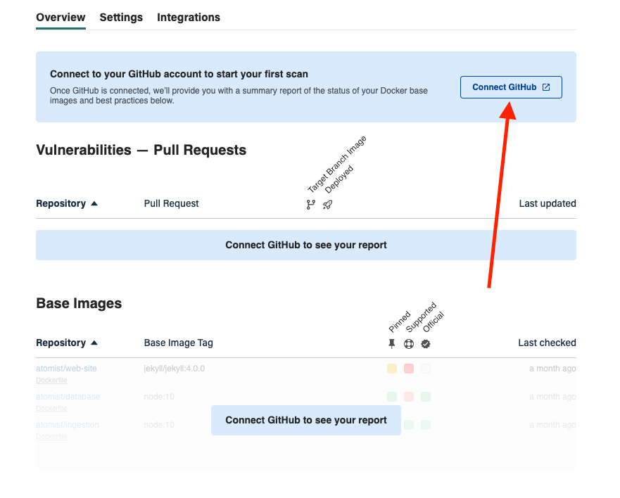

Atomist will now start scanning. You’ll see that data pertaining to Dockerfiles, base images, and Dockerfile best practices, will start to flow in and be shown in the Overview tab.

This provides a very GitHub-centric view of the universe. We know that *something* is building container images too. In our tutorial below, that *something* will be a GitHub Action (the diversity in this space is staggering). We’ll integrate by watching for images being pushed.

## Configure Docker Hub integration

If you don't already have a [Docker Hub](https://hub.docker.com) account, you can [create one for free](https://hub.docker.com/signup) which will work just fine for the purposes of this tutorial. 

### Get the information you'll need from Docker Hub

We recommend creating a new public repository called `nodetest`in your Docker Hub account. It’s easy to clean up after the tutorial.

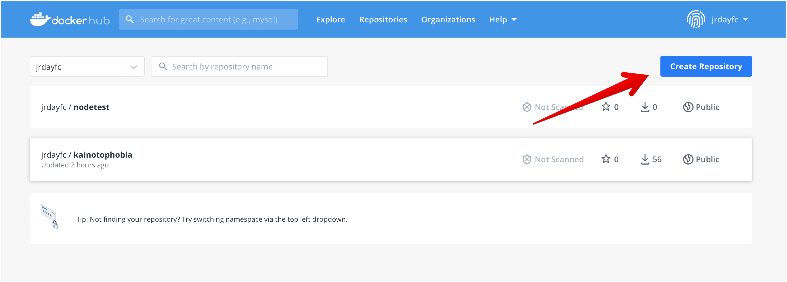

Here's what you'll need for the next step:

- Your **Docker Namespace** — this is the Docker ID you use to sign into Docker Hub
- The **Docker Repository** for use in this tutorial (we suggested you create a repo named `nodetest`)
- A **[Docker Hub Access Token](https://hub.docker.com/settings/security)** — Note that DockerHub has recently started limiting the number of personal access tokens that you can create from a free account. We’d have recommended creating a new personal access token but you may have to re-use an exisiting one.

### Configure the integration in the Atomist app

In the [web app](https://dso.atomist.com), select the Integrations tab and choose 'Configure' for the Docker Hub integration.

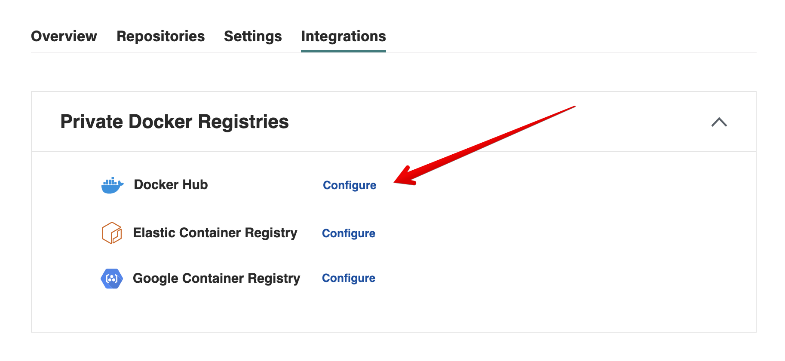

We have a separate section in our docs, which describes the [Docker Hub
integration][dockerhub] in more detail. Make sure that you copy the webhook URL from the Docker Hub Integration settings page in our web app, and configure it on your new Docker Hub repository as described in the [docs][dockerhub].

[dockerhub]: https://docs.atomist.com/integration/dockerhub/

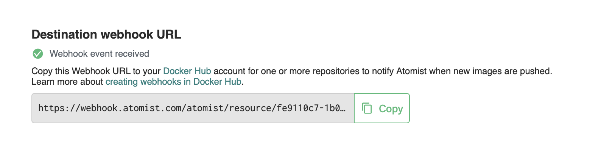

Atomist will use events from this webhook to track images being pushed into this Docker Hub repository.

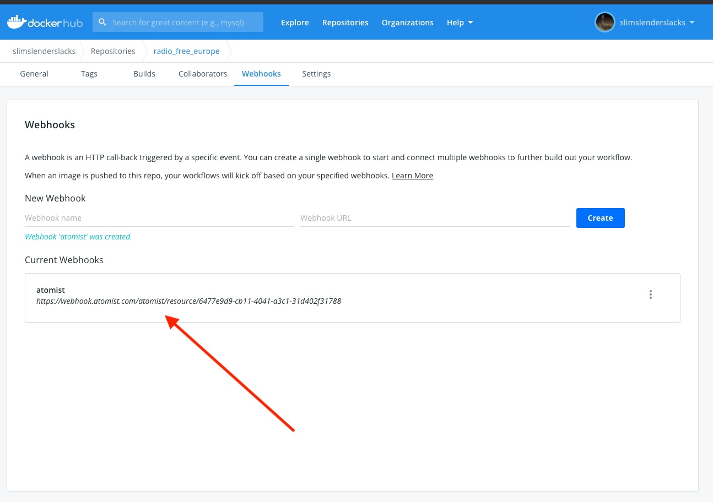


After saving the configuration, the connection will be tested and will indicate with a green check mark if the connection was made successfully.

<figure>
  
</figure>

You can also verify that the Docker Hub integration is getting webhook events and verified access by choosing 'Edit' to see the configuration.

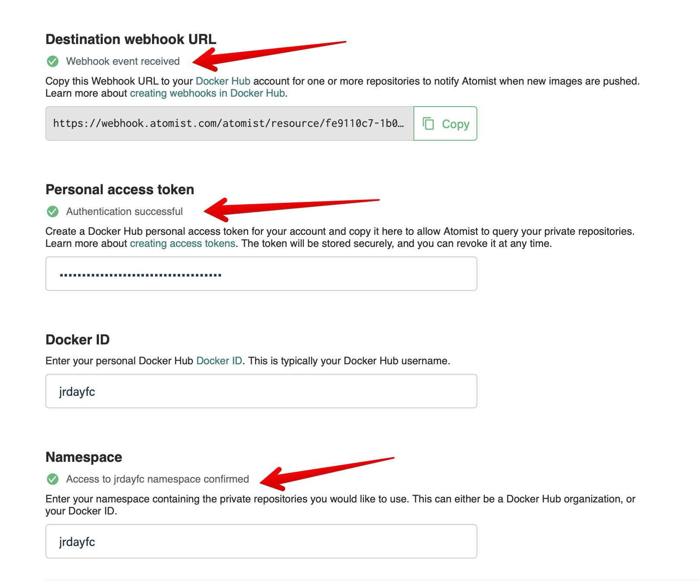


## Test vulnerability detection

Here are the steps we'll walk through in this tutorial:

1. **Fork the test repository.** We have prepared a repo containing some known CVEs for you to fork.
2. **Configure the Build & Push Action.** The GitHub action is included in the forked repo. It builds and pushes to your new Docker Hub repository.
3. **Confirm image scan check run.** Atomist will publish a check run showing you that your new image has been scanned.
4. **Send a deployment event.** This step simulates a deployment and marks the initial set of vulnerabilities as “deployed”.
5. **Introduce a new vulnerability.** We’ll do this by adding a new npm dependency with a known CVE. There’s nothing special about npm here. We just happened to have used a node project for this tutorial.
6. **Check for new vulnerabilities.** Confirm that your pull request receives the proper feedback on the new vulnerability.

Here we go...


## 1. Fork the test repository

Start by forking [https://github.com/atomist/nodetest](https://github.com/atomist/nodetest) into the GitHub organization or user account that you are using with Atomist.

## 2. Configure the Build & Push Action

**Enable the action**

This project contains a GitHub actions workflow that will build the contents of this repository and push the container image to Docker Hub. Forking a repository that already contains a GitHub action is a special case. Click on the Actions tab in the forked repository and confirm that the workflow should be enabled.

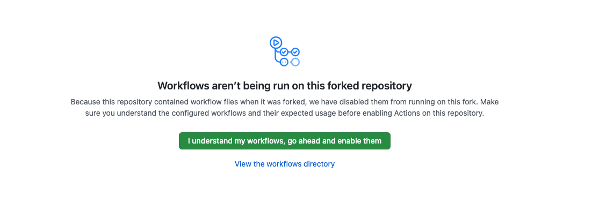
**Configure the secrets**

This action requires three [secrets to be configured](https://docs.github.com/en/actions/reference/encrypted-secrets) in your new GitHub repo:

- `DOCKER_USERNAME` must be set to your Docker ID
- `DOCKER_PASSWORD` is an [Access Token for your Docker Hub account](https://hub.docker.com/settings/security)
- `DOCKER_REPOSITORY` is the name of the repository you created on Docker Hub (e.g. `nodetest` if you followed our suggestion). This is the repository that has the webhook pointing to Atomist.

After you’ve added these secrets, your GitHub Secrets should look like this:

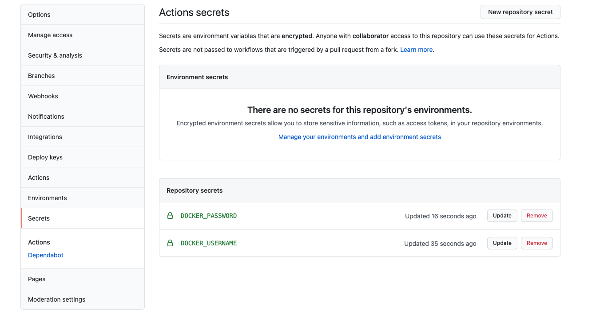

**Enable vulnerability scanning for the forked repo**

Finally, navigate to the Overview tab in the [Atomist web app](https://dso.atomist.com), and activate the policy on your new repo. 

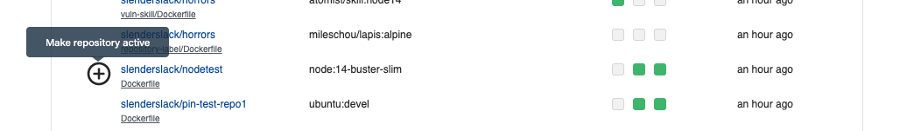

Atomist provides consistent behavior across all of your repositories. However, we can limit the activity to just the forked repo for now. 

Before enabling the vulnerabilty policy on this repo, you'll need to confirm that you want the policy to be activated on this test repo.

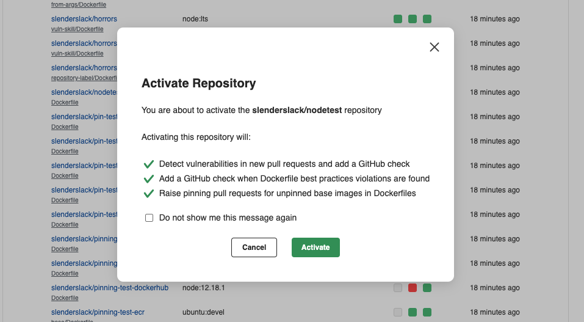

## 3. Confirm image scan check run

**Trigger a new Build**

Create a new push to your repository by incrementing the version number in the `version.txt` file in the root of the repository and pushing the change. Your GitHub action will be triggered by this change. As long as your secrets are configured correctly, this will trigger a build and push of your image to Docker Hub. Docker Hub will notify Atomist of this new image, and after scanning it, Atomist will create a check run on your latest push. An example of the check run you’ll see is shown below. Note that there are already 5 critical and 24 high vulnerabilities in this image (this could be a different number when you go through the tutorial - vulnerabilities are always changing).

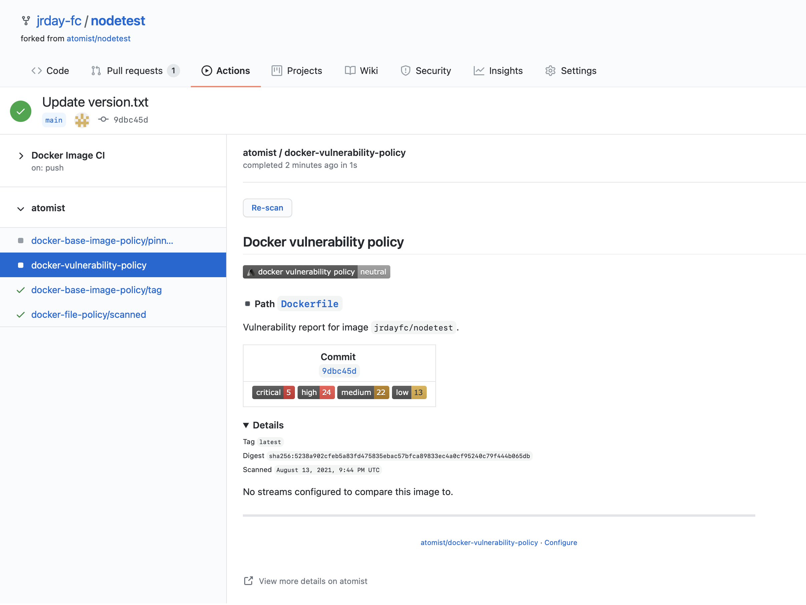

## 4. Send a deployment event

The number of ways to detect that an image has been deployed is infinite.  We might integrate:

* a kubernetes admission controller
* watch for closed JIRA issues
* gitops approaches like [fluxcd][flux] or [argocd][argo] 
* [Google Cloud Build][cloudbuild], [AWS CodePipelines][awscodepipelines], or [Azure Devops][azuredevops]
* .... etc to infinity

[flux]: https://fluxcd.io/
[argo]: https://argoproj.github.io/argo-cd/#:~:text=Argo%20CD%20is%20a%20declarative%2C%20GitOps%20continuous%20delivery%20tool%20for%20Kubernetes.
[cloudbuild]: https://cloud.google.com/build
[awscodepipelines]: https://aws.amazon.com/codepipeline/
[azuredevops]: https://azure.microsoft.com/en-us/services/devops/

In all cases, there is a point at which an image and its set
of vulnerabilites are "accepted".  We'll simulate that event here by calling an
endpoint with the digest of the new image.  

### Get the info needed to call the API endpoint

Believe it or not, you’ll have to pull together 5 pieces of information in order to mark your image as deployed. Get ready to set some environment variables! Here is the info you'll need to pass into the `curl` command below:

**Atomist API endpoint URL.** You’ll need to copy the endpoint URL from the Integrations tab in the [Atomist web app](https://dso.atomist.com/). 

Example: `API_URL=https://webhook.atomist.com/atomist/resource/b570bc8b-ed3a-4ced-a52b-46276e6063b6`

**Atomist API Key.** This endpoint also requires authorization, so you’ll have to create yourself a new API key too. 

Example: `API_KEY=team::3765928D4DBD70E90174D03B54A239AE70FFE644CD02B87A64BA3F0846`

<figure>
  
  <figcaption>API endpoint and API key settings in Atomist web app</figcaption>
</figure>

**Your Docker Hub namespace**. 

Example: `DOCKERHUB_NAMESPACE=jrdayfc`

**The Docker repository for this tutorial.** 

Example: `DOCKERHUB_REPOSITORY=nodetest`

**Image digest of the pushed image.**

Example: `IMAGE_DIGEST=sha256:47437c32047850d002df8bfb55a4cab196fd80900f1b70c6bc3f`  

Find this on the Docker Hub page for the image tag that was just pushed by the GitHub Action.

<figure>
  
  <figcaption>Find that image digest on Docker Hub</figcaption>
</figure>

### Make the API call

Run this from your favorite curl-enabled shell:

```bash
curl -X POST \
     -H "Content-Type: application/json" \
     -H "Authorization: bearer ${API_TOKEN}" \
     $API_URL \
     -d "{\"image\": {\"url\": \"${DOCKERHUB_NAMESPACE}/${DOCKERHUB_REPOSITORY}@${IMAGE_DIGEST}\"}}"
```

You should see output like this from calling the API.

```bash
{"correlation_id":"bb9338bf-6184-4370-93b3-0d52d5f6edb0"}
```

If you look at the check run that was previously created, you’ll notice that the details will have been updated to indicate that there is now a “deployed” image. It just happens to be that the current commit is the deployed version.

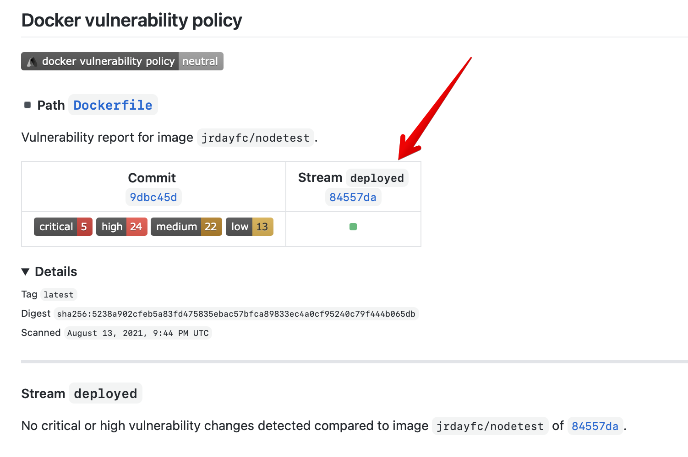

## 5. Introduce a Vulnerability

Clone the forked `nodetest` GitHub repository, create a branch and then install a package with a known vulnerability. An example of this flow is included below. The 6.4.0 version of nodemailer should add one critical vulnerability that wasn’t there before.

```bash
$ git checkout -b vulnerable
$ npm install nodemailer@6.4.0
$ git commit -am 'introduce vulnerability'
$ git push origin -u vulnerable
```

**Don't have npm installed? Test GitHub account not configured to push? No problem.**

You can go in and directly edit the `package.json` file on GitHub. Just add the `nodemailer` dependency and push to a new branch, `vulnerable`. It'll look like this:

```jsx
{
  "name": "atomist.test",
  "version": "1.0.0",
  "description": "",
  "main": "index.js",
  "scripts": {
    "test": "echo \"Error: no test specified\" && exit 1"
  },
  "author": "",
  "license": "ISC",
  "dependencies": {
    "nodemailer": "6.4.0"
  }
}
```

### Raise a pull request

Remember that this is a forked repo. Raise a pull request to target the main branch on this repo, not on `atomist/nodetest`. 

After pushing to the new `vulnerable` branch, raise a pull request. 

The action workflow in this repository is configured to build and push branches too.

## 6. Check for new vulnerabilities

The check run on your commit will indicate if the pull request has introduced any problems that you should discuss with your AppSec team (hint: it has). Maybe you *are* the AppSec team?

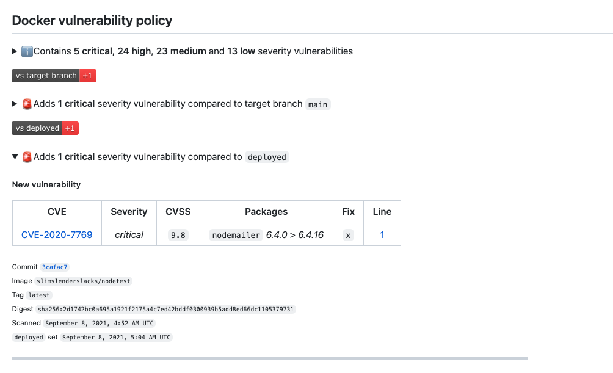

The Overview tab will also show any open PRs that have been scanned:

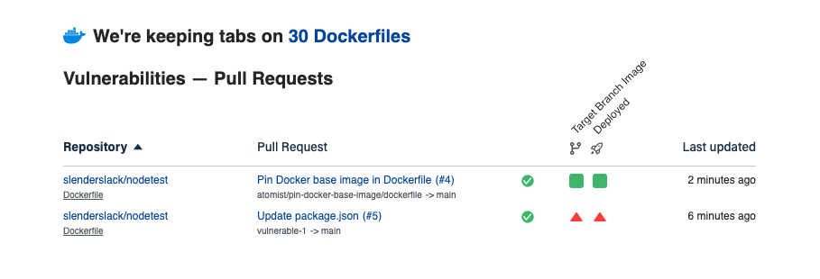

