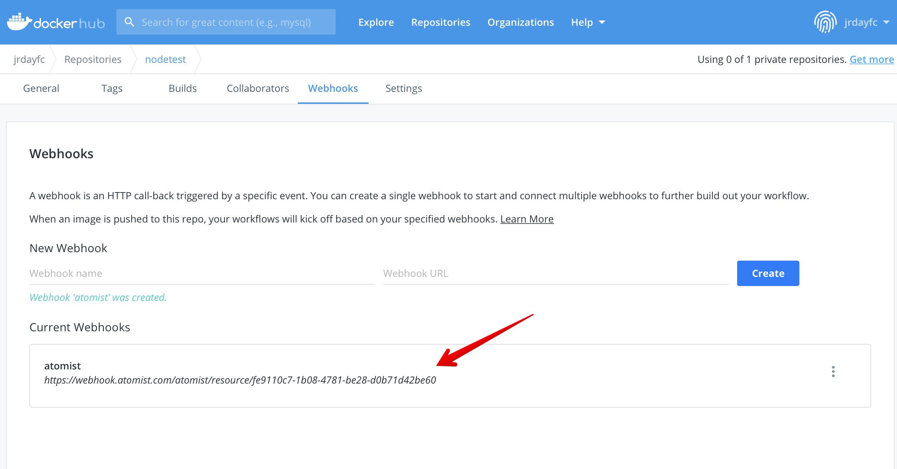

# Tracking new vulnerabilities

Atomist can help your team detect when a pull request will
introduce new vulnerabilities.  And by new vulnerabilities, we mean ones that are not currently already present in 
your "deployed" environment. One of the hard parts of helping developers get started with vulnerability analysis is dealing 
with the problem of what's already there.  It's useful context to know about how a change impacts what's currently running.


In this GitHub CheckRun, we see that a Commit contains 5 critical and 24 high vulnerabilities, but only 1 of them is being introduced by this change.  The rest are already present on the default branch, and in the currently deployed version of the Docker Image

Atomist can help you and your team keep track of these changes.  To see this in action, 
you'll need to add the Atomist application
to one of your GitHub Organizations, and configure the Atomist Dockerhub
integration (this tutorial works equally well
with other registry types).

## Signup

Start by creating a [free account](https://dso.atomist.com/user/signup).


## Connect Github App

Atomist starts by discovering Dockerfiles in your GitHub repositories.  Dockerfiles are pretty good signs that Container Images are being built!  Although interestingly, it's becoming more common that this is not the _only_ signal.  [`buildah`][buildah], [`jib`][jib], and [`buildpacks`][buildpack] all provide alternatives to the Dockerfile (I almost used the phrase 'classic Dockerfile' here - can a format become a "classic" in just 8 years?).

[buildah]: https://buildah.io/
[jib]: https://cloud.google.com/blog/products/application-development/introducing-jib-build-java-docker-images-better
[buildpack]: https://buildpacks.io/

Add the app to one of your GitHub organizations.  Try to include some
repositories that contain Dockerfiles. Atomist will scan default branch refs
looking for places where it can help.  It will not take any action on these
Repositories.  Before creating any pull requests adding a check run, or making
some other change, Atomist will require that the underlying rule be enabled in
that context.  By default, the app will be in discovery mode.


Atomist will now start scanning.  You'll see that data pertaining to
Dockerfiles, base images, and Dockerfile best practices, will start to flow in.

This provides a very GitHub centric view of the universe. We know that
_something_ is building container images too.  In our tutorial below, that
_something_ will be GitHub actions (the diversity in this space is staggering).
We'll integrate by watching for Images being pushed.

## Connect DockerHub

We recommend creating a new public Repository in your Docker namespace. It's easy to clean up after the tutorial.


At this point, you'll know your `DOCKER_NAMESPACE`, and now 
you'll also have a `DOCKER_REPOSITORY`.  Besides that, you'll
need to know your personal access token.  Note that
DockerHub has recently started limiting the number of personal access tokens
that you can create from a free account.  We'd have recommended creating a new personal access token but you may have to
re-use an exisiting one.

After saving the configuration, Atomist will test the connection and indicate
with a green check mark if the connection was made successfully.


We have a separate section in our docs, which describes the [DockerHub
integration][dockerhub] in more detail. Make sure that you copy the webhook url
from the Atomist console, and configure it on your new DockerHub repository.
Atomist will use events from this webhook to track Images being pushed into
this Repository.



[dockerhub]: https://docs.atomist.com/integration/dockerhub/

## Recognizing new vulnerabilities

As mentioned earlier, getting started with vulnerability analysis can be a real challenge. 
Before an appsec team has finished triaging existing vulnerabilities, vulnerability data is often not in a productive form.
Creating a pull request based feedback loop between developers and appsec when _new_ vulnerabilities are introduced focuses the team's attention on the impact of just _this_ change.  
This is the polar opposite of the quarterly audit style report where vulnerability issues are resurrected by tools that run outside of developer feedback loops.  
An important aspect of devsecops culture is that the best time to discuss a potential _new_ vulnerability is now.

The script for this demo is roughly the following:

1.  Fork a test repository with a repo containing some known CVEs (we've prepared a repo for you to fork)
2.  Configure a GitHub Action (also in the forked repo), to build and push to your new DockerHub repository. 
3.  Atomist will publish a CheckRun showing you that your new Image has been scanned.
4.  Mark the initial set of vulnerabilities as "deployed" (this simulates a deployment event)
5.  Create a branch and open a pull request
6.  Introduce a new vulnerability (we'll do this by adding a new npm dependency with a known CVE - there's nothing special about npm here.  This just happens to be a node project)
7.  Push your change to the Pull Request branch and let the GitHub Action build and push the new Image
8.  Verify that your pull request receives the proper feedback on the new vulnerability.

## Fork Test Repo

Start by forking
[https://github.com/atomist/nodetest](https://github.com/atomist/nodetest) into
the GitHub Org that you have already attached to Atomist.  
This project
contains a GitHub action workflow that will build and push the contents of this
repository to DockerHub.  Forking a repository that already contains a GitHub
Action is a special case.  GitHub will ask for confirmation that the
workflow should be enabled. 


This Action also requires three secrets to be configured in your new GitHub repo:

* `DOCKER_USERNAME` must be set to your docker id
* `DOCKER_PASSWORD` is a personal access token for your DockerHub account
* `DOCKER_REPOSITORY` is the name of the repository you created on DockerHub (this is the repository that has the Webhook pointing to Atomist)

After you've added these secrets, your GitHub Secrets should look like this:


Finally, you'll need to navigate to the Settings tab in [atomist](https://dso.atomist.com).  
Enable the vulnerability policy for the
new forked repository (TODO:  this will probably not be necessary when we release the tutorial).  
The policies on the setting page are designed to
provide consistent behavior across all of your repositories.  However, we can
limit the activity to just the forked repo for now.  Turn on the vulnerability
policy, the base image policy, and the dockerfile best practices.  In the
Repositories list, make sure that your new repo is selected.  The policy section
should look like:


Verify again that you have selected your new repo in the Repo filter dialog.


## Trigger a new Build

Create a new push to your repository by incrementing the version number in the
`version.txt` file in the root of the repository.  Your GitHub action will be
triggered by this change.  As long as your secrets are configured correctly,
this will trigger a build and push of your image to DockerHub.  
DockerHub will notify Atomist of
this new Image, and after scanning it, Atomist will create a CheckRun on your
latest push.  An example of the CheckRun you'll see is shown below.  Note that
there are already 5 critical and 24 high vulnerabilities in this image (this
could be a different number when you go through the tutorial - vulnerabilities
are always changing).  


## Mark initial vulnerabilities as "deployed"

The number of ways to detect that an image has been deployed is infinite.  We might integrate:

* a kubernetes admission controller
* watch for closed JIRA issues
* gitops approaches like [fluxcd][flux] or [argocd][argo] 
* [Google Cloud Build][cloudbuild], [AWS CodePipelines][awscodepipelines], or [Azure Devops][azuredevops]
* .... etc to infinity

[flux]: https://fluxcd.io/
[argo]: https://argoproj.github.io/argo-cd/#:~:text=Argo%20CD%20is%20a%20declarative%2C%20GitOps%20continuous%20delivery%20tool%20for%20Kubernetes.
[cloudbuild]: https://cloud.google.com/build
[awscodepipelines]: https://aws.amazon.com/codepipeline/
[azuredevops]: https://azure.microsoft.com/en-us/services/devops/

In all cases, there is a point at which an image and its set
of vulnerabilites are "accepted".  We'll simulate that event here by calling an
endpoint with the digest of the new image.  

You'll need co copy the endpoint url out
of the Integrations tab in the [atomist console](https://dso.atomist.com).

This endpoint also requires authorization, so you'll have to create yourself a new api key too.


Believe it or not, you'll have to pull together 5 pieces of information in order to mark your image as deployed.

```bash
API_URL=https://webhook.atomist.com/atomist/resource/b570bc8b-ed3a-4ced-a52b-46276e6063b6
API_TOKEN=team::3765928D4DBD70E90174D03B54A239AE70FFE644CD02B87A64BA3F08462C6F44
DOCKERHUB_NAMESPACE=slimslenderslacks
DOCKERHUB_REPOSITORY=radio_free_europe
IMAGE_DIGEST=sha256:47437c32047850d002df8bfb55a4cab196fd80900f1b70c6bc3f2f3438169913

curl -X POST \
     -H "Content-Type: application/json" \
     -H "Authorization: bearer ${API_TOKEN}" \
     $API_URL \
     -d "{\"image\": {\"url\": \"${DOCKERHUB_NAMESPACE}/${DOCKERHUB_REPOSITORY}@${IMAGE_DIGEST}\"}}"
```

If you look at the previous CheckRun, you'll notice that the details will have
been updated to indicate that there is now a "deployed" image.  It just happens
to be that the current Commit _is_ the deployed version.


## Introduce a Vulnerability

Clone the repository, create a branch and then install a package with a known
vulnerability.  An example of this flow is included below.  The `6.4.0` version
of `nodemailer` should add one critical vulnerability that wasn't there before.

```
$ git checkout -b vulnerable
$ npm install nodemailer@6.4.0
$ git commit -am 'introduce vulnerability'
$ git push origin -u vulnerable
```

After pushing this new branch, raise a pull request.  Remember that this is a
forked repo.  Raise the pull request to target the main branch on this repo,
not on `atomist/nodetest`.  The Action workflow in this repository is
configured to build and push branches too.

The CheckRun on your
commit will indicate if the pull request has introduced any problems that you
should discuss with your appsec team (hint: it has).


