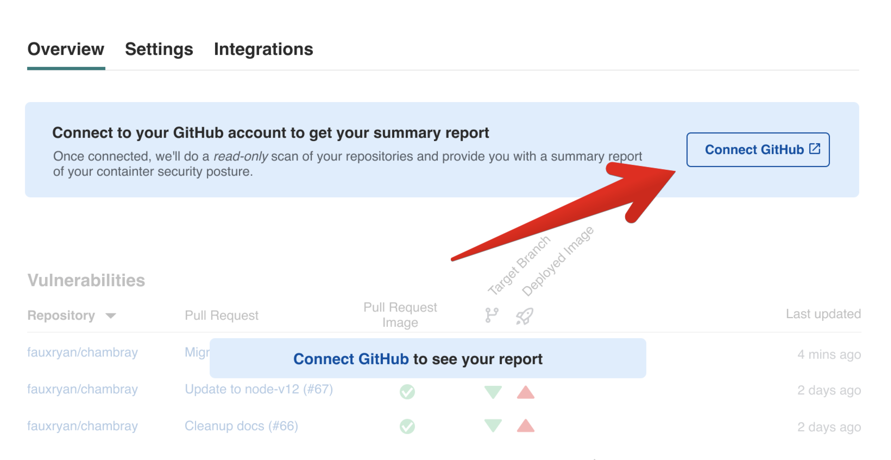
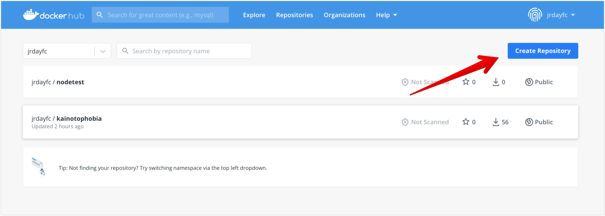
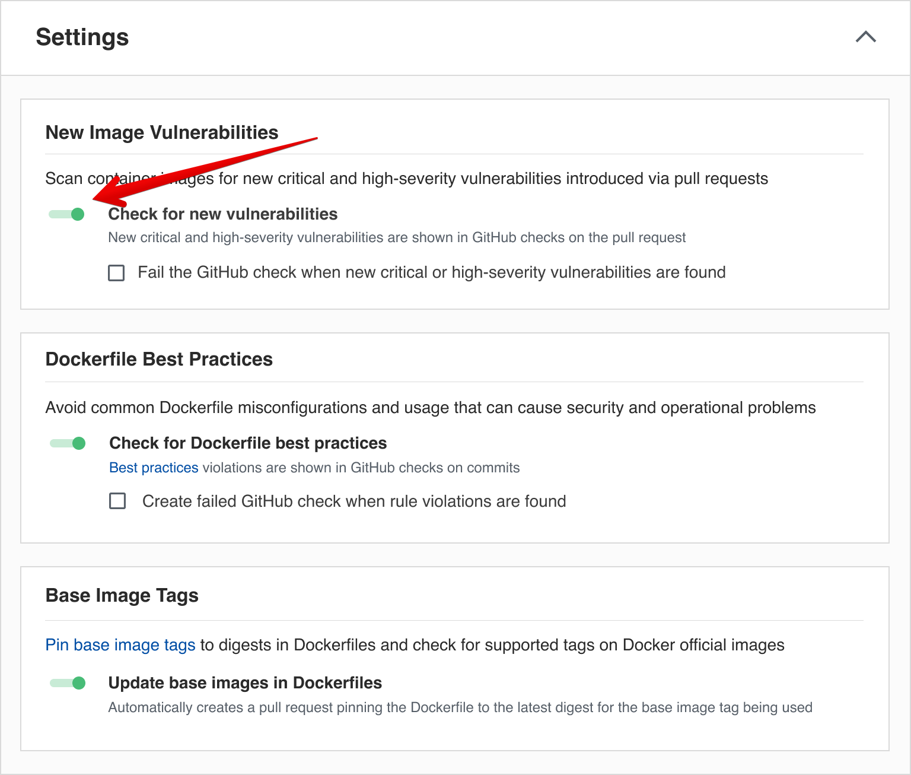
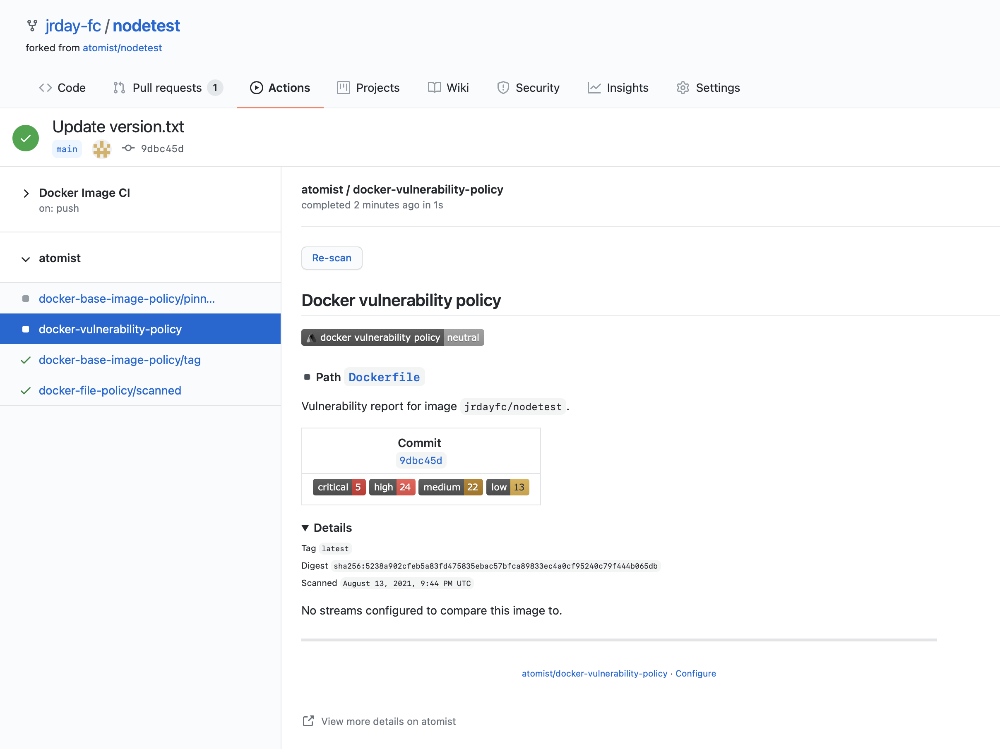
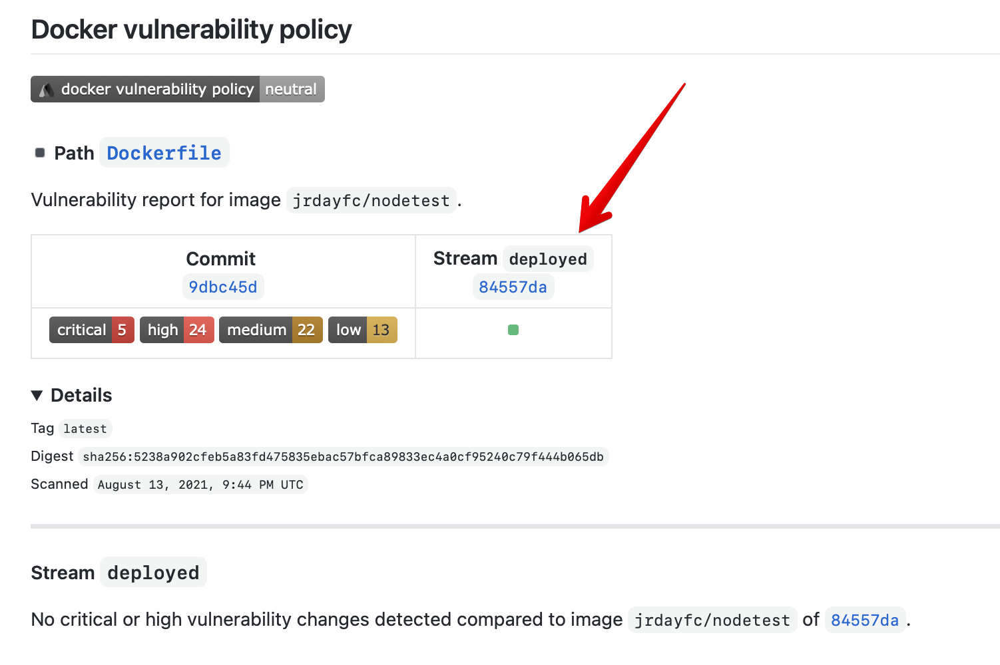

# Tracking new vulnerabilities

You can use Atomist to help your developers detect when a pull reqeust will introduce new vulnerabilities that are not currently running in your production environment.  To see this in action, you'll need to add the Atomist application to one of your GitHub Organizations, and configure the Atomist Dockerhub integration (we'll use DockerHub for this tutorial, but it works equally well with other registries).

## Signup

Start by creating a [free account](https://dso.atomist.com/user/signup).


## Connect Github App

Atomist is ready to start discoverying Dockerfiles in your GitHub repositories.  Add the app to one of your GitHub organizations and include some repositories that contain Dockerfiles. Don't worry, because Atomist will only scan default branch refs looking for Dockerfiles that can help with.  It will start raising pull requests, or adding check runs without your permission.  The app will start off in a pure discovery mode.



After adding this application, Atomist will start scanning so you'll see data about Dockerfiles, base images, and Dockerfile best practices.  Before diving into this, we'll set up the DockerHub integration to watch your registry.

## Connect DockerHub

For this exercise, we recommend creating a new public Repository in your Docker namespace.  

To [configure the DockerHub integration][dockerhub], navigate to the "Integrations" tab.  You'll need to either create a new personal access token or use an existing one.  Note that DockerHub has recently started limiting the number of personal access tokens that you can create from a free account.  After saving the configuration, Atomist will test the connection and indicate with a green check mark if the connection was made successfully.


In the [configuration docs][dockerhub], there's some additional info on creating a webhook on your new DockerHub repository.  Configure and Atomist webhook on your new repository.  Atomist will use this to track when new Images are pushed into the repository.

[dockerhub]: https://docs.atomist.com/integration/dockerhub/




## Recognizing new vulnerabilities

Atomist is now scanning GitHub commits and Docker Images.  Getting started with vulnerability analysis can be a challenge for teams. Before your appsec team has finished triaging the existing vulnerabilities, it can be difficult for developers to know whether they are being told about a new vulnerability, or whether this is something that is already in production.  Creating a pull request based feedback loop between developers and appsec when _new_ vulnerabilities are introduced focuses the team's attention on a new vulnerability as it's being introduced.  Compare this to a process where quarterly audits resurrect these issues a few months down the road.  The added context that this pull request is potentially increasing the vulnerability debt is a good reason to pull in appsec right now.  Atomist delivers this additional information in the form of a GitHub CheckRun.

To see this action, we've prepared a repository with a set of known (and triaged) vulnerabilities.  For this exercise, we'll mark this initial set of vulnerabilities as being "deployed" and only complain about ones that are not in this initial set.  The steps of the tutorial are roughly:

1.  Fork a test repository
2.  GitHub Action
3.  Atomist will publish a CheckRun showing you that your new Image has been scanned.
4.  Mark the initial set of vulnerabilities as "deployed"
5.  Open a Pull Request
6.  Introduce a new vulnerability (we'll do this by adding an npm dependency with a known CVE)
7.  Push your change to the Pull Request branch (let the GitHub Action build and push the Image)
8.  Get a failed GitHub CheckRun with details about the new vulnerability

## Fork Test Repo

Start by forking [https://github.com/atomist/nodetest](https://github.com/atomist/nodetest) into the GitHub Org that is attached to Atomist.  This is a Node.js Docker project and it contains a GitHub action that will build and push the contents of this repository to DockerHub.  Forking a repository that already contains a GitHub Action is a special case where gitHub will ask for confirmation that the workflow should be enabled. 


This Action also requires three secrets to be configured in your new GitHub repo:

* `DOCKER_USERNAME` must be set to your docker id
* `DOCKER_PASSWORD` is the personal access token for your DockerHub account
* `DOCKER_REPOSITORY` is the name of the repository you created on DockerHub (this is the repository that has the Webhook pointing to Atomist)

After you've added these secrets, your GitHub Secrets should look like this:


Finally, head to the Settings page to enable the vulnerability policy for the new forked repository.  The policies on the setting page are designed to provide consistent behavior across all of your repositories.  However, we can limit the activity to just the forked repo for now.  Turn on the vulnerability policy, the base image policy, and the dockerfile best practices.  In the Repositories list, make sure that the new repo is selected.  The policy section should look like:




## Trigger a new Build

Create a new push to your repository by incrementing the version number in the version.txt file in the root of your repository.  Your GitHub action will be triggered by this push, and as long as your secrets are configured correctly, it will build and push an image to DockerHub.  DockerHub will notify Atomist of this new Image, and after scanning it, Atomist will create a CheckRun on your latest push.  An example of the CheckRun you'll see is shown below.  Note that there are already 5 critical and 24 high vulnerabilities in this image (this could be a different number when you go through the tutorial - vulnerabilities are always changing).  



## Mark initial vulnerabilities as "deployed"

There are many different ways that we come to realize that an image has been deployed.  It might be a Kubernetes admission controller which allows an image into the prod cluster.  It could be the closing of a Jira issue.  It could be triggered by a continuous deployment engine.  In any case, there is a point in which an image and its set of vulnerabilites are "accepted".  We'll simulate that event here by calling an endpoint with the digest of the new image.  You can copy the endpoint url out of the Integrations tab at [https://dso.atomist.com](https://dso.atomist.com).  There's also a 


```bash
API_URL=https://webhook.atomist.com/atomist/resource/b570bc8b-ed3a-4ced-a52b-46276e6063b6 API_TOKEN=team::3765928D4DBD70E90174D03B54A239AE70FFE644CD02B87A64BA3F08462C6F44
DOCKERHUB_NAMESPACE=slimslenderslacks
DOCKERHUB_REPOSITORY=radio_free_europe
IMAGE_DIGEST=sha256:47437c32047850d002df8bfb55a4cab196fd80900f1b70c6bc3f2f3438169913

curl -X POST \
     -H "Content-Type: application/json" \
     -H "Authorization: bearer ${API_TOKEN}" \
     $API_URL \
     -d "{\"image\": {\"url\": \"${DOCKERHUB_NAMESPACE}/${DOCKERHUB_REPOSITORY}@${IMAGE_DIGEST}\"}}"
```

If you look at the previous CheckRun, you'll notice that the details will have been updated to indicate that there is now an indication that the "deployed" stream contains this image.



## Introduce a Vulnerability

Clone the repository, create a branch and then install a package with a known vulnerability.  An example is:

```
$ git checkout -b vulnerable
$ npm install nodemailer@6.4.0
$ git commit -am 'introduce vulnerability'
$ git push origin -u vulnerable
```

After pushing the branch, raise a pull request.  The CheckRun will now the specific vulnerabilies that would result in an increase in vulnerabilities going into production.


